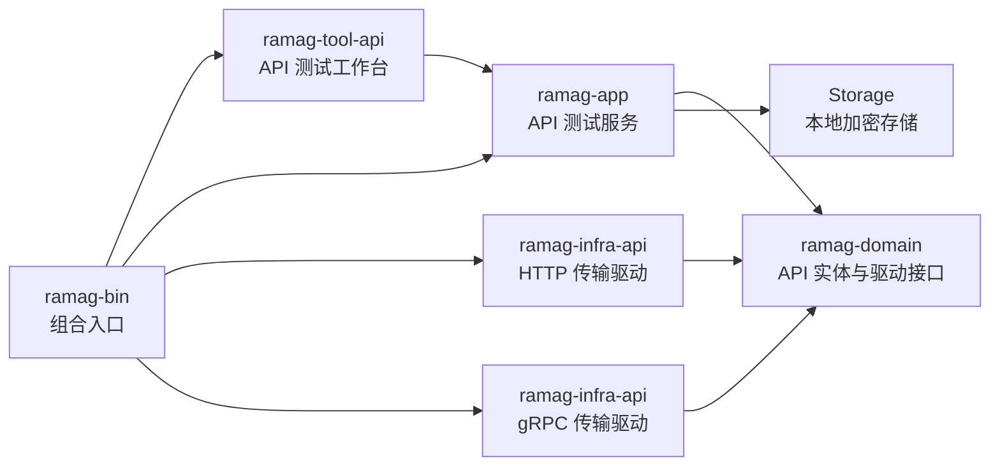

# API 测试工具开发计划

> 状态：`API-000` 至 `API-007`、`API-008.1`、`API-008.2` 和 `API-008.3` 已完成。首个可交付版本已支持 HTTP 和 gRPC Unary、流式接口测试；原生 Windows 窗口操作证据仍单独记录。
>
> 适用范围：Ramag Platform 的 API 测试工作台、HTTP 请求、gRPC 请求、请求集合、环境变量、响应断言和本地测试服务验收。
>
> 参考界面：用户提供的 HTTPie 工作区截图，以及 Postman 的 Collection、Environment、Request、History 和 Tests 工作流。参考只用于提取交互模式，不复制产品品牌、资源或实现。

## 术语表与命名约定

| 规范中文名 | English / Acronym | 当前方案中的职责边界 | 不代表什么 |
|---|---|---|---|
| API 测试工具 | API Testing Tool | Ramag 中用于编辑、执行、保存和验证 HTTP/gRPC 请求的桌面工作台 | 不代表 API 网关、服务注册中心或远程部署工具 |
| HTTP 请求 | HTTP Request | 通过 HTTP/HTTPS 发送方法、URL、查询参数、Headers 和请求体 | 不代表 gRPC over HTTP/2 的调用 |
| gRPC 请求 | gRPC Request | 通过 gRPC 连接 Service/Method、Metadata 和 Protobuf 消息 | 不代表普通 HTTP JSON 请求 |
| API 测试服务 | API Test Service | `ramag-app` 中负责校验、变量解析、驱动调用、取消和结果编排的应用服务 | 不代表 HTTP 或 gRPC 客户端实现 |
| 请求记录 | Request Record | 用户保存的一个可重复执行的 HTTP 或 gRPC 请求配置 | 不代表一次已经执行的响应 |
| 请求集合 | Collection | 按目录组织多个请求记录，并为后续批量执行提供边界 | 不代表远程 API 的资源集合 |
| 工作区 | Workspace | 保存请求集合、环境和打开请求 Tab 的本地工作区域 | 不代表云端同步空间 |
| 环境 | Environment | 保存变量、变量值和敏感变量引用，供请求模板解析 | 不代表运行环境或部署环境本身 |
| 断言 | Assertion | 对状态、Headers、Metadata、正文字段和耗时进行声明式验证 | 不代表任意脚本执行器 |
| Descriptor | Protobuf Descriptor | 描述 gRPC Service、Method、字段和消息结构的数据 | 不代表 gRPC 服务实例 |
| Server Reflection | Server Reflection | 从 gRPC 服务发现可调用的 Service、Method 和 Descriptor | 不代表所有 gRPC 服务都必然启用的能力 |
| Metadata | gRPC Metadata | gRPC 请求 Headers、响应 Headers 和 Trailers 的协议元数据 | 不代表 Protobuf 消息字段 |
| 双向 TLS | Mutual TLS / mTLS | 客户端和服务端互相使用证书完成身份校验的 TLS 连接 | 不代表只校验服务端证书的普通 HTTPS |
| 显式代理 | Explicit Proxy | 请求明确指定的 HTTP 代理及其可选 Basic 认证；HTTPS/gRPC 隧道使用 CONNECT | 不代表系统代理、PAC、SOCKS 或 OAuth2 |
| OAuth2 Client Credentials | Client Credentials | 使用 `client_id` 和 `client_secret` 向 Token Endpoint 获取短期访问令牌，并把令牌放入 HTTP Authorization 或 gRPC Metadata | 不代表用户登录授权、Refresh Token 或把访问令牌写入工作区 |
| Token Endpoint | Token Endpoint | 接收 `grant_type=client_credentials` 和可选 `scope`，返回访问令牌的 HTTP 接口 | 不代表业务 API，也不接收令牌后的业务请求 |
| 传输驱动 | Transport Driver | `ramag-domain` 定义、`ramag-infra-api` 实现的 HTTP/gRPC 协议适配接口 | 不代表 UI 视图或应用服务 |

正文首次出现使用“规范中文名（English / Acronym）”，后续使用规范中文名；协议名称始终保留 `HTTP`、`HTTPS`、`gRPC`、`Protobuf` 和 `TLS` 的标准大小写。

## 1. 目标与当前基线

### 1.1 目标

API 测试工具首个可交付版本完成以下闭环：

1. 用户可以创建、保存和执行 HTTP 请求。
2. 用户可以通过 `.proto` 文件或 Server Reflection 发现 gRPC Service/Method，并执行 Unary、Server Streaming、Client Streaming 和 Bidirectional Streaming 请求。
3. 用户可以查看有界的响应正文、Headers/Metadata、状态和耗时。
4. 用户可以使用环境变量复用请求配置，并对响应执行声明式断言。
5. 用户可以在工作区中组织 Collection、Folder 和 Request，并查看执行历史。
6. HTTP 和 gRPC 都有真实本机 Docker 服务验证，不用静态测试数据或仅编译结果代替协议集成证据。

### 1.2 当前仓库基线

- `ramag-domain` 保存实体、错误和跨层接口，不依赖 GPUI 或具体协议客户端。
- `ramag-app` 负责编排用例、取消、上下文隔离和日志，不负责 UI 布局。
- `ramag-infra-*` 负责具体协议与外部服务适配。
- `ramag-tool-*` 负责工作台 UI，`ramag-bin` 负责内置工具装配和视图注册。
- Workspace 已直接使用 `reqwest`、`http`、Tokio 和 Rustls，可复用现有 HTTP 客户端基础设施。
- `ramag-infra-api` 已完成动态 gRPC 执行链路，使用 `tonic`、`tonic-prost`、`prost`、`prost-types`、`prost-reflect` 和 `tonic-reflection`；API 工作台 UI 已在 `API-004` 中接入，后续继续补充断言、环境变量和历史。
- 本地 Storage 已保存 MQTT/Kafka 等配置，API 工作区需要新增专用实体和加密字段存储，不复用 MQTT 或 Kafka 配置结构。

## 2. 目标架构



拟新增或扩展的代码边界：

| 代码边界 | 主要职责 | 明确不负责 |
|---|---|---|
| `ramag-domain` | API 请求、响应、环境、Collection、断言、限制、错误和驱动接口 | 不创建 GPUI 控件，不调用 `reqwest`/`tonic` |
| `ramag-app` | 校验、变量解析、请求代次、取消、驱动调用、结果脱敏和 Storage 编排 | 不决定页面布局，不拼接协议客户端对象 |
| `ramag-infra-api` | `HttpApiDriver`、`GrpcApiDriver`、TLS、Descriptor 和动态消息适配 | 不保存 UI 状态，不直接读取 GPUI 输入状态 |
| `ramag-tool-api` | 工作区、请求编辑器、响应面板、历史和断言结果展示 | 不直接依赖 `reqwest`、`tonic` 或 Protobuf 客户端类型 |
| `ramag-bin` | 创建服务与驱动、注册 `ApiTool`、注册 API 视图和关闭生命周期 | 不包含 API 请求业务规则 |
| `ramag-infra-storage` | 保存工作区、Collection、请求、环境和加密敏感字段 | 不保存执行响应正文和无界历史 |

## 3. 首期范围

### 3.0 API-000 预研记录（2026-09-19）

`API-000` 已在 `ramag-infra-api` 中完成最小动态 gRPC 调用样例，当前依赖版本由 Cargo.lock 固定：

- `tonic` `0.14.6`：低层 `Grpc::unary` 和 `Channel`。
- `tonic-prost` `0.14.6`：Protobuf Codec。
- `prost` `0.14.4`：消息编码与解码。
- `prost-reflect` `0.16.5`：DescriptorPool、MessageDescriptor 和 DynamicMessage。
- `protox` `0.9.1`：运行时用纯 Rust 编译 `.proto` 源文件，避免要求用户单独安装 `protoc`。
- `tonic-prost-build` `0.14.6`：从 `.proto` 生成测试服务和 DescriptorSet。

预研代码通过一份 `api.spike.Echo` `.proto` 生成 DescriptorSet，在测试中完成以下真实协议路径：

1. 读取 DescriptorSet 并找到请求/响应 MessageDescriptor。
2. 用 `DynamicMessage` 构造请求消息，不生成业务专用 Rust 消息类型。
3. 通过 `tonic::client::Grpc` 创建 HTTP/2 gRPC Unary 请求。
4. 使用自定义动态 Codec 编码请求并按响应 Descriptor 解码响应。
5. 保留请求 Metadata，并在发送前校验完整方法路径必须以 `/` 开始。

`ramag-infra-api` 的 2 项预研测试通过：动态 Descriptor Unary 调用和方法路径校验。该测试使用进程内的最小 gRPC 服务验证 Codec/调用链，不替代后续本机 Docker 服务集成测试。`tonic-reflection` 当前主要提供服务端实现，虽包含生成的 Reflection 客户端消息和客户端类型，仍需在 `API-003` 中验证服务发现、FileDescriptor 拉取、依赖文件合并和错误恢复。

### 3.1 API-001 领域模型、限制和本地存储记录（2026-09-19）

`API-001` 已完成并通过领域层与本地 Storage 验收：

- `ramag-domain` 新增 `ApiWorkspace`、`ApiCollection`、`ApiRequestRecord`、`ApiEnvironment`、声明式 `ApiAssertion`、HTTP/gRPC 请求规格和有界 `ApiResponseSnapshot`。
- HTTP 请求覆盖 Method、URL 模板、Query、Headers、Basic/Bearer/API Key、正文和超时；gRPC 请求覆盖 Endpoint、Service、Method、Metadata、Reflection/FileDescriptorSet 和 TLS 路径。
- 领域层统一校验名称、协议字段、参数数量和值长度、请求/响应正文、Descriptor 大小、断言数量、超时、ID 唯一性和 Environment 引用；响应正文提供有界裁剪并保留原始大小。
- `ApiDriver` 只定义应用层需要的协议执行接口，不依赖 `reqwest`、`tonic` 或 UI；取消标记和变量映射由调用方传入。
- `ramag-infra-storage` 新增加密 `api_workspaces` redb 表和 CRUD；读取、写入、列表数量与总字节预算均重复校验，工作区中的 Token、密码、请求正文不以明文落盘，响应快照不持久化。
- 新字段使用 serde 默认值保持旧请求 JSON 可读取；专项测试覆盖校验、脱敏 Debug、正文限制、旧 JSON 兼容、加密往返和删除。

本切片验证结果：`ramag-domain` 198 项通过，`ramag-infra-storage` 76 项通过、3 项既有性能测试忽略；workspace Clippy、`ramag-bin` 构建和格式检查通过。未在本切片宣称 HTTP/gRPC Docker 集成或 UI 完成。

### 3.2 HTTP 请求

- 方法：`GET`、`POST`、`PUT`、`PATCH`、`DELETE`、`HEAD`、`OPTIONS`。
- URL、Query 参数、Headers。
- JSON、纯文本和 `application/x-www-form-urlencoded` 请求体。
- Bearer Token、Basic Auth、API Key。
- OAuth2 Client Credentials；访问令牌只在驱动内存中缓存，HTTP 401 会清除缓存并重试一次。
- HTTP/HTTPS、TLS 校验、超时和取消。
- 状态码、响应 Headers、正文、响应大小和耗时。
- JSON 格式化、纯文本查看和正文大小限制。
- 状态码、Header、Body 包含文本、JSON 字段和耗时断言。

#### API-002 代码切片记录（2026-09-19）

`HttpApiDriver` 已在 `ramag-infra-api` 实现：

- 使用 `reqwest` 异步构造 HTTP/HTTPS 请求，支持 URL 模板、Query、Headers、请求体、Basic/Bearer/API Key 和每请求超时。
- 按 `ApiTlsConfig` 加载 CA、客户端证书/密钥或关闭证书校验，并在基础设施边界初始化 Rustls Crypto Provider。
- 保留 HTTP 状态码和响应 Headers；响应正文最多缓存 8 MiB，记录原始大小和 `truncated` 状态，不把非 2xx 响应误判为传输错误。
- 发送阶段和响应流读取阶段均监听 `ApiCancellation`；传输错误只返回安全错误文本，不复制 URL、Headers 或响应正文中的凭据。
- `ramag-infra-api` 的本地 TCP HTTP 验收测试覆盖成功/非 2xx、变量、Query、Headers、三类认证、请求体、正文截断、超时、取消和 TLS 配置错误，共 8 项通过。

本代码切片记录只证明驱动边界和本地协议行为，不能用本地 TCP 测试替代 Docker 集成、API 工作台 UI 验收或真实 Windows 窗口截图；Docker 集成证据见下节。

#### API-002 本机 Docker 集成记录（2026-09-19）

- `scripts/api-test/compose.yaml` 构建 `ramag-api-http-test:python-3.12.11-alpine-3.22`，基础镜像解析为 `python:3.12.11-alpine3.22`，容器通过 `127.0.0.1:18089` 暴露 HTTP 端点。
- `scripts/api-test/api-test.ps1 test` 启动容器并等待 healthcheck 变为 `healthy`；`cargo test --locked -p ramag-infra-api --test docker_http` 通过 1 项，实际覆盖 JSON、响应 Headers、变量/Query/请求体、Basic 认证、401、418、延迟超时和流式取消。
- 测试完成后执行 `scripts/api-test/api-test.ps1 down`，容器 `ramag-api-http-test` 和网络 `ramag-api-http-test` 均已清理；现有 Mosquitto、Kafka 和数据库测试服务未被修改。

这组测试证明 HTTP 驱动到本机 Docker 服务的真实协议链路；TLS 双向证书和 API UI 仍按路线图单独验收。

### 3.3 gRPC 请求

- 明文和 TLS 连接。
- 编译后的 `FileDescriptorSet` 文件导入和原始 `.proto` 文件导入；`.proto` 编译限制入口目录、源文件大小和 DescriptorSet 大小。
- Server Reflection 服务发现。
- Service/Method 选择。
- 动态 Protobuf 消息编辑和 Unary 调用。
- 请求 Metadata、响应 Metadata、Trailers、Status 和耗时。
- Basic/Bearer/API Key/OAuth2 Client Credentials；OAuth2 令牌以 Authorization Metadata 发送，Reflection 请求复用同一认证配置。
- gRPC 状态码、Metadata、消息字段和耗时断言。

#### API-003 代码与本机 Docker 集成记录（2026-09-19）

`GrpcApiDriver` 已在 `ramag-infra-api` 实现，`API-003` 的历史记录先覆盖动态 Unary 调用：

- 支持明文 `http` 和 TLS `https` Endpoint；TLS 支持系统根证书、自定义 CA、客户端证书/密钥和显式关闭校验，所有连接、调用和 Reflection 请求均有超时与取消传播。
- 支持本地 `FileDescriptorSet` 和 Server Reflection；Reflection 会读取 Service 目录、合并 `FileDescriptorProto` 依赖文件，再按 Service/Method 构造 `DynamicMessage`。
- 支持模板变量、ASCII/Binary Metadata、响应 Metadata、gRPC Status、响应消息 JSON、响应大小上限和耗时；流式调用在 `API-007` 单独补齐。
- `ramag-infra-api` 本地测试覆盖 FileDescriptorSet Unary、Reflection Service/Method 发现、请求/响应 Metadata、错误 Status 和方法路径校验，共 3 项通过。

本机 Docker 集成使用仓库内 `scripts/api-test/grpc` 测试服务：

- 镜像为 `ramag-api-grpc-test:rust-1.91.0-bookworm`，构建基础镜像固定为 Rust 1.91.0 Bookworm 和 Debian Bookworm Slim digest；容器端口 `50051` 映射到 `127.0.0.1:18090`。
- `scripts/api-test/grpc-test.ps1 test` 启动并等待 `ramag-api-grpc-test` healthcheck；`docker_grpc` 通过 1 项，实际覆盖 Reflection、Unary、请求/响应 Metadata、错误 Status 和取消。
- 本轮测试先确认 gRPC 测试服务为 `healthy/running`，随后执行 `scripts/api-test/grpc-test.ps1 down`；容器 `ramag-api-grpc-test` 和网络已清理。TLS 端到端 Docker 场景尚未纳入本测试服务，属于后续补充项。

### 3.4 公共能力

- Workspace、Collection、Folder、Request 的新增、保存、编辑、复制和删除。
- 请求 Tab 和最近执行历史。
- `{{variable}}` 变量替换。
- 环境变量的普通值与敏感值分离存储。
- 加载、执行、成功、失败、取消、超时和变量缺失状态。
- 配置变更或切换请求后，旧请求的迟到结果不得污染当前页面。

### 3.5 API-004 API 工作台 UI 记录（2026-09-19）

`ramag-tool-api` 已接入 Ramag 工具注册和主窗口 Shell，提供第一版 HTTP/gRPC Unary 请求工作区：

- 左侧显示工作区、当前请求名称、协议和已保存请求摘要；顶部支持 HTTP/gRPC 切换、保存、发送和取消。
- HTTP 编辑器支持 Method、URL 和有界请求正文；gRPC 编辑器支持 Endpoint、Service、Method、Metadata 名称/值和 Protobuf JSON 消息；通过 Server Reflection 读取 Service/Method 目录后，可直接选择目录中的方法。
- 响应区显示 HTTP 状态或 gRPC Status、耗时、大小、响应 Headers/Metadata 和有界正文预览；响应失败会保留具体错误提示。
- `ApiService` 在应用边界重复执行请求校验，并在受控 app worker 中为 HTTP/gRPC 驱动建立 Tokio runtime，避免 GPUI 后台执行器缺少 Tokio reactor 时发送请求失败。
- 保存操作写入 API Workspace 的默认 Collection；发送操作带有取消标记和请求代次检查，迟到的旧结果不会覆盖当前请求。

UI 验收证据：`ramag-tool-api` headless GPUI 测试覆盖 360、640、1024 和 1440 像素宽度，验证请求/响应边界、协议切换、发送/保存状态和实际 HTTP/gRPC 请求。双协议 UI 测试连接本机 Docker 服务并通过真实驱动返回 HTTP 200 和 gRPC `ok`；gRPC 测试服务要求的 `x-request: docker` Metadata 已由界面字段发送。Computer Use 当前返回可控应用列表为空，因此本切片没有真实 Windows 窗口截图或键盘/鼠标证据，不能将 headless 结果描述为原生窗口验收。

API 工作台 gRPC Reflection 发现修正记录（2026-09-20）：`ramag-domain` 增加独立的 gRPC Service 发现请求和目录项模型，`ramag-app` 通过已有 gRPC 驱动边界执行发现并传播 Environment 变量、超时和取消；`ramag-tool-api` 增加“发现”操作、Service/Method 目录和方法选择按钮。界面不展示标准 Reflection 内部 Service，避免自动选择到协议发现服务；本机 Docker UI 测试实际读取 `api.docker.Echo` 并选择 `Unary` 后完成 gRPC 请求。领域测试 214 项、应用测试 223 项、API 工作台测试 15 项通过。

API 工作台 `FileDescriptorSet` 导入记录（2026-09-20）：`ramag-tool-api` 增加有界的本地 DescriptorSet 文件选择和读取，只接受普通文件，限制为 16 MiB，并拒绝空文件；导入结果同时用于 gRPC Service/Method 发现、请求构造和工作区恢复，界面显示当前来源并在发现期间禁用重复导入。支持常见的 `.bin`、`.fds` 和 `.desc` 后缀；原始 `.proto` 文件的编译和导入尚未接入，不能把二进制 DescriptorSet 导入描述为 `.proto` 编译。领域测试 215 项、API 工作台测试 16 项通过。

API 工作台原始 `.proto` 导入记录（2026-09-20）：新增 `protox` 纯 Rust 编译路径和“导入 `.proto`”入口；入口文件所在目录及其子目录内的相对 `import` 会合并到 DescriptorSet，标准 `google/protobuf` 文件由编译器内置解析。单个源文件限制为 8 MiB，所有用户源文件合计限制为 32 MiB，输出 DescriptorSet 限制为 16 MiB；绝对路径、父目录跳出、非 UTF-8 文件、目录和解析错误均在编译前或编译时拒绝。编译结果复用现有 gRPC 发现、请求执行和工作区恢复链路；API 工作台测试 18 项通过。

本机 Docker 服务保持运行供复验：`ramag-api-http-test` 使用 `ramag-api-http-test:python-3.12.11-alpine-3.22`，绑定 `127.0.0.1:18089 -> 8080`；`ramag-api-grpc-test` 使用 `ramag-api-grpc-test:rust-1.91.0-bookworm`，绑定 `127.0.0.1:18090 -> 50051`。两个容器健康检查均为 `healthy`。API-005 的断言、环境变量编辑、执行历史和结果摘要在下一节记录。

### 3.6 API-005 断言、环境变量和历史记录（2026-09-19）

API-005 已完成以下闭环：

- `ramag-domain` 新增受限 `{{variable}}` 模板解析、HTTP 状态/Header、gRPC Metadata、正文、JSON Path 和耗时断言评估，以及断言结果模型。
- `ramag-app` 新增 `ApiService::execute_record`，在驱动边界前展开 URL、Query、Headers、认证、正文、gRPC Endpoint/Metadata/Message；变量缺失、传输失败和取消都会产生失败历史，不把用户级失败伪装成传输成功。
- `ramag-infra-storage` 新增独立加密 `api_history` 表，按工作区保存最多 200 条摘要，限制总字节；历史只保存状态、耗时、大小、断言统计和有界正文预览，敏感环境变量值统一替换为 `[REDACTED]`。
- `ramag-tool-api` 增加 Environment 变量/敏感变量编辑器、声明式断言编辑器、断言结果区域和执行历史列表；默认 HTTP URL 使用 `{{base_url}}/json`，由本地环境变量展开。

API-005 测试覆盖成功、断言失败、取消、变量缺失、敏感值脱敏、加密历史往返、断言/环境编辑格式和 360/640/1024/1440 宽度 UI。真实 Docker UI 测试通过 HTTP `200`、`status=200` 断言和 gRPC `ok`；真实 Windows 窗口仍受 Computer Use 空应用列表限制，未取得原生截图或鼠标/键盘证据。

### 3.7 API-006 Collection 运行和格式兼容切片边界（2026-09-19）

API-006 拆为三个独立验收切片，按顺序提交：

1. Collection 运行：在同一环境和取消标记下按保存顺序串行执行请求，返回每条请求的成功/失败/取消结果和汇总，不提交业务协议的隐式状态。
2. Ramag JSON 与 Postman Collection v2.1 导入：输入大小有界，坏数据定位到 Collection、Folder、Request 和字段；导入后的请求必须复用 API-005 的环境变量、断言和执行链路。
3. OpenAPI 3 JSON 导入：读取服务器、Path、Operation、Parameters、JSON Request Body 和示例，无法安全映射的引用或字段必须报告具体路径。

三个 API-006 切片、API-007 的 Multipart 和 gRPC 流式调用切片，以及 API-008.1 的 mTLS、API-008.2 的显式代理和 API-008.3 的 OAuth2 切片均已完成；本文件保留每个切片的独立验收边界。

Collection 运行切片验收记录（2026-09-19）：`ApiService::run_collection` 按保存顺序串行调用 API-005 执行链路，共享 Environment 和取消标记；汇总每条请求的响应、错误、取消状态及通过/失败/取消计数，取消后不启动后续请求。API 工作台新增请求工具栏和 Collection 汇总，桌面端使用请求/响应并排布局，窄窗口改为纵向布局；Header、工具栏和主体之间增加 headless bounds 非重叠检查。

通过项：`ramag-domain` 201 项、`ramag-app` 220 项库测试和 17 项集成测试、`ramag-tool-api` 9 项 GPUI 测试；`cargo fmt --all -- --check`、workspace Clippy、源文件行数检查和 `git diff --check` 通过。本机 Docker 服务保持运行：HTTP `ramag-api-http-test:python-3.12.11-alpine-3.22`（容器 ID `da6b26ac136a`，`127.0.0.1:18089 -> 8080`，healthy）和 gRPC `ramag-api-grpc-test:rust-1.91.0-bookworm`（容器 ID `f2eaa95f52a6`，`127.0.0.1:18090 -> 50051`，healthy），测试未启动或清理服务。Computer Use 返回空应用列表，真实 Windows 窗口截图与键鼠证据未完成；UI 结论仅覆盖 headless GPUI 和真实 Docker 协议交互。

### 3.8 API-006.2 Ramag JSON 与 Postman Collection v2.1 导入设计（2026-09-19）

本切片只处理 API-006 的第二项，不提前实现 OpenAPI 3：

- Ramag JSON 接受当前 `ApiWorkspace` 直序列化格式，也接受 `format = "ramag-api"`、`version = 1`、`workspace` 封装格式；导入前执行 JSON 大小、结构、Workspace 数量和领域校验。
- Postman 只接受 Collection v2.1 schema；Collection、Folder 和 Request 都保留到错误路径中。Folder 在当前无 Folder 实体的模型中按 `Folder / Request` 拼接请求名称，但执行仍复用 API-005 的请求记录、Environment、断言和 `ApiService` 执行链路。
- 安全映射 HTTP Method、URL、Query、Headers、raw/urlencoded Body、Basic/Bearer/API Key 和 Collection variables；Postman 脚本不执行，只产生有界警告。文件、GraphQL、OAuth2、Digest 等无法保持语义的字段直接报告具体 JSON 路径。
- 导入请求和环境重建本地 ID 后合并到当前 Workspace，由 `ApiService` 校验并加密保存；重复环境名称自动生成不冲突名称，保存失败不修改当前界面状态。

API-006.2 实现验收记录（2026-09-19）：`ramag-domain` 增加有界 Ramag JSON/Postman v2.1 解析器和 JSON 路径错误，覆盖嵌套 Folder、Query、Headers、raw/urlencoded Body、Basic/Bearer/API Key、Collection variables、脚本警告、环境重名和本地 ID 重建；`ApiService::import_workspace_json` 负责合并后校验并持久化，`ramag-tool-api` 增加 `导入` 文件选择入口、UTF-8/8 MiB 文件读取限制、导入结果回填和摘要提示。Domain 导入测试 4 项、App 导入持久化链路和 API UI headless 测试均通过；OpenAPI 3 的验收记录见下一节。

UI 证据边界：headless GPUI 已验证 `导入` 控件存在、请求/认证/正文类型回填和窄窗口布局；Computer Use 在本机返回空应用列表，即使启动 `target/debug/ramag.exe` 后仍无法取得可控窗口，因此系统文件选择器的真实 Windows 点击、截图和键鼠证据尚未完成，不能将其描述为原生窗口验收。

### 3.9 API-006.3 OpenAPI 3 JSON 导入设计（2026-09-19）

本切片只处理 OpenAPI 3.0/3.1 JSON 文档，并把导入范围限制在当前 API 工作台可以直接编辑和执行的 HTTP 请求：

- 入口先校验 `openapi` 版本和根对象，使用根级、Path 级、Operation 级的首个 `server`；服务器变量转为 `{{variable}}`，默认值写入导入 Environment，缺少默认值时保留变量并记录路径提示。
- Path 级参数与 Operation 级参数按 `(name, in)` 合并，支持 `path`、`query`、`header`、`cookie`；参数值按 `example`、`examples`、`schema.example`、`schema.default`、枚举首值的顺序选择。Path 参数写入 URL 模板，Cookie 参数转换为 `Cookie` Header。
- `requestBody` 只把 `application/json` 或 `+json` 媒体类型映射为 `ApiBody`；优先使用媒体类型 `example`、命名 `examples`、Schema 示例/默认值，随后生成有界的 JSON 示例。其它媒体类型保留带路径的提示并不猜测编码。
- `components` 中的本地 JSON Pointer `$ref` 可解析并受嵌套深度限制；外部引用、循环引用、引用目标类型错误，以及影响请求语义但无法安全映射的字段直接失败，并报告原始 JSON 路径。
- `securitySchemes` 仅映射 HTTP Basic/Bearer 和 header/query API Key；OAuth2、OpenID Connect 和未声明的安全方案只产生路径提示。Operation 的安全声明不改变请求可执行性以外的字段，不执行文档脚本。
- 每个 Operation 生成一个请求，名称优先使用 `operationId`，否则使用 `METHOD path`；文档标题生成 Collection 名称。成功导入后统一通过现有 Workspace 校验、ID 重建、持久化和 API-005 执行链路。

验收要求：Domain 测试覆盖服务器变量、参数合并与示例优先级、JSON Body、Basic/Bearer/API Key、本地引用和具体路径错误；应用层验证导入后可保存并执行；UI headless 验证 OpenAPI 文件识别、摘要与请求编辑区回填；真实 Docker HTTP 服务验证至少一条导入请求返回 200。Computer Use 若仍返回空应用列表，只记录 headless/UI 限制，不将其描述为原生窗口验收。

API-006.3 实现验收记录（2026-09-19）：`ramag-domain` 新增 OpenAPI 3.0/3.1 JSON 识别和导入，覆盖首个 server 及变量、Path/Operation 参数合并、参数示例优先级、Cookie Header、JSON requestBody 示例/Schema 生成、本地 `$ref`、HTTP Basic/Bearer/API Key 和具体路径错误；`ramag-tool-api` 更新文件过滤器并验证导入工作区可回填请求、认证、正文和 Environment；`ramag-infra-api` 将导入请求接入真实 Docker HTTP 回归。Domain 208 项、App 220 项库测试和 17 项集成测试、API UI 11 项测试、OpenAPI focused tests、fmt、Clippy、源文件行数检查和 `git diff --check` 通过。本机 Docker 服务为 `ramag-api-http-test:python-3.12.11-alpine-3.22`（容器 ID `7502473adc72`，`127.0.0.1:18089 -> 8080`，healthy），真实 OpenAPI `/json` 请求返回 HTTP 200；服务未停止或清理，供后续回归复用。

API 工作台布局修正记录（2026-09-19）：`ramag-tool-api` 将 Method/URL 与保存、发送、取消、Collection 操作合并为同一条响应式命令行，宽窗口同排、窄窗口换行；headless bounds 测试新增命令行边界、操作区不越界和宽窗口同排检查。`cargo test --locked -p ramag-tool-api` 11 项、workspace Clippy、fmt、源文件行数检查和 `git diff --check` 通过。Computer Use 返回空应用列表，未取得真实 Windows 窗口截图或键鼠证据。

API Query 编辑器修正记录（2026-09-19）：HTTP 工作台新增有界 Params 区域，使用逐行 `name=value` 编辑格式；OpenAPI/Postman/Ramag 导入的 Query 参数回填后不会在保存或发送时丢失，查询模板继续由 API-005 Environment 展开。`ramag-tool-api` 12 项测试通过，覆盖解析、导入回填和 360/640/1024/1440 布局。

### 3.10 API-007 Multipart 请求切片（2026-09-20）

本切片完成 HTTP `multipart/form-data` 的领域、应用、驱动和工作台闭环；gRPC 流式调用的验收记录见下一节，mTLS、显式代理和 OAuth2 的验收记录见后续章节：

- `ramag-domain` 新增 `ApiBodyMode`、`ApiMultipartPart` 和文本/文件字段模型；限制字段数量最多 64 个，单个文件最多 16 MiB，文件正文总量最多 32 MiB，文件路径和文件名有独立长度上限。Multipart 请求不能手动设置 `Content-Type`，由驱动生成 boundary；旧版纯文本正文 JSON 仍可读取，Debug 输出不显示正文和文件路径。
- `ramag-app` 展开 Multipart 字段名称、文本值、文件路径、文件名和字段 `Content-Type` 中的环境变量，不把 Multipart 请求降级为普通文本正文；请求变量、取消标记和应用层校验继续沿用 API-005 执行链路。
- `ramag-infra-api` 启用 `reqwest` Multipart，生成 boundary，读取文件前检查文件大小，读取期间响应取消标记，并在发送前限制单文件和总正文大小；本地 HTTP 测试覆盖文本/文件字段、自动 boundary、超大文件拒绝和取消。
- `ramag-tool-api` 增加 Text/Multipart 模式切换；Multipart 编辑器按行读取 `text|字段|值[|secret]` 或 `file|字段|路径[|文件名|Content-Type]`，导入的 Multipart 请求可回填、保存和重新构造领域请求。文件选择使用明确的本地路径输入，不把系统文件选择器作为本切片的完成条件。
- 本机 Docker HTTP 测试服务增加 `/multipart` 校验，实际验证自动 boundary、文本字段和文件字段；`ramag-api-http-test` 绑定 `127.0.0.1:18089`，健康状态为 `healthy`，重启策略为 `unless-stopped`，服务保留运行供复验。

本切片通过：`cargo test --locked -p ramag-domain --lib` 213 项、`cargo test --locked -p ramag-app --lib` 223 项、`cargo test --locked -p ramag-infra-api --lib` 11 项、`cargo test --locked -p ramag-tool-api --lib` 15 项；真实 Docker 回归 `RAMAG_TEST_API_HTTP_URL=http://127.0.0.1:18089 cargo test --locked -p ramag-infra-api --test docker_http -- --test-threads=1` 1 项通过。目标 Clippy、workspace 提交钩子的格式/Clippy、源码尺寸检查和 `git diff --check` 均通过。

未完成项：真实 Windows 窗口截图、键盘和鼠标证据仍受 Computer Use 空应用列表限制，不能用 headless GPUI 结果替代。

### 3.11 API-007 gRPC 流式调用切片（2026-09-20）

本切片只实现 gRPC 流式调用，不扩展 mTLS、代理和 OAuth2；三项能力在后续独立切片完成：

- `ramag-domain` 允许 gRPC 流式请求正文使用换行，并增加最多 1024 条消息的限制；普通 Unary 请求仍按完整 Protobuf JSON 解析。
- `ramag-infra-api` 根据 Descriptor 的 `client_streaming` 和 `server_streaming` 标记选择四种调用方式。Client Streaming 和 Bidirectional Streaming 的请求正文按行解析，每行一个 Protobuf JSON 对象；Server Streaming 和 Bidirectional Streaming 的响应保存为 JSON 数组，Client Streaming 的最终响应保持单个 JSON 对象。
- 流式响应读取逐条检查取消标记，消息数量最多 1024 条，响应正文最多保留 8 MiB；超出正文或消息数量时保存已读取部分并标记 `truncated`，不继续无界缓存。
- Server Reflection 读取在保存响应前限制响应数量和编码后的总大小，分别复用 1024 条消息和 16 MiB Descriptor 上限；超限时立即终止发现，避免异常服务持续占用内存。
- `ramag-tool-api` 将 gRPC 消息编辑器改为多行 JSON 编辑器，并明确提示流式请求的逐行格式；Unary 请求仍可使用普通 JSON 对象。
- 本地进程内测试覆盖 Unary、Server Streaming、Client Streaming、Bidirectional Streaming、Reflection 方法标记和 Metadata；Docker gRPC 测试服务覆盖相同方法，并通过真实容器回归。

本切片不实现 mTLS、代理或 OAuth2；三项能力由后续独立切片分别补充，避免把流式消息处理和认证、连接配置改动混在同一提交中。

本轮验收：`ramag-infra-api` 单元测试 15 项、Domain 213 项、App 223 项、API 工作台 15 项通过；Docker 镜像 `ramag-api-grpc-test:rust-1.91.0-bookworm` 构建成功，容器绑定 `127.0.0.1:18090 -> 50051` 并保持 `healthy`，真实 `docker_grpc` 回归通过 1 项，覆盖 Reflection、Unary、Server Streaming、Client Streaming、Bidirectional Streaming、Metadata、错误状态和取消。服务配置 `restart: unless-stopped`，保留运行供复验。

### 3.12 API-008.1 双向 TLS（Mutual TLS / mTLS）切片（2026-09-20）

本切片完成 HTTP 和 gRPC 的双向 TLS 传输闭环；显式代理和 OAuth2 继续使用独立传输切片：

- `ramag-domain` 保留 CA、客户端证书和客户端密钥路径的有界配置；配置客户端身份时禁止使用 `verify=none`，避免客户端证书认证同时关闭服务端身份校验。
- `ramag-tool-api` 增加共享 TLS/mTLS 编辑区，支持 `full`、`ca`、`none` 校验模式以及 CA、客户端证书和客户端密钥路径；HTTP 请求、gRPC 请求和 Server Reflection 使用同一份配置，导入/保存会保留路径。
- `ramag-infra-api` 复用已有受限 PEM 读取和 Rustls/Tonic 身份配置，HTTP 与 gRPC 均发送客户端证书并验证测试 CA；证书材料和路径不写入响应历史、错误详情或普通调试输出。
- 本机 Docker HTTP 服务增加 `127.0.0.1:18091 -> 8443` 的 mTLS 端点；gRPC 服务增加 `127.0.0.1:18092 -> 50052` 的 mTLS 端点。两者均要求客户端证书，测试 CA、服务端证书和客户端证书只用于仓库测试服务。

本切片验收：`ramag-domain` 217 项、`ramag-infra-api --all-targets` 单元 15 项和 Docker 集成 2 项、`ramag-tool-api --lib` 18 项通过；HTTP 与 gRPC Docker 测试均验证有客户端证书时返回成功、去掉客户端证书时握手失败。HTTP 服务使用 `ramag-api-http-test:python-3.12.11-alpine-3.22`，普通端口 `18089`、mTLS 端口 `18091`；gRPC 服务使用 `ramag-api-grpc-test:rust-1.91.0-bookworm`，普通端口 `18090`、mTLS 端口 `18092`，容器保持 `healthy/running`。本轮按当前任务要求未增加真实 Windows 窗口 UI 测试。

### 3.13 API-008.2 显式代理（Explicit Proxy）切片设计与实现边界（2026-09-20）

本切片只处理显式 HTTP 代理：明文 HTTP 使用标准代理转发，HTTPS/gRPC 使用 HTTP CONNECT 隧道；不扩展系统代理、PAC、SOCKS、代理链或 OAuth2，OAuth2 由下一独立切片负责：

- `ramag-domain` 增加共享 `ApiProxyConfig`；代理地址只接受 `http://`，禁止 URL 内嵌用户名/密码，用户名和密码必须成对配置并受长度、控制字符和 URL 结构校验限制。未配置代理时保持直连，不能读取进程环境中的代理变量。
- `ramag-infra-api` 的 HTTP 驱动使用 reqwest 的显式代理配置；gRPC 和 Server Reflection 使用受限的 HTTP CONNECT 自定义连接器，先与代理建立 TCP 连接并完成有界的 `200 Connection Established` 校验，再交给现有 HTTP/2 和 TLS 链路。代理认证失败、CONNECT 非 2xx、目标地址无效和连接取消都返回安全的连接错误。
- `ramag-tool-api` 在共享传输配置区增加代理地址、用户名和密码编辑项；密码输入使用掩码，保存和导入保留配置，Debug、错误、响应历史不显示密码或完整代理认证头。
- 本机 Docker HTTP/gRPC 测试服务各增加一个只允许测试目标的 Basic 认证 CONNECT 代理；测试同时覆盖明文请求、mTLS 请求、正确认证成功和错误认证失败。代理容器只绑定 `127.0.0.1`，服务保持运行供复验。

本切片的交付条件是：Domain/App/Infra/工作台编译与目标测试通过，HTTP 与 gRPC 真实本机 Docker 代理测试都验证成功和失败路径，workspace Clippy、fmt、源码尺寸检查和提交钩子通过；本轮不增加真实 Windows 窗口 UI 测试。

本切片验收记录（2026-09-21）：`cargo test --locked -p ramag-domain --lib` 通过 218 项，`cargo test --locked -p ramag-app --lib` 通过 224 项，`cargo test --locked -p ramag-infra-api --all-targets` 的单元目标通过 15 项，`cargo test --locked -p ramag-tool-api --lib` 通过 18 项；真实 Docker 回归使用 `127.0.0.1:18089`/`18091` 的 HTTP 服务和 `127.0.0.1:18090`/`18092` 的 gRPC 服务，并通过 `127.0.0.1:18093`/`18094` 的 Basic 认证代理。HTTP `docker_http` 代理回归 1 项、gRPC `docker_grpc` 代理回归 1 项通过，覆盖普通请求、mTLS、正确认证、错误认证、超时、Reflection、Unary 和取消。HTTP、gRPC 服务及两个代理容器均为 `healthy/running`，配置 `restart: unless-stopped` 并保留运行供复验；`cargo fmt --all -- --check`、workspace Clippy、源码尺寸检查、提交钩子检查和 `git diff --check` 通过。本轮不增加真实 Windows 窗口 UI 测试。

### 3.14 API-008.3 OAuth2 Client Credentials 切片

本切片完成 HTTP 和 gRPC API 调用的 OAuth2 Client Credentials 认证，范围和安全边界如下：

- `ramag-domain` 增加 `ApiAuth::OAuth2` 和 `ApiOAuth2Config`，校验 Token Endpoint、Client ID、Client Secret 和可选 Scope；调试输出只保留 Token Endpoint 和 Scope，不显示 Client Secret。
- `ramag-app` 在执行副本中展开 OAuth2 配置模板，再次校验展开结果；Client Secret 继续由现有加密工作区保存，访问令牌不进入请求记录、响应历史、导出文件或日志。
- `ramag-infra-api` 使用 `client_credentials` 向 Token Endpoint 发起 `application/x-www-form-urlencoded` 请求，并通过 HTTP Basic 发送 Client ID/Client Secret。访问令牌只由进程内驱动缓存，按认证配置、TLS 和代理边界隔离，提前 10 秒刷新，缓存有效期最多 24 小时，Token Endpoint 响应最多读取 64 KiB。
- HTTP 请求把访问令牌写入 `Authorization: Bearer ...`；收到 HTTP 401 时清除对应缓存并只重试一次。gRPC 请求和 Server Reflection 把访问令牌写入 `authorization` Metadata；收到 `Unauthenticated` 或 Reflection 的同类认证失败时清除缓存并只重试一次。
- HTTP/gRPC Token Endpoint 请求复用当前 TLS、显式代理、超时和取消规则；Token Endpoint 的 400/401、无效令牌类型、空令牌、无效有效期和超大响应均返回安全错误，不包含 Client Secret 或访问令牌。
- `ramag-tool-api` 的 HTTP/gRPC 认证编辑器支持 None、Basic、Bearer、OAuth2 Client Credentials 和 API Key；Client Secret、Bearer Token、API Key 值使用掩码控件，gRPC Reflection 与实际调用共用认证配置。
- 本机 Docker HTTP/gRPC 回归服务增加 Token Endpoint、受保护 HTTP 资源和受保护 gRPC Unary 方法；OAuth2 变量由 `api-test.ps1` 和 `grpc-test.ps1` 自动注入，缺少变量时只跳过 OAuth2 子场景，不影响其他协议回归。

本切片验收记录（2026-09-21）：`ramag-domain` 220 项、`ramag-app` 225 项、`ramag-infra-api --all-targets` 16 项单元测试及 2 项 Docker 集成测试、`ramag-tool-api --lib` 18 项通过。HTTP Docker 回归使用 `127.0.0.1:18089/oauth/token` 获取 `docker-oauth-token` 后访问 `/oauth-protected`；gRPC Docker 回归使用同一 Token Endpoint，并把令牌发送到受保护 Unary 方法。HTTP、gRPC 服务及两个 Basic 认证代理容器均为 `healthy/running`，配置 `restart: unless-stopped` 并保留运行供复验。`cargo fmt --all -- --check`、目标源码尺寸检查、`git diff --check` 和目标编译通过；真实 Windows 窗口截图、键盘和鼠标证据仍未完成。

## 4. 首期非目标

- 不支持 OAuth2 Authorization Code、Device Code、Refresh Token、动态客户端注册或外部身份管理；当前只实现 Client Credentials。
- 不执行任意 JavaScript 或 Lua 脚本；首期只提供声明式断言。
- 不实现云端同步、团队协作和远程 Collection 服务。
- 不通过 Shell、`curl` 或外部命令执行请求，避免命令拼接和凭据泄露。
- 不把 WebSocket、SSE、GraphQL 和 SOAP 混入首期 HTTP/gRPC 范围。
- 不默认关闭 TLS 校验，不把密码或 Token 写入 URL、日志、截图和普通导出文件。

## 5. UI 交互方案

界面沿用 Ramag 的原生 GPUI 工作台和深色主题，吸收附图中的工作区、请求 Tab 和请求列表结构：

1. Activity Bar 增加 API 测试工具入口。
2. 左侧显示 Workspace、Collection、Folder 和 Request；请求行显示协议标记和名称。
3. 顶部显示打开的 Request Tab，Tab 切换不丢失编辑状态。
4. 请求区根据协议切换编辑器：HTTP 显示 Method/URL/Params/Headers/Auth/Body，gRPC 显示 Endpoint/Service/Method/Metadata/Message。
5. `发送`、`取消`、`保存` 操作保持固定尺寸，状态文字允许收缩和换行。
6. 响应区提供 Body、Headers/Metadata、Timing、Assertions 页签。
7. gRPC 发现失败、Descriptor 缺失、变量缺失和协议错误必须显示具体原因。
8. 360px 和 640px 窗口使用纵向请求/响应布局；1024px 以上允许左右或上下分栏。

## 6. 数据模型与资源限制

拟定义以下领域模型，具体字段在 `API-001` 技术设计中冻结：

```text
ApiProtocol          = Http | Grpc
ApiWorkspace         = id, name, collections, environments
ApiCollection        = id, workspace_id, name, folders, requests
ApiRequestRecord     = id, protocol, name, request_spec, assertions
HttpRequestSpec      = method, url_template, query, headers, auth, body, timeout
GrpcRequestSpec      = endpoint_template, service, method, descriptor, metadata, body, tls
ApiEnvironment       = name, variables, sensitive_variable_refs
ApiAssertion         = status/header/metadata/body/json-path/latency rule
ApiResponseSnapshot   = status, headers, metadata, body, timing, size, truncated
```

所有大小和数量限制必须在领域层校验，至少包括：

- 请求正文大小上限。
- 响应正文大小上限。
- Header/Metadata 数量和单值长度上限。
- JSON/Protobuf 消息深度和字段数量上限。
- Collection、Request、Environment 和 History 数量上限。
- 执行超时、取消传播和有界响应缓存。

响应历史只保存有界摘要；默认不持久化完整响应正文和敏感 Metadata。

## 7. 分阶段开发任务

| ID | 任务 | 依赖 | 主要输出 | 验收条件 |
|---|---|---|---|---|
| `API-000` | gRPC 动态调用技术预研与设计冻结 | `PLAT-003` | 设计文档、能力矩阵、最小 gRPC 调用样例 | `tonic + prost-reflect` 可完成 Reflection 或 `.proto` 导入后的 Unary 调用 |
| `API-001` | 领域模型、限制和本地存储 | `API-000` | API 实体、驱动接口、Storage 扩展、脱敏规则 | 领域与 Storage 测试覆盖校验、兼容和敏感字段 |
| `API-002` | HTTP 执行链路 | `API-001` | `HttpApiDriver`、请求构造、响应解析、取消和超时 | Docker HTTP 服务覆盖成功、错误、Headers、JSON、认证、超时和取消 |
| `API-003` | gRPC Unary 执行链路 | `API-001`、`API-000` | `GrpcApiDriver`、Descriptor、Reflection、动态消息和 TLS | Docker gRPC 服务覆盖 Unary、Metadata、错误 Status、Reflection 和取消 |
| `API-004` | API 工作台 UI | `API-002`、`API-003` | `ramag-tool-api`、工具注册、请求/响应页面 | HTTP/gRPC 都能从 UI 发起真实驱动调用，360/640/1024/1440 布局通过 |
| `API-005` | 断言、环境变量和历史 | `API-004` | 声明式断言、变量解析、执行历史和结果摘要 | 成功、失败、取消、变量缺失、敏感值脱敏均有测试 |
| `API-006` | Collection 运行和格式兼容 | `API-005` | 批量运行、Ramag JSON、Postman Collection v2.1、OpenAPI 3 导入 | 导入请求可执行，坏数据定位到具体请求和字段 |
| `API-007` | gRPC 流式调用和 Multipart | `API-003`、`API-005` | gRPC 四种调用形态、Multipart、资源限制、取消和有界响应 | 每项能力都有独立协议测试、资源限制和失败恢复证据 |
| `API-008` | 扩展传输能力 | `API-007` | mTLS、代理和 OAuth2 | 每项能力都有独立安全配置、失败恢复和敏感信息处理证据 |
| `API-008.1` | 双向 TLS（mTLS） | `API-008` | HTTP/gRPC 客户端证书和 CA 校验 | HTTP、gRPC 和 Server Reflection 均有本机 Docker 双向 TLS 证据 |
| `API-008.2` | 显式 HTTP 代理 | `API-008` | HTTP 转发、HTTPS/gRPC CONNECT 隧道和 Basic 认证 | HTTP、gRPC 和 Server Reflection 均有本机 Docker 代理成功/失败证据 |
| `API-008.3` | OAuth2 | `API-008` | Token 安全存储、刷新、失效和失败恢复 | 已完成 HTTP、gRPC 请求、Reflection、工作台认证编辑器及敏感配置处理验收 |

同一时间只推进一个 `API-*` 交付切片；每个独立切片完成测试后使用一个 Conventional Commit，并立即推送当前 `dev` 分支。

## 8. 测试与验收证据

### 8.1 单元与应用层测试

- Domain：URL、Method、Header、Metadata、变量、断言和资源限制。
- App：请求代次、取消、迟到结果隔离、Storage 编排、错误分类和日志脱敏。
- gRPC：Descriptor 解析、字段映射、默认值和动态消息限制。
- UI：请求编辑、协议切换、保存、发送、取消、断言结果和窄窗口布局。

### 8.2 本机 Docker 集成测试

- HTTP 测试服务使用固定镜像、固定版本和 `127.0.0.1` 绑定端口，提供 JSON、Headers、延迟、错误码和认证场景。
- gRPC 测试服务使用固定镜像或仓库内可复现的测试服务容器，提供 Reflection、Unary、四种流式方法、Metadata、错误 Status、取消和 mTLS 场景；服务配置 `restart: unless-stopped`。
- 测试记录服务名、镜像/版本、宿主端口、启动状态和清理状态。
- 不使用远程服务、静态响应或 Mock 结果宣称协议集成通过。

### 8.3 UI 证据

- 优先使用真实 Windows 窗口完成 HTTP/gRPC 发送、响应展示、请求切换和错误恢复截图。
- Computer Use 不可用时，使用 GPUI headless 渲染和交互测试，并明确记录真实窗口限制。
- 截图只证明可见界面状态；协议行为必须由应用层和本机 Docker 集成测试证明。

2026-09-19 API-004 验收记录：`cargo test --locked -p ramag-tool-api --lib` 覆盖 API 工作台 headless 布局、协议切换、无服务状态和本机 Docker 双协议发送；其中 UI Docker 用例实际收到 HTTP 200 和 gRPC `ok`。本机 Docker 服务为 `ramag-api-http-test`（Python 3.12.11 Alpine 3.22，`127.0.0.1:18089`）和 `ramag-api-grpc-test`（Rust 1.91.0 Bookworm，`127.0.0.1:18090`），均保持 healthy/running。Computer Use 返回可控应用列表为空，未取得真实 Windows 窗口截图；本次 UI 完成状态仅包含 headless 和真实 Docker 交互证据。

2026-09-19 API-005 验收记录：`cargo test --locked -p ramag-domain` 通过 201 项，`cargo test --locked -p ramag-infra-storage` 通过 77 项并忽略 3 项既有性能测试，`cargo test --locked -p ramag-app` 通过 217 项库测试及 17 项集成测试，`cargo test --locked -p ramag-tool-api` 通过 9 项 UI/解析测试。应用层覆盖成功、断言失败、取消和变量缺失；Storage 覆盖加密历史往返、敏感值脱敏和清理；UI Docker 测试使用默认 `{{base_url}}/json` 展开到 `127.0.0.1:18089`，验证 HTTP `status=200` 断言，并继续验证 gRPC `ok`。workspace Clippy、fmt 和源码行数检查通过。Computer Use 返回空应用列表，未取得真实 Windows 窗口证据。

2026-09-19 验收记录：`cargo test --locked -p ramag-tool-mqtt --lib -- --test-threads=1` 通过 30 项 headless GPUI 测试，覆盖连接名称/Endpoint 展示、连接测试与保存、发布、订阅主题增删和启停、消息选项、服务端客户端/主题/指标快照、动态安全管理编辑器及 360/1024/1440 宽度布局。Computer Use 返回可控应用列表为空，本轮未取得真实 Windows 窗口截图；不能以 headless 结果替代真实窗口证据。

### 8.4 提交前检查

```text
cargo fmt --all -- --check
cargo test --locked -p ramag-domain
cargo test --locked -p ramag-app
cargo test --locked -p ramag-infra-api --all-targets
cargo test --locked -p ramag-tool-api --lib
cargo clippy --workspace --all-targets -- -D warnings
cargo build --locked -p ramag-bin
scripts/check-source-size.sh  # Windows uses scripts/windows/check-source-size.ps1
git diff --check
```

`.githooks/pre-commit` 已在格式和 Clippy 检查前执行全量 Rust 源码行数检查，并再次检查已暂存 Rust 文件；新文件或修改后的文件超过 600 行时直接拒绝提交。Windows 使用等价的 PowerShell 检查脚本，历史基线文件由 `scripts/source-size-baseline.txt` 明确列出。

新增或修改 Rust 文件后，必须以最终待提交内容重新执行格式、源码行数检查和 workspace Clippy；任一检查失败都不能提交或推送。

## 9. 交付顺序

建议提交顺序如下：

1. `docs: define api testing tool design`
2. `feat: add api domain models and storage`
3. `feat: add http api execution`
4. `feat: add grpc unary execution`
5. `feat: add api testing workspace`
6. `feat: add api assertions and environments`
7. `feat: add api collection runner`
8. `feat: add api format imports`
9. `feat: add multipart api requests`
10. `feat: add grpc streaming api requests`
11. `feat: add api mutual tls transport`
12. `feat: add api proxy support`
13. `feat: add api oauth2 client credentials`

首个双协议版本的完成条件是：`API-000` 至 `API-007` 均完成，API-007 的 Multipart 和 gRPC 四种调用形态有本地协议与 Docker 证据，UI headless 验收通过，并完成至少一组真实 Windows 窗口截图；当前代码和 Docker/headless 证据已满足前四项，原生窗口截图仍未完成，不能用 headless 结果替代。

## 10. 当前未完成项

- `API-001` 至 `API-007` 的已实现范围均有本地协议测试、本机 Docker 集成验收和 API 工作台 headless 双协议验收记录。API-007 的 Multipart 和 gRPC 流式调用均已完成领域、应用、驱动、UI 和本机 Docker 验收；gRPC 工作台支持 Reflection、`FileDescriptorSet` 导入和原始 `.proto` 编译导入。
- API 工作台的真实 Windows 窗口截图、键盘操作和鼠标操作仍未完成，原因是 Computer Use 返回可控应用列表为空；这项限制不影响已完成的 headless 布局/交互测试和 Docker 协议测试，但不能把 API-004 的窗口验收写成完成。
- OAuth2 Client Credentials 已由 API-008.3 完成；未完成项仅包括真实 Windows 窗口截图、键盘和鼠标证据，以及未纳入当前范围的 Authorization Code、Device Code 和 Refresh Token 流程。

API 工作台主体对齐修正（2026-09-19）：修复 API 主体横向 Flex 默认垂直居中导致的编辑器顶部偏移、响应面板错位和工作区底部越界；主体、编辑器和请求/响应分栏改为拉伸填充，新增 1024/1440px 主体上下边界断言。Computer Use 仍无法取得可控原生窗口，本次 UI 验收使用 GPUI headless bounds 测试。

API 已保存请求切换修正记录（2026-09-22）：左侧请求列表改为可点击控件，点击后回填对应 HTTP/gRPC 请求并显示当前请求；切换请求时清理旧响应、断言结果、变量回填、Collection 汇总、gRPC Service 目录和遗留 Metadata。`ramag-tool-api --lib` 21 项测试通过，Computer Use 仍无法取得可控原生窗口。

API 侧栏窄窗口布局修正记录（2026-09-22）：360px 以下侧栏占满主体宽度并限制为 `240px` 高度，侧栏内容可滚动；桌面端保持固定宽度并支持纵向滚动，避免大量已保存请求推出编辑器和响应区。`ramag-tool-api --lib` 21 项测试通过，Computer Use 仍无法取得可控原生窗口。

API 已保存请求恢复修正记录（2026-09-22）：API 服务启动读取本地 Workspace 后会回填首个已保存请求、环境和历史；工作台记录当前请求 ID，重复名称不会误标当前项，保存已有请求时保留请求 ID 以维持历史关联。`ramag-tool-api --lib` 21 项测试通过，Computer Use 仍无法取得可控原生窗口。

API 请求列表筛选优化记录（2026-09-22）：请求侧栏新增有界搜索输入，先对全部已保存请求按 Collection、请求名和协议过滤，再限制渲染数量；列表项显示 Collection 上下文和当前匹配数量，避免请求超过 50 条后无法定位或重名请求难以区分。`ramag-tool-api --lib` 22 项测试通过，Computer Use 仍无法取得可控原生窗口。

API 请求列表空状态修正记录（2026-09-22）：搜索没有匹配项时，侧栏显示明确空状态；清空搜索后列表恢复，侧栏渲染拆分为独立模块以保持源码尺寸限制。`ramag-tool-api --lib` 22 项测试通过，Computer Use 仍无法取得可控原生窗口。

API 请求筛选清除交互优化记录（2026-09-22）：请求搜索框复用共享 `cleanable_input`，关键词非空时显示带提示的清除按钮，清除后立即恢复全部请求并重新聚焦搜索框。`ramag-tool-api --lib` 22 项测试通过，Computer Use 仍无法取得可控原生窗口。
