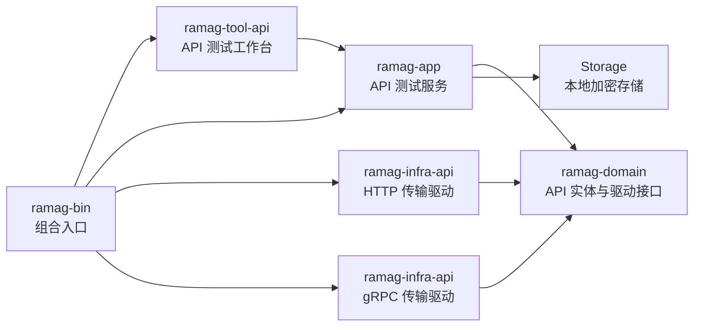

# API 测试工具开发计划

> 状态：`API-000` gRPC 动态 Unary 预研、`API-001` 领域模型与本地存储、`API-002` HTTP 执行链路已完成；下一项为 `API-003` gRPC Unary 执行链路。首个可交付版本必须同时支持 HTTP 和 gRPC Unary 接口测试。
>
> 适用范围：Ramag Platform 的 API 测试工作台、HTTP 请求、gRPC 请求、请求集合、环境变量、响应断言和本地测试服务验收。
>
> 参考界面：用户提供的 HTTPie 工作区截图，以及 Postman 的 Collection、Environment、Request、History 和 Tests 工作流。参考只用于提取交互模式，不复制产品品牌、资源或实现。

## 术语表与命名约定

| 规范中文名 | English / Acronym | 当前方案中的职责边界 | 不代表什么 |
|---|---|---|---|
| API 测试工具 | API Testing Tool | Ramag 中用于编辑、执行、保存和验证 HTTP/gRPC 请求的桌面工作台 | 不代表 API 网关、服务注册中心或远程部署工具 |
| HTTP 请求 | HTTP Request | 通过 HTTP/HTTPS 发送方法、URL、查询参数、Headers 和请求体 | 不代表 gRPC over HTTP/2 的调用 |
| gRPC 请求 | gRPC Request | 通过 gRPC 连接 Service/Method、Metadata 和 Protobuf 消息 | 不代表普通 HTTP JSON 请求 |
| API 测试服务 | API Test Service | `ramag-app` 中负责校验、变量解析、驱动调用、取消和结果编排的应用服务 | 不代表 HTTP 或 gRPC 客户端实现 |
| 请求记录 | Request Record | 用户保存的一个可重复执行的 HTTP 或 gRPC 请求配置 | 不代表一次已经执行的响应 |
| 请求集合 | Collection | 按目录组织多个请求记录，并为后续批量执行提供边界 | 不代表远程 API 的资源集合 |
| 工作区 | Workspace | 保存请求集合、环境和打开请求 Tab 的本地工作区域 | 不代表云端同步空间 |
| 环境 | Environment | 保存变量、变量值和敏感变量引用，供请求模板解析 | 不代表运行环境或部署环境本身 |
| 断言 | Assertion | 对状态、Headers、Metadata、正文字段和耗时进行声明式验证 | 不代表任意脚本执行器 |
| Descriptor | Protobuf Descriptor | 描述 gRPC Service、Method、字段和消息结构的数据 | 不代表 gRPC 服务实例 |
| Server Reflection | Server Reflection | 从 gRPC 服务发现可调用的 Service、Method 和 Descriptor | 不代表所有 gRPC 服务都必然启用的能力 |
| Metadata | gRPC Metadata | gRPC 请求 Headers、响应 Headers 和 Trailers 的协议元数据 | 不代表 Protobuf 消息字段 |
| 传输驱动 | Transport Driver | `ramag-domain` 定义、`ramag-infra-api` 实现的 HTTP/gRPC 协议适配接口 | 不代表 UI 视图或应用服务 |

正文首次出现使用“规范中文名（English / Acronym）”，后续使用规范中文名；协议名称始终保留 `HTTP`、`HTTPS`、`gRPC`、`Protobuf` 和 `TLS` 的标准大小写。

## 1. 目标与当前基线

### 1.1 目标

API 测试工具首个可交付版本完成以下闭环：

1. 用户可以创建、保存和执行 HTTP 请求。
2. 用户可以通过 `.proto` 文件或 Server Reflection 发现 gRPC Service/Method，并执行 Unary 请求。
3. 用户可以查看有界的响应正文、Headers/Metadata、状态和耗时。
4. 用户可以使用环境变量复用请求配置，并对响应执行声明式断言。
5. 用户可以在工作区中组织 Collection、Folder 和 Request，并查看执行历史。
6. HTTP 和 gRPC 都有真实本机 Docker 服务验证，不用静态测试数据或仅编译结果代替协议集成证据。

### 1.2 当前仓库基线

- `ramag-domain` 保存实体、错误和跨层接口，不依赖 GPUI 或具体协议客户端。
- `ramag-app` 负责编排用例、取消、上下文隔离和日志，不负责 UI 布局。
- `ramag-infra-*` 负责具体协议与外部服务适配。
- `ramag-tool-*` 负责工作台 UI，`ramag-bin` 负责内置工具装配和视图注册。
- Workspace 已直接使用 `reqwest`、`http`、Tokio 和 Rustls，可复用现有 HTTP 客户端基础设施。
- `ramag-infra-api` 已完成 gRPC 动态 Unary 预研，使用 `tonic`、`tonic-prost`、`prost` 和 `prost-reflect`；Reflection 客户端仍需在 `API-003` 中单独封装和验收。
- 本地 Storage 已保存 MQTT/Kafka 等配置，API 工作区需要新增专用实体和加密字段存储，不复用 MQTT 或 Kafka 配置结构。

## 2. 目标架构



拟新增或扩展的代码边界：

| 代码边界 | 主要职责 | 明确不负责 |
|---|---|---|
| `ramag-domain` | API 请求、响应、环境、Collection、断言、限制、错误和驱动接口 | 不创建 GPUI 控件，不调用 `reqwest`/`tonic` |
| `ramag-app` | 校验、变量解析、请求代次、取消、驱动调用、结果脱敏和 Storage 编排 | 不决定页面布局，不拼接协议客户端对象 |
| `ramag-infra-api` | `HttpApiDriver`、`GrpcApiDriver`、TLS、Descriptor 和动态消息适配 | 不保存 UI 状态，不直接读取 GPUI 输入状态 |
| `ramag-tool-api` | 工作区、请求编辑器、响应面板、历史和断言结果展示 | 不直接依赖 `reqwest`、`tonic` 或 Protobuf 客户端类型 |
| `ramag-bin` | 创建服务与驱动、注册 `ApiTool`、注册 API 视图和关闭生命周期 | 不包含 API 请求业务规则 |
| `ramag-infra-storage` | 保存工作区、Collection、请求、环境和加密敏感字段 | 不保存执行响应正文和无界历史 |

## 3. 首期范围

### 3.0 API-000 预研记录（2026-09-19）

`API-000` 已在 `ramag-infra-api` 中完成最小动态 gRPC 调用样例，当前依赖版本由 Cargo.lock 固定：

- `tonic` `0.14.6`：低层 `Grpc::unary` 和 `Channel`。
- `tonic-prost` `0.14.6`：Protobuf Codec。
- `prost` `0.14.4`：消息编码与解码。
- `prost-reflect` `0.16.5`：DescriptorPool、MessageDescriptor 和 DynamicMessage。
- `tonic-prost-build` `0.14.6`：从 `.proto` 生成测试服务和 DescriptorSet。

预研代码通过一份 `api.spike.Echo` `.proto` 生成 DescriptorSet，在测试中完成以下真实协议路径：

1. 读取 DescriptorSet 并找到请求/响应 MessageDescriptor。
2. 用 `DynamicMessage` 构造请求消息，不生成业务专用 Rust 消息类型。
3. 通过 `tonic::client::Grpc` 创建 HTTP/2 gRPC Unary 请求。
4. 使用自定义动态 Codec 编码请求并按响应 Descriptor 解码响应。
5. 保留请求 Metadata，并在发送前校验完整方法路径必须以 `/` 开始。

`ramag-infra-api` 的 2 项预研测试通过：动态 Descriptor Unary 调用和方法路径校验。该测试使用进程内的最小 gRPC 服务验证 Codec/调用链，不替代后续本机 Docker 服务集成测试。`tonic-reflection` 当前主要提供服务端实现，虽包含生成的 Reflection 客户端消息和客户端类型，仍需在 `API-003` 中验证服务发现、FileDescriptor 拉取、依赖文件合并和错误恢复。

### 3.1 API-001 领域模型、限制和本地存储记录（2026-09-19）

`API-001` 已完成并通过领域层与本地 Storage 验收：

- `ramag-domain` 新增 `ApiWorkspace`、`ApiCollection`、`ApiRequestRecord`、`ApiEnvironment`、声明式 `ApiAssertion`、HTTP/gRPC 请求规格和有界 `ApiResponseSnapshot`。
- HTTP 请求覆盖 Method、URL 模板、Query、Headers、Basic/Bearer/API Key、正文和超时；gRPC 请求覆盖 Endpoint、Service、Method、Metadata、Reflection/FileDescriptorSet 和 TLS 路径。
- 领域层统一校验名称、协议字段、参数数量和值长度、请求/响应正文、Descriptor 大小、断言数量、超时、ID 唯一性和 Environment 引用；响应正文提供有界裁剪并保留原始大小。
- `ApiDriver` 只定义应用层需要的协议执行接口，不依赖 `reqwest`、`tonic` 或 UI；取消标记和变量映射由调用方传入。
- `ramag-infra-storage` 新增加密 `api_workspaces` redb 表和 CRUD；读取、写入、列表数量与总字节预算均重复校验，工作区中的 Token、密码、请求正文不以明文落盘，响应快照不持久化。
- 新字段使用 serde 默认值保持旧请求 JSON 可读取；专项测试覆盖校验、脱敏 Debug、正文限制、旧 JSON 兼容、加密往返和删除。

本切片验证结果：`ramag-domain` 198 项通过，`ramag-infra-storage` 76 项通过、3 项既有性能测试忽略；workspace Clippy、`ramag-bin` 构建和格式检查通过。未在本切片宣称 HTTP/gRPC Docker 集成或 UI 完成。

### 3.2 HTTP 请求

- 方法：`GET`、`POST`、`PUT`、`PATCH`、`DELETE`、`HEAD`、`OPTIONS`。
- URL、Query 参数、Headers。
- JSON、纯文本和 `application/x-www-form-urlencoded` 请求体。
- Bearer Token、Basic Auth、API Key。
- HTTP/HTTPS、TLS 校验、超时和取消。
- 状态码、响应 Headers、正文、响应大小和耗时。
- JSON 格式化、纯文本查看和正文大小限制。
- 状态码、Header、Body 包含文本、JSON 字段和耗时断言。

#### API-002 代码切片记录（2026-09-19）

`HttpApiDriver` 已在 `ramag-infra-api` 实现：

- 使用 `reqwest` 异步构造 HTTP/HTTPS 请求，支持 URL 模板、Query、Headers、请求体、Basic/Bearer/API Key 和每请求超时。
- 按 `ApiTlsConfig` 加载 CA、客户端证书/密钥或关闭证书校验，并在基础设施边界初始化 Rustls Crypto Provider。
- 保留 HTTP 状态码和响应 Headers；响应正文最多缓存 8 MiB，记录原始大小和 `truncated` 状态，不把非 2xx 响应误判为传输错误。
- 发送阶段和响应流读取阶段均监听 `ApiCancellation`；传输错误只返回安全错误文本，不复制 URL、Headers 或响应正文中的凭据。
- `ramag-infra-api` 的本地 TCP HTTP 验收测试覆盖成功/非 2xx、变量、Query、Headers、三类认证、请求体、正文截断、超时、取消和 TLS 配置错误，共 8 项通过。

本代码切片记录只证明驱动边界和本地协议行为，不能用本地 TCP 测试替代 Docker 集成、API 工作台 UI 验收或真实 Windows 窗口截图；Docker 集成证据见下节。

#### API-002 本机 Docker 集成记录（2026-09-19）

- `scripts/api-test/compose.yaml` 构建 `ramag-api-http-test:python-3.12.11-alpine-3.22`，基础镜像解析为 `python:3.12.11-alpine3.22`，容器通过 `127.0.0.1:18089` 暴露 HTTP 端点。
- `scripts/api-test/api-test.ps1 test` 启动容器并等待 healthcheck 变为 `healthy`；`cargo test --locked -p ramag-infra-api --test docker_http` 通过 1 项，实际覆盖 JSON、响应 Headers、变量/Query/请求体、Basic 认证、401、418、延迟超时和流式取消。
- 测试完成后执行 `scripts/api-test/api-test.ps1 down`，容器 `ramag-api-http-test` 和网络 `ramag-api-http-test` 均已清理；现有 Mosquitto、Kafka 和数据库测试服务未被修改。

这组测试证明 HTTP 驱动到本机 Docker 服务的真实协议链路；TLS 双向证书和 API UI 仍按路线图单独验收。

### 3.3 gRPC 请求

- 明文和 TLS 连接。
- `.proto` 文件导入。
- Server Reflection 服务发现。
- Service/Method 选择。
- 动态 Protobuf 消息编辑和 Unary 调用。
- 请求 Metadata、响应 Metadata、Trailers、Status 和耗时。
- gRPC 状态码、Metadata、消息字段和耗时断言。

### 3.4 公共能力

- Workspace、Collection、Folder、Request 的新增、保存、编辑、复制和删除。
- 请求 Tab 和最近执行历史。
- `{{variable}}` 变量替换。
- 环境变量的普通值与敏感值分离存储。
- 加载、执行、成功、失败、取消、超时和变量缺失状态。
- 配置变更或切换请求后，旧请求的迟到结果不得污染当前页面。

## 4. 首期非目标

- gRPC Client/Server/Bidirectional Streaming 不阻塞首个双协议版本，单独排期到 `API-007`。
- 不执行任意 JavaScript 或 Lua 脚本；首期只提供声明式断言。
- 不实现云端同步、团队协作和远程 Collection 服务。
- 不通过 Shell、`curl` 或外部命令执行请求，避免命令拼接和凭据泄露。
- 不把 WebSocket、SSE、GraphQL 和 SOAP 混入首期 HTTP/gRPC 范围。
- 不默认关闭 TLS 校验，不把密码或 Token 写入 URL、日志、截图和普通导出文件。

## 5. UI 交互方案

界面沿用 Ramag 的原生 GPUI 工作台和深色主题，吸收附图中的工作区、请求 Tab 和请求列表结构：

1. Activity Bar 增加 API 测试工具入口。
2. 左侧显示 Workspace、Collection、Folder 和 Request；请求行显示协议标记和名称。
3. 顶部显示打开的 Request Tab，Tab 切换不丢失编辑状态。
4. 请求区根据协议切换编辑器：HTTP 显示 Method/URL/Params/Headers/Auth/Body，gRPC 显示 Endpoint/Service/Method/Metadata/Message。
5. `发送`、`取消`、`保存` 操作保持固定尺寸，状态文字允许收缩和换行。
6. 响应区提供 Body、Headers/Metadata、Timing、Assertions 页签。
7. gRPC 发现失败、Descriptor 缺失、变量缺失和协议错误必须显示具体原因。
8. 360px 和 640px 窗口使用纵向请求/响应布局；1024px 以上允许左右或上下分栏。

## 6. 数据模型与资源限制

拟定义以下领域模型，具体字段在 `API-001` 技术设计中冻结：

```text
ApiProtocol          = Http | Grpc
ApiWorkspace         = id, name, collections, environments
ApiCollection        = id, workspace_id, name, folders, requests
ApiRequestRecord     = id, protocol, name, request_spec, assertions
HttpRequestSpec      = method, url_template, query, headers, auth, body, timeout
GrpcRequestSpec      = endpoint_template, service, method, descriptor, metadata, body, tls
ApiEnvironment       = name, variables, sensitive_variable_refs
ApiAssertion         = status/header/metadata/body/json-path/latency rule
ApiResponseSnapshot   = status, headers, metadata, body, timing, size, truncated
```

所有大小和数量限制必须在领域层校验，至少包括：

- 请求正文大小上限。
- 响应正文大小上限。
- Header/Metadata 数量和单值长度上限。
- JSON/Protobuf 消息深度和字段数量上限。
- Collection、Request、Environment 和 History 数量上限。
- 执行超时、取消传播和有界响应缓存。

响应历史只保存有界摘要；默认不持久化完整响应正文和敏感 Metadata。

## 7. 分阶段开发任务

| ID | 任务 | 依赖 | 主要输出 | 验收条件 |
|---|---|---|---|---|
| `API-000` | gRPC 动态调用技术预研与设计冻结 | `PLAT-003` | 设计文档、能力矩阵、最小 gRPC 调用样例 | `tonic + prost-reflect` 可完成 Reflection 或 `.proto` 导入后的 Unary 调用 |
| `API-001` | 领域模型、限制和本地存储 | `API-000` | API 实体、驱动接口、Storage 扩展、脱敏规则 | 领域与 Storage 测试覆盖校验、兼容和敏感字段 |
| `API-002` | HTTP 执行链路 | `API-001` | `HttpApiDriver`、请求构造、响应解析、取消和超时 | Docker HTTP 服务覆盖成功、错误、Headers、JSON、认证、超时和取消 |
| `API-003` | gRPC Unary 执行链路 | `API-001`、`API-000` | `GrpcApiDriver`、Descriptor、Reflection、动态消息和 TLS | Docker gRPC 服务覆盖 Unary、Metadata、错误 Status、Reflection 和取消 |
| `API-004` | API 工作台 UI | `API-002`、`API-003` | `ramag-tool-api`、工具注册、请求/响应页面 | HTTP/gRPC 都能从 UI 发起真实驱动调用，360/640/1024/1440 布局通过 |
| `API-005` | 断言、环境变量和历史 | `API-004` | 声明式断言、变量解析、执行历史和结果摘要 | 成功、失败、取消、变量缺失、敏感值脱敏均有测试 |
| `API-006` | Collection 运行和格式兼容 | `API-005` | 批量运行、Ramag JSON、Postman Collection v2.1、OpenAPI 3 导入 | 导入请求可执行，坏数据定位到具体请求和字段 |
| `API-007` | 高级传输能力 | `API-003`、`API-005` | gRPC 流式调用、Multipart、mTLS、代理、OAuth2 和响应变量提取 | 每项能力都有独立协议测试、资源限制和失败恢复证据 |

同一时间只推进一个 `API-*` 交付切片；每个独立切片完成测试后使用一个 Conventional Commit，并立即推送当前 `dev` 分支。

## 8. 测试与验收证据

### 8.1 单元与应用层测试

- Domain：URL、Method、Header、Metadata、变量、断言和资源限制。
- App：请求代次、取消、迟到结果隔离、Storage 编排、错误分类和日志脱敏。
- gRPC：Descriptor 解析、字段映射、默认值和动态消息限制。
- UI：请求编辑、协议切换、保存、发送、取消、断言结果和窄窗口布局。

### 8.2 本机 Docker 集成测试

- HTTP 测试服务使用固定镜像、固定版本和 `127.0.0.1` 绑定端口，提供 JSON、Headers、延迟、错误码和认证场景。
- gRPC 测试服务使用固定镜像或仓库内可复现的测试服务容器，提供 Reflection、Unary、Metadata、错误 Status 和 TLS 场景。
- 测试记录服务名、镜像/版本、宿主端口、启动状态和清理状态。
- 不使用远程服务、静态响应或 Mock 结果宣称协议集成通过。

### 8.3 UI 证据

- 优先使用真实 Windows 窗口完成 HTTP/gRPC 发送、响应展示、请求切换和错误恢复截图。
- Computer Use 不可用时，使用 GPUI headless 渲染和交互测试，并明确记录真实窗口限制。
- 截图只证明可见界面状态；协议行为必须由应用层和本机 Docker 集成测试证明。

### 8.4 提交前检查

```text
cargo fmt --all -- --check
cargo test --locked -p ramag-domain
cargo test --locked -p ramag-app
cargo test --locked -p ramag-infra-api --all-targets
cargo test --locked -p ramag-tool-api --lib
cargo clippy --workspace --all-targets -- -D warnings
cargo build --locked -p ramag-bin
scripts/check-source-size.sh  # Windows uses scripts/windows/check-source-size.ps1
git diff --check
```

`.githooks/pre-commit` 已在格式和 Clippy 检查前执行全量 Rust 源码行数检查，并再次检查已暂存 Rust 文件；新文件或修改后的文件超过 600 行时直接拒绝提交。Windows 使用等价的 PowerShell 检查脚本，历史基线文件由 `scripts/source-size-baseline.txt` 明确列出。

新增或修改 Rust 文件后，必须以最终待提交内容重新执行格式、源码行数检查和 workspace Clippy；任一检查失败都不能提交或推送。

## 9. 交付顺序

建议提交顺序如下：

1. `docs: define api testing tool design`
2. `feat: add api domain models and storage`
3. `feat: add http api execution`
4. `feat: add grpc unary execution`
5. `feat: add api testing workspace`
6. `feat: add api assertions and environments`
7. `feat: add api collection runner`

首个双协议版本的完成条件是：`API-000` 至 `API-005` 均完成，HTTP 和 gRPC Unary 都有真实 Docker 服务证据，UI headless 验收通过，并完成至少一组真实 Windows 窗口截图；不能用只完成 HTTP 的结果宣称 API 测试工具完成。

## 10. 当前未完成项

- `API-001` 和 `API-002` 已完成；HTTP 驱动的本地 TCP 与本机 Docker 集成验收均已记录。
- 尚未完成 Reflection 客户端、FileDescriptor 依赖合并和 gRPC 服务目录读取。
- 尚未创建 gRPC Docker 测试服务。
- 尚未实现 `ramag-tool-api`、应用服务和 `ramag-bin` API 工具注册。
- 尚未运行 gRPC API Docker 集成测试或 API UI 截图验收；当前已有领域、Storage、HTTP 本地 TCP 和 HTTP Docker 专项测试。

下一项推进 `API-003`：实现 gRPC Unary 驱动、Descriptor/Reflection/TLS 处理，并使用本机 Docker gRPC 服务形成真实协议证据。
