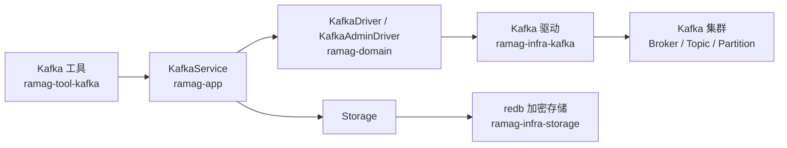

# Kafka 消息管理工具独立开发计划

> 状态：阶段 15 的配置加载、异步状态、断线恢复、Windows 原生验收和最终质量检查已完成；当前推进 UI-004 的紧凑主题工作区切片
> 更新日期：2026-09-04
> 计划性质：独立开发计划，不并入数据库 DataGrip-like 路线图或其他工具的功能排期
> 适用范围：`ramag-domain`、`ramag-app`、`ramag-infra-kafka`、`ramag-infra-storage`、`ramag-tool-kafka`、`ramag-ui` 和 `ramag-bin`
> 当前基线：`dev`（阶段 1-10 已完成）
> 实施分支：`dev`
> 当前主线：大功能基线完成后，UI、响应性布局和已知问题按 [`docs/development-roadmap.md`](development-roadmap.md) 排期

## 术语表与命名约定

| 规范名称 | English / Acronym | 在本路线图中的职责边界 | 不代表什么 |
|---|---|---|---|
| Kafka 集群 | Kafka Cluster | 由多个 Broker 组成、通过 Kafka 协议提供消息服务的整体 | 不代表 Ramag 中保存的一条连接配置 |
| Broker | Broker | Kafka 集群中的服务节点，负责保存分区并提供请求处理 | 不代表客户端进程或 Topic |
| 主题 | Topic | 消息的逻辑分类和日志名称 | 不代表数据库表或消费者组 |
| 分区 | Partition | Topic 内独立且有序的消息日志 | 不代表跨分区的全局顺序 |
| Offset | Offset | 消息在单个 Partition 内的递增位置 | 不代表跨集群唯一的消息 ID |
| 消息 | Message | 包含 Key、Value、Headers、Timestamp、Partition 和 Offset 的 Kafka 记录 | 不代表 Ramag 应持久化的业务数据 |
| 消费者组 | Consumer Group | Kafka 维护的消费成员和已提交 Offset 集合 | 不代表权限组或 UI 用户组 |
| Kafka ACL | Kafka ACL | 由 Kafka Broker 执行的 Principal、Resource、Operation 和 Permission 规则 | 不代表 AKHQ 或 Ramag 的 UI 角色权限 |
| 消息搜索 | Message Search | Ramag 在明确范围内读取消息并在客户端过滤 | 不代表 Kafka 原生提供的任意消息索引查询 |
| 集群配置 | Cluster Configuration | 通过 Kafka Admin API 读取或修改的动态 Broker/Topic 配置 | 不代表修改服务器启动文件 `server.properties` |
| Bootstrap Server | Bootstrap Server | 连接初始化时使用的 Broker 地址集合 | 不代表集群完整 Broker 列表 |
| Schema Registry | Schema Registry | 可选的外部 Schema 服务，用于解析 Avro、Protobuf 或 JSON Schema | 不代表 Kafka Broker 本身 |

命名约定：领域类型使用 `KafkaClusterConfig`、`KafkaBroker`、`KafkaTopic`、`KafkaPartition`、`KafkaMessageRecord`、`KafkaConsumerGroup` 和 `KafkaAcl`；连接标识使用 `KafkaClusterId`。只读能力和管理能力分别使用 `KafkaDriver` 与 `KafkaAdminDriver`，避免一个接口承载所有高风险操作。UI 内使用上表中的规范中文名，代码和日志使用稳定的 English 类型名及操作名。

## 1. 背景与目标

Offset Explorer 的交互重点是通过对象树进入 Broker、Topic、Partition 和 Consumer，并按 Offset 或时间查看消息；其消息搜索还覆盖 Key、Value、Headers 和多种数据格式。[Offset Explorer Features](https://www.kafkatool.com/features.html)

AKHQ 将 Topic、Topic 数据、消费者组、Schema Registry 和 Kafka Connect 放在同一个 Kafka 工作区中；其集群配置使用 Bootstrap Server 和 Kafka 客户端属性描述连接。[AKHQ README](https://github.com/tchiotludo/akhq#readme) [AKHQ 集群配置](https://akhq.io/docs/configuration/brokers.html)

本工具的第一目标不是复制某个产品的全部页面，而是为开发者和运维人员提供以下闭环：

```text
选择 Kafka 集群
    -> 浏览 Broker、Topic 和 Partition
    -> 按 Offset 或时间读取消息
    -> 在有限范围内搜索 Key、Value 和 Headers
    -> 查看原始消息和结构化内容
    -> 在确认后管理 Topic、动态配置和 Kafka ACL
```

核心交付范围：

1. 查看和搜索 Kafka 消息。
2. 浏览 Kafka 集群、Broker、Topic 和 Partition 状态。
3. 创建、删除和扩容 Topic，并读取或修改支持动态变更的配置。
4. 查看、创建和删除 Kafka ACL。
5. 保存多个集群配置，支持常用 TLS 和 SASL 连接方式。

首期不包含 Schema Registry、Kafka Connect、ksqlDB、消息生成器和批量导入；这些能力保留为后续独立迭代，避免核心消息查看流程被外部服务耦合。

## 2. 当前 Ramag 基线

Ramag 已经采用清晰的分层结构：

- `ramag-domain` 定义实体和跨层 trait，不依赖 GPUI、redb 或具体客户端实现。
- `ramag-app` 编排 Domain trait，当前已有 `ConnectionService`、`RedisService`、`MongoService` 等应用服务。
- `ramag-infra-*` 封装具体协议驱动和 runtime。
- `ramag-tool-*` 提供独立工具 UI。
- `ramag-ui` 的 `ActivityBar` 从 `ToolRegistry` 读取工具入口，`Shell` 通过 `register_tool_view` 挂载工具页面。
- `ramag-infra-storage` 使用 redb 和加密层保存连接、偏好及其他工作区数据。

### 2.1 与其他开发计划的关系

本路线图只负责 Kafka 消息管理工具。它与 [`docs/database-client-datagrip-roadmap.md`](database-client-datagrip-roadmap.md) 以及其他工具的路线图互不构成阶段依赖：

跨工具的 UI 和已知问题修复不再在本文件中另起一套排期，统一遵循 [`docs/development-roadmap.md`](development-roadmap.md)。

- Kafka 功能可以独立排期、开发、测试、提交、推送和回滚。
- Kafka 的功能完成情况不以数据库客户端、VCS、SSH 或其他工具的未完成项为前置条件。
- 数据库客户端或其他工具的后续改动不得被顺带放入 Kafka 提交；Kafka 实现也不得为了复用而改变既有工具的业务语义。
- 如果需要修改 `ramag-domain`、`ramag-app`、`ramag-ui` 或 `ramag-infra-storage` 的共享能力，必须在 Kafka 计划中单独列出，并保持一个小功能一次提交。
- Kafka 的发布说明、集成测试、UI 截图和故障记录单独维护，不与数据库路线图合并统计。

实现开始时建议建立 `codex/feat/kafka-tool`，以当前开发主线为代码基准；该分支只承载 Kafka 工具及其必要的共享层改动。每个小功能先完成验证，再提交并推送，然后继续下一项；不把整个 Kafka 计划压缩成一个长期积累的大提交。

### 2.2 允许共享的基础设施

独立开发不等于复制通用代码。Kafka 可以复用以下稳定边界：

- `ToolRegistry`、`ActivityBar`、`Shell` 和 GPUI 主题等工具接入机制。
- `Storage` 的 redb 事务、加密和偏好持久化能力，但 Kafka 配置使用独立实体和独立存储表。
- 应用层的后台任务、取消、日志和错误展示约定，但 Kafka 的任务状态与数据库查询状态分别维护。
- 通用的确认弹窗、有限列表、虚拟渲染和测试辅助工具，但不把数据库结果表直接当作 Kafka 消息模型。

这些共享点只表示技术接入位置，不改变 Kafka 计划的独立验收条件和提交顺序。

相关入口：

- [`crates/ramag-domain/src/traits/tool.rs`](../crates/ramag-domain/src/traits/tool.rs)
- [`crates/ramag-ui/src/activity_bar.rs`](../crates/ramag-ui/src/activity_bar.rs)
- [`crates/ramag-ui/src/shell.rs`](../crates/ramag-ui/src/shell.rs)
- [`crates/ramag-bin/src/composition.rs`](../crates/ramag-bin/src/composition.rs)
- [`crates/ramag-domain/src/traits/storage.rs`](../crates/ramag-domain/src/traits/storage.rs)
- [`crates/ramag-infra-storage/src/lib.rs`](../crates/ramag-infra-storage/src/lib.rs)

Kafka 不应加入现有 `DriverKind` 或复用数据库的 `ConnectionConfig`。数据库连接以 Schema、SQL、事务和数据库连接池为中心，Kafka 连接则需要 Bootstrap Server、SASL/TLS、消息读取策略和 Admin API 权限；强行合并会让现有数据库表单和 Domain trait 出现大量无意义的 `NotImplemented`。

## 3. 分层设计



### 3.1 `ramag-domain`

新增 `entities/kafka.rs`，至少包含：

- `KafkaClusterId` 和 `KafkaClusterConfig`。
- `KafkaSecurityProtocol`、`KafkaSaslMechanism`、TLS 配置和只读状态。
- `KafkaClusterMetadata`、`KafkaBroker`、`KafkaTopic`、`KafkaPartition`。
- `KafkaMessageRecord`，保留原始字节，并提供有限大小的文本预览。
- `KafkaMessageQuery` 和 `KafkaMessageSearchQuery`。
- `KafkaConsumerGroup`、`KafkaConsumerMember`、`KafkaAcl`。
- 集群、Topic、消息、ACL 的数量、字节数、名称和过滤条件上限。

新增 `traits/kafka_driver.rs`：

- `KafkaDriver`：连接测试、集群元数据、Broker/Topic/Partition 查询、消息读取、有限范围搜索和消费者组只读查询。
- `KafkaAdminDriver`：Topic 生命周期、Partition 扩容、Topic/Broker 动态配置和 Kafka ACL 查询/变更。

两个 trait 可以由同一个基础设施对象实现，但应用层和 UI 层按只读与管理能力分开注入。管理接口必须返回结构化错误，至少区分认证失败、TLS 失败、超时、权限不足、配置不支持、资源不存在和请求被取消。

### 3.2 `ramag-infra-kafka`

优先验证并采用 `rdkafka`，由它封装 `librdkafka`，避免手工实现 Kafka 协议。该库已经提供消费者、生产者、Topic 管理、Broker/Topic 配置、集群元数据和消费者组等能力。[rdkafka 文档](https://docs.rs/rdkafka/latest/rdkafka/)

基础设施层负责：

- 将 `KafkaClusterConfig` 转换为客户端属性，并拒绝未经过校验的任意属性注入。
- 独立创建 Admin Client 和消息读取 Consumer。
- 将 `librdkafka` 错误映射为 `DomainError` 的 Kafka 专用错误信息。
- 设置连接、元数据、消息读取和管理请求的超时。
- 处理 Windows、macOS 和 Linux 的 `librdkafka` 构建依赖；先完成 CMake/static linking 的依赖 spike，再决定是否支持 dynamic linking。

消息读取使用手动分配 Partition 的独立 Consumer：

- 不复用用户业务 Consumer Group。
- `enable.auto.commit=false`。
- 浏览消息不提交 Offset，不改变已有消费者组进度。
- 搜索任务使用独立任务状态、取消句柄和并发上限。

### 3.3 `ramag-app`

新增 `KafkaService`，负责：

- 集群配置的加载、保存、删除和连接测试。
- 统一编排元数据刷新、消息读取和搜索任务。
- 将搜索范围限制、取消和进度状态传给基础设施层。
- 在管理操作前执行只读状态和输入校验。
- 记录操作名称、集群 ID、Topic、Partition、耗时和结果数量，但不记录密码、客户端密钥或消息正文。

### 3.4 本地存储

在 `Storage` 增加 Kafka 集群配置的默认兼容接口，并由 `RedbStorage` 增加独立表：

- 集群名称、Bootstrap Server、TLS/SASL 选项和 UI 备注持久化。
- 密码等敏感字段沿用 redb 加密层。
- 证书和密钥优先保存受校验的本地路径；不把证书正文写入日志。
- 当前选中集群、展开节点和消息筛选条件作为偏好保存，不保存消息正文。
- 增加旧数据库打开时的 schema 补齐和存储 round-trip 测试。

第一版不提供任意 Kafka 属性 Map 编辑器。高级属性需要经过 allowlist、长度限制和敏感字段脱敏后再单独设计。

## 4. UI 设计

### 4.1 Activity Bar 入口

在 `ActivityBar` 增加“Kafka”工具入口和稳定图标，在 `ramag-bin` 注册 `KafkaTool`、Kafka driver、`KafkaService` 和 `KafkaWorkspaceView`。工具未配置集群时显示空状态，不显示假的 Broker 或 Topic 数据。

### 4.2 Kafka 工作区

- 顶部：集群选择、连接状态、连接测试、刷新和添加集群。
- 左侧对象树：概览、Brokers、Topics、Consumer Groups、ACL、集群配置。
- 主区域：根据选中的对象显示详情、消息表或管理表单。
- Topic 详情使用消息、分区和配置三个主视图。
- 管理操作使用统一确认弹窗，并显示目标集群、Topic、Partition 或 ACL 的变更前后内容。

消息查看器必须使用虚拟列表或等价的有界渲染模型，不能把搜索到的全部消息一次性复制到 GPUI 状态中。消息表至少显示 Partition、Offset、Timestamp、Key、Value 摘要和 Headers 数量；详情区按需显示完整的有限预览。

## 5. 产品边界与安全原则

### 5.1 消息查看和搜索

Kafka 不为任意消息正文提供服务器端索引，因此消息搜索必须明确标记为客户端扫描：

- 搜索前必须指定 Topic、Partition 范围、Offset 或时间范围。
- 默认读取有限数量的消息，并显示预计扫描范围和当前进度。
- 同时限制最大记录数、最大字节数、最大耗时和并发 Partition 数。
- 支持取消；取消后不再接受旧任务返回结果。
- 文本搜索区分 Key、Value 和 Headers；正则表达式作为后续能力，不在首版默认开放。
- 搜索结果只保留必要字段和有限预览，原始字节通过明确动作查看或导出。

### 5.2 集群配置

Kafka Admin API 可以读取集群和 Topic 配置，也可以修改部分动态配置。第一版只允许：

- 展示配置来源、当前值、默认值和是否可动态修改。
- 通过 `IncrementalAlterConfigs` 修改明确支持动态变更的配置。
- 对只读、静态或当前 Broker 不支持的配置直接拒绝，不尝试修改 `server.properties`。
- 修改前显示资源类型、资源名称、配置键、旧值和新值。

### 5.3 Kafka ACL

ACL 页面管理的是 Kafka Broker 的授权规则，不实现 AKHQ 文档中面向 UI 用户的 Groups/Roles 机制。AKHQ 的 Groups 页面将 UI 角色映射到资源和动作，这与 Kafka ACL 的执行位置不同。[AKHQ Groups](https://akhq.io/docs/configuration/authentifications/groups.html)

Kafka ACL 首期支持：

- 按 Principal、Host、Resource Type、Resource Name、Pattern、Operation 和 Permission 查询。
- 创建前显示完整规则预览，并要求二次确认。
- 删除前显示精确匹配条件，禁止用空条件执行批量删除。
- 当前用户没有 `DescribeAcls`、`CreateAcls` 或 `DeleteAcls` 权限时，显示 Broker 返回的权限错误，不伪造成功状态。

## 6. 分阶段开发计划

每一行代表一个可独立评审的小功能。上一项完成、验证、提交和推送后，才能进入下一项。

| 顺序 | 建议提交信息 | 交付内容 | 主要验收证据 |
|---:|---|---|---|
| 1 | `feat(kafka): add cluster domain model and validation` | 集群、Broker、Topic、消息、ACL 模型和输入边界 | Domain 单元测试通过 |
| 2 | `feat(storage): persist kafka cluster profiles` | redb 集群配置表、加密字段和迁移兼容 | 存储 round-trip、重开数据库测试 |
| 3 | `chore(kafka): verify rdkafka integration baseline` | 新增 `ramag-infra-kafka`，完成跨平台依赖和连接测试 | 最小客户端编译、连接失败错误映射测试 |
| 4 | `test(kafka): add docker integration environment` | KRaft Kafka 容器、固定测试数据和启动/停止脚本 | Docker 健康检查、消息 fixture 可复用 |
| 5 | `feat(kafka): add sidebar tool shell` | Activity Bar 入口、工具注册、空状态和工作区骨架 | GPUI headless 渲染测试、真实窗口入口截图 |
| 6 | `feat(kafka): show cluster overview and brokers` | 集群 ID、Controller、Broker 地址、版本和状态 | Docker 集群元数据集成测试 |
| 7 | `feat(kafka): browse topics and partitions` | Topic 搜索、Partition、Replica、ISR 和首尾 Offset | Topic/Partition 集成测试 |
| 8 | `feat(kafka): read messages by partition offset` | 按 Offset/时间读取 Key、Value、Headers 和 Metadata | 多 Partition 消息读取测试，确认不提交消费进度 |
| 9 | `feat(kafka): search messages with bounded scan` | 范围搜索、进度、取消、字节和记录数限制 | 命中、未命中、超限和取消测试 |
| 10 | `feat(kafka): inspect and export message details` | UTF-8、JSON、Hex、Base64 和原始消息导出 | 编码边界、超长消息和导出文件测试 |
| 11 | `feat(kafka): manage topics` | 创建、删除和增加 Partition | 管理操作确认、成功和权限失败测试 |
| 12 | `feat(kafka): manage topic and broker configs` | 配置读取、动态配置修改和不支持项提示 | 动态配置回读、静态配置拒绝测试 |
| 13 | `feat(kafka): inspect consumer groups` | 组、成员、分配 Partition、提交 Offset 和 Lag | 消费者组只读查询测试 |
| 14 | `feat(kafka): manage kafka acls` | ACL 查询、创建和精确删除 | 授权集群集成测试、权限失败测试 |
| 15 | `feat(kafka): harden desktop workflow` | 加载错误、断线恢复、刷新竞态、日志脱敏和 UI 细节 | Windows 真实窗口验收和完整质量检查 |

阶段 3 实施记录：

- `ramag-infra-kafka` 通过可选 workspace 依赖接入 `rdkafka`；默认构建不触发 native 构建，显式启用 `cmake-build` 后才使用 CMake 构建 `librdkafka`。
- `tls`/`kafka-tls` 和 `sasl`/`kafka-sasl` 是独立可选能力；TLS/SASL 配置在未启用对应构建能力时返回明确的不支持错误。
- `RdkafkaDriver` 在阻塞线程中创建 Admin Client 并拉取元数据，用于连接测试；连接测试不提交 Offset。
- 客户端属性仅由受支持的集群配置生成，固定关闭自动提交、自动 Offset 存储和 Topic 自动创建。
- 底层错误被映射为不包含凭据、密钥或消息正文的 Kafka 专用结构化错误；TLS/SASL 构建能力未启用时明确返回不支持原因。
- 阶段 3 的基础设施基线仍保留为独立可选 native 构建；阶段 5-10 在此边界上继续增加只读 Topic、Partition、消息和 UI 能力。

阶段 4 实施记录：

- `scripts/kafka-test/compose.yaml` 固定使用 `apache/kafka:4.0.0`，以单节点 KRaft 模式启动专用测试容器、网络和数据卷，并绑定 `127.0.0.1:19092`；健康检查通过后才允许后续操作。
- `scripts/kafka-test/kafka-test.ps1` 提供 `up`、`status`、`seed`、`test`、`down` 和 `clean`；测试会创建三分区 Topic，写入固定 fixture，从头读取并核对记录，再执行 Rust `rdkafka` 元数据连接测试。
- 2026-08-30 已在 Docker 中完成健康检查、fixture 写入/读取和 `docker_kafka_accepts_metadata_request` 集成测试；专用容器 `ramag-kafka-test` 保持运行以便复用。

阶段 5-10 实施记录：

- `ramag-tool-kafka` 已接入 Activity Bar、ToolRegistry 和主壳，未配置集群时展示空状态，不生成伪造 Broker、Topic 或消息。
- `KafkaService` 编排本地集群配置、连接测试、集群元数据、Topic/Partition 查询、Offset/时间范围读取和客户端搜索；返回快照在应用边界再次执行数量、字节和字段校验。
- `RdkafkaDriver` 使用手动分配的临时消费者组读取 Partition，关闭自动提交和自动 Offset 存储，不加入或推进用户业务消费者组；读取、搜索和时间范围转换均在有界后台任务中完成。
- Kafka 工作区提供集群配置、概览、Broker、Topic/Partition、消息表、Key/Value/Headers 详情、UTF-8/Hex/Base64 查看、JSON 导出和取消控制；Kafka 资源写操作与消息生产不在本阶段开放。
- 2026-08-30 GPUI headless 验收测试通过，覆盖真实数据状态渲染、消息页切换、读取控件和取消后的旧任务失效；本机 `ramag.exe` 使用 VS18 2026 直接 `cargo build` 构建并打开 `Ramag — Kafka` 窗口，原生截图确认消息筛选控件未越界。
- 2026-08-30 Docker 集成测试通过 2 项，覆盖生产 `RdkafkaDriver` 的元数据、Topic/Partition 读取位置、Offset/时间读取、Value 搜索和记录数边界。
- 2026-08-30 Windows 截图复核发现侧栏“+”和空状态“新建集群”按钮点击后仍停留在欢迎页。现已修正草稿状态的配置页路由，并以 GPUI 点击回归测试覆盖两个入口；原生窗口已复验配置页入口和消息页筛选字段切换。

阶段 11-13 实施记录：

- Topic 管理已提供创建、删除和增加 Partition 的二次确认；配置页已支持 Topic/Broker 配置读取、动态配置修改以及只读和静态配置拒绝。
- `KafkaConsumerGroup` 快照包含组状态、协议、成员、分配 Partition、已提交 Offset、末尾 Offset 和 Lag。`KafkaService` 在应用边界重新校验组、成员和 Offset 的数量、唯一性与范围。
- `RdkafkaDriver` 使用独立查询客户端读取消费者组和提交 Offset，限制组、成员、Partition、分配载荷与 Offset 快照规模；损坏的 `ConsumerProtocolAssignment` 不会越界解析或写入凭据/消息正文。
- Kafka 工作区新增“消费者组”视图，提供组筛选、成员/分配/Offset 详情、ID 选择与复制、列表纵向滚动条，以及窄窗口下的上下布局；刷新、切换集群和迟到任务结果均按请求代次隔离。
- 2026-08-31 GPUI headless UI 验收覆盖消费者组列表、详情、复制、滚动条和 900px 窄窗口布局；Docker KRaft 集成测试 4 项通过，包含真实成员分配、提交 Offset 与 Lag。
- 2026-09-02 Windows 原生窗口验收显示真实消费者组、成员/分配、提交 Offset 与 Lag 详情，截图归档为 [`consumer-groups-windows.png`](screenshots/kafka/consumer-groups-windows.png)。

阶段 15 当前切片实施记录：

- 本地集群配置加载使用独立请求代次；加载失败会在 Kafka 侧栏保留错误原因，并提供明确的“重试”操作，不把失败伪装成空配置列表。
- 保存配置、测试连接和删除配置使用共享操作代次及当前集群上下文校验；切换集群、新建配置或删除后，迟到结果不会修改当前表单、选中配置或操作状态。
- 元数据刷新同时校验请求代次和当前集群上下文；新建草稿、切换集群和删除配置会使旧刷新失效，刷新按钮在配置操作期间禁用，避免并行任务覆盖状态。
- `ramag-tool-kafka` 新增代次与上下文组合测试；阶段 15 的原生窗口验收使用专用 Docker Kafka 容器，不写入真实业务数据。
- 消息、消费者组、ACL、配置和 Topic 请求遇到可重试的 Kafka 网络/超时错误时，会将连接失效原因提升到工作区状态；页面保留原操作错误，并通过元数据刷新恢复，不自动重放写操作。
- 2026-09-02 GPUI headless 回归测试覆盖断线状态提示、手动重试和成功恢复；Windows 原生窗口在停止专用 Broker 后显示同步失败、原操作错误和“重试”按钮，截图归档为 [`runtime-failure-windows.png`](screenshots/kafka/runtime-failure-windows.png)，恢复容器并点击重试后恢复概览数据，截图归档为 [`runtime-retry-windows.png`](screenshots/kafka/runtime-retry-windows.png)。`cargo fmt --all -- --check`、workspace Clippy、workspace 全量测试、`ramag-bin` 构建、源文件大小检查、`git diff --check` 和 Docker Kafka 集成测试均通过。

阶段 16 当前切片实施记录：

- `c01aaae` 补充消息页紧凑窗口可用性：窗口宽度小于 900px 时，消息页使用外层纵向滚动，结果面板保留 480px 最小高度，分页后滚动位置回到页首；不改变 Kafka 请求、消息读取或消费进度行为。
- 扩展 `kafka_message_table_and_detail_fit_three_window_widths` headless 测试，覆盖 360/800/1024/1440 窗口、800×500 低高度场景、窄窗口纵向滚动范围和结果区可见性；`cargo fmt --all -- --check`、`cargo test --locked --workspace`、workspace Clippy、Windows GNU Clippy、Windows GNU debug build、源码大小检查和 `git diff --check` 均通过。
- 原生可执行文件已启动并枚举到目标窗口，但 Computer Use helper 连续返回 `node_repl exec context not found`，未取得截图或控件状态证据；真实 Windows 窗口验收仍待补充。

阶段 17 当前切片实施记录：

- `a92ef05` 修复主题页紧凑布局：700px 以下标题和搜索框上下排列；列表与详情不再继承整高，按当前窗口高度分配稳定区域，外层页面滚动承载完整主题工作区；宽窗口继续保留左右分栏。
- 新增 `kafka_topics_reflow_header_and_split_at_supported_widths`，使用长 Topic 名称验证 360/900/1440 窗口下标题、搜索框、列表、详情、扩容、删除和浏览消息操作均留在父容器内，并确认紧凑窗口列表和详情上下排列。
- `cargo fmt --all -- --check`、`cargo check -p ramag-tool-kafka`、Windows GNU Clippy、Kafka crate 17 项测试、Windows 源文件大小检查和 `git diff --check` 均通过；真实 Windows 窗口截图和操作记录仍待补充。

后续独立路线：

Kafka 大功能扩展暂缓，先按主线完成 UI 和响应性问题收口。以下条目保留为 M6 评审后的候选，不代表当前开发顺序：

- `feat(kafka): add schema registry integration`
- `feat(kafka): add kafka connect integration`
- `feat(kafka): add consumer offset reset workflow`
- `feat(kafka): add message production workflow`
- `feat(kafka): add ksqldb integration`

## 7. 测试和验收条件

### 7.1 Domain、App 和 Infra

- 集群配置、Bootstrap Server、Topic 名称、Partition、搜索范围和 ACL 输入均有边界测试。
- 客户端属性映射测试不泄露密码、SASL 配置或密钥内容。
- 消息读取任务在刷新、切换集群、取消和连接失效后不会把旧结果写入新视图。
- 本地配置加载失败保留可见错误原因，并可在同一页面重试；重试只接受最后一次加载结果。
- 搜索只返回有界结果；达到限制时显示截断状态，不把截断误报为完整搜索。
- Admin API 失败时保留明确错误和目标资源，不显示成功通知。

### 7.2 Docker Kafka 集成测试

测试环境使用 KRaft Kafka，至少覆盖：

- 多 Broker 元数据和 Controller 识别。
- 多 Partition Topic 的首尾 Offset 和消息读取。
- Key、Value、Headers、Timestamp 和非 UTF-8 字节。
- 消息搜索命中、未命中、取消、最大记录数和最大字节数。
- Topic 创建、删除、扩容和动态配置修改后回读。
- 启用 Kafka Authorizer 的独立配置，覆盖 ACL 查询、创建、删除和权限不足。

Docker 测试不得使用开发者真实集群、真实账号或真实业务消息；测试脚本应提供 `up`、`test`、`status`、`down` 和清理专用数据的入口。

### 7.3 UI 验收

- Kafka 工具在 Activity Bar 中与已有工具对齐，集群为空、连接中、连接失败和已连接状态互不重叠。
- Topic 树、消息表、详情区和管理表单在 Windows 实际窗口中完成截图验证。
- 消费者组列表、成员分配和 Offset/Lag 详情在 headless UI 中完成布局与交互验收，并在真实 Windows 窗口中补充截图后才可关闭该项。
- 消息表大于视口时保持垂直滚动；宽消息字段和 Headers 能横向查看，不遮挡分页或状态栏。
- 切换集群、Topic、Partition 和搜索任务后，旧任务结果不会覆盖当前上下文。
- 管理操作的确认弹窗显示完整目标和变更内容，拒绝或失败后页面状态保持可恢复。

### 7.4 每个提交的发布前检查

每个小功能都必须在提交前执行与风险匹配的测试，并从 workspace 根目录通过：

```text
cargo fmt-check
cargo check-all
cargo clippy-all
cargo test-all
git diff --check
```

涉及源文件时还必须通过 `scripts/check-source-size.sh`；涉及 Kafka 集成时追加 Docker 测试。测试未通过、真实 UI 尚未验证或功能只完成一部分时，不提交和推送该功能。

## 8. 风险、取舍和停止条件

| 风险 | 影响 | 应对 |
|---|---|---|
| `librdkafka` 跨平台构建 | Windows、macOS 和 Linux 构建失败或包体积增加 | 先做依赖 spike；固定版本和构建方式，补充三平台编译检查 |
| Kafka 版本差异 | Admin API 或动态配置行为不同 | 先支持常用版本；读取能力和修改能力分别声明，失败时明确提示 |
| 高吞吐 Topic 扫描 | 搜索耗时、内存和网络流量不可控 | 强制范围、记录数、字节数、耗时和取消限制 |
| ACL 权限不足 | 操作失败或用户误以为规则已生效 | 使用 Broker 返回结果作为页面状态，成功后重新读取规则 |
| 管理操作误用 | 删除 Topic、配置或 ACL 造成生产事故 | 默认只读、显式管理操作、精确预览和二次确认 |
| 消息格式复杂 | JSON、二进制和 Schema 数据显示错误 | 首期保留原始字节，格式化失败时回退 Hex/Base64；Schema Registry 后置 |
| UI 大结果集 | GPUI 卡顿或状态占用过多内存 | 虚拟列表、分页、有限预览和后台任务代次隔离 |

进入下一阶段前必须满足：

1. 上一阶段的验收条件和测试命令全部通过。
2. 工作区只包含当前小功能，提交可以独立回滚和评审。
3. 不支持的 Kafka 版本、配置或权限会显示失败原因，不伪装成成功。
4. 涉及窗口布局的改动有真实 Windows UI 证据；无法执行时在提交说明中记录限制。

## 9. 结论

Kafka 工具应以 Offset Explorer 的消息定位和查看体验、AKHQ 的集群对象组织方式为交互参考，以 Kafka Admin API 和 `rdkafka` 为基础设施边界，以“只读核心优先、管理能力分开、每个小功能独立提交”为交付规则。

第一阶段完成后，Ramag 应能安全地连接多个 Kafka 集群，浏览 Broker、Topic 和 Partition，按范围查看和搜索消息，并在明确确认后逐步开放 Topic、动态配置和 Kafka ACL 管理。Schema Registry、Kafka Connect、ksqlDB、消息生产和 Offset 重置不进入首个大 PR。
