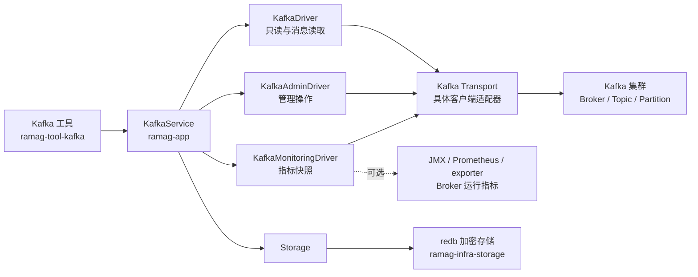
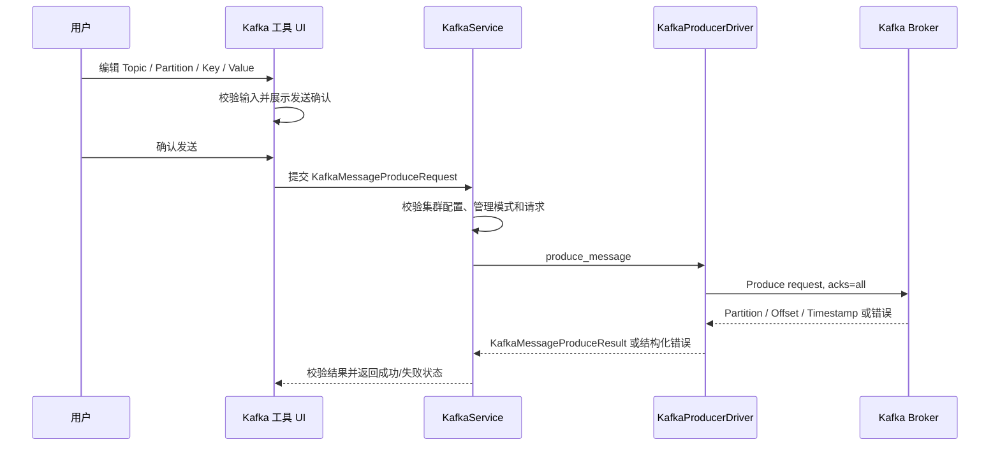

# Kafka 消息管理工具独立开发计划

> 状态：阶段 24 已完成列表重绘、Topic/Partition 与消费者组快照预算、刷新合并、消费者组/运行时元数据/ACL/配置/指标/连接测试读取取消和写请求 UI 生命周期隔离；阶段 25 单条消息生产工作流的领域、应用、基础设施和 UI 代码、GPUI headless 验收及本机 Docker KRaft 生产回读已完成；阶段 23 的本机 OpenMetrics HTTP fixture 已验证，真实 Kafka exporter、真实 Broker 运行指标端点和真实 Windows 截图仍待补充
> 更新日期：2026-09-11
> 计划性质：独立开发计划，不并入数据库 DataGrip-like 路线图或其他工具的功能排期
> 适用范围：`ramag-domain`、`ramag-app`、`ramag-infra-kafka`、`ramag-infra-storage`、`ramag-tool-kafka`、`ramag-ui` 和 `ramag-bin`
> 功能矩阵：[`kafka-workbench-feature-matrix.md`](kafka-workbench-feature-matrix.md)
> 当前基线：`dev`（阶段 18-25 的高规模列表、快照边界和单条消息生产切片已同步，明文 KRaft Docker 生产回读和 OpenMetrics HTTP fixture 已复核；写请求不主动取消，真实 Kafka exporter、真实 Broker 运行指标端点和真实 Windows 截图仍待补充）
> 实施分支：默认在 `dev` 开发；只保留并同步 `main` 和 `dev`，其他短期分支不作为长期开发入口
> 当前主线：阶段 25 单条消息生产工作流和 `KAFKA-023` 两个消息定位切片已完成，下一项继续建立并推进 AKHQ/Offset Explorer 功能矩阵；通用 UI 问题仍按 [`docs/development-roadmap.md`](development-roadmap.md) 排期

## 术语表与命名约定

| 规范名称 | English / Acronym | 在本路线图中的职责边界 | 不代表什么 |
|---|---|---|---|
| Kafka 集群 | Kafka Cluster | 由多个 Broker 组成、通过 Kafka 协议提供消息服务的整体 | 不代表 Ramag 中保存的一条连接配置 |
| Broker | Broker | Kafka 集群中的服务节点，负责保存分区并提供请求处理 | 不代表客户端进程或 Topic |
| 主题 | Topic | 消息的逻辑分类和日志名称 | 不代表数据库表或消费者组 |
| 分区 | Partition | Topic 内独立且有序的消息日志 | 不代表跨分区的全局顺序 |
| Offset | Offset | 消息在单个 Partition 内的递增位置 | 不代表跨集群唯一的消息 ID |
| 消息 | Message | 包含 Key、Value、Headers、Timestamp、Partition 和 Offset 的 Kafka 记录 | 不代表 Ramag 应持久化的业务数据 |
| 消费者组 | Consumer Group | Kafka 维护的消费成员和已提交 Offset 集合 | 不代表权限组或 UI 用户组 |
| Kafka ACL | Kafka ACL | 由 Kafka Broker 执行的 Principal、Resource、Operation 和 Permission 规则 | 不代表 AKHQ 或 Ramag 的 UI 角色权限 |
| 消息搜索 | Message Search | Ramag 在明确范围内读取消息并在客户端过滤 | 不代表 Kafka 原生提供的任意消息索引查询 |
| 消息生产工作流 | Message Production Workflow | 从 UI 编辑、确认到 Kafka Broker 返回 Partition/Offset 的单条消息写入流程 | 不代表批量导入、重放或业务生产管道 |
| 消息生产器 | Kafka Producer | 在基础设施层向指定 Topic 提交单条消息并等待 Broker 结果的客户端能力 | 不代表消费者、Consumer Group 或消息持久化服务 |
| 生产请求 | Produce Request | 经过领域校验的 Topic、可选 Partition/Key、Value 和 Headers 输入 | 不代表已写入 Kafka 的消息 |
| 生产结果 | Produce Result | Broker 确认后的 Topic、Partition、Offset 和 Timestamp | 不代表全局唯一消息 ID 或业务处理成功 |
| 管理模式 | Read-Write Mode | `KafkaReadOnlyState::ReadWrite` 允许当前集群配置执行写请求的状态 | 不代表 Kafka ACL 已授予所有写权限 |
| 发送确认 | Send Confirmation | UI 在真正调用消息生产器前展示目标和内容摘要并要求二次确认的步骤 | 不代表 Broker ACK 或事务提交 |
| Kafka 工作台 | Kafka Workbench | 将集群运维、消息分析、消费者组和指标观察组织在同一桌面工作区中的产品边界 | 不代表复制 AKHQ 或 Offset Explorer 的全部页面 |
| 实时消息流 | Live Message Tail | 使用独立读取客户端持续读取明确 Topic/Partition 范围并向 UI 推送有界消息流 | 不代表加入业务消费者组或永久保存消息 |
| 指标快照 | Metrics Snapshot | 在时间点记录集群、Topic、Partition 或消费者组的可比较状态 | 不代表 Kafka Broker 的全部运行指标 |
| 消费者组 Lag | Consumer Group Lag | committed offset 与当前 Partition 末尾 Offset 之间的差值 | 不代表业务处理延迟或端到端消息延迟 |
| Broker 运行指标 | Broker Runtime Metrics | 通过 JMX、Prometheus 或 exporter 获取的 CPU、内存、磁盘、JVM 和请求指标 | 不代表 Kafka Admin API 能直接返回的元数据 |
| Kafka 传输层 | Kafka Transport | 将 Kafka 协议客户端能力隔离在基础设施适配器中，并向上提供稳定的读取、管理和观测接口 | 不代表 UI、领域模型或某一个具体客户端库 |
| 集群配置 | Cluster Configuration | 通过 Kafka Admin API 读取或修改的动态 Broker/Topic 配置 | 不代表修改服务器启动文件 `server.properties` |
| Bootstrap Server | Bootstrap Server | 连接初始化时使用的 Broker 地址集合 | 不代表集群完整 Broker 列表 |
| Schema Registry | Schema Registry | 可选的外部 Schema 服务，用于解析 Avro、Protobuf 或 JSON Schema | 不代表 Kafka Broker 本身 |

命名约定：领域类型使用 `KafkaClusterConfig`、`KafkaBroker`、`KafkaTopic`、`KafkaPartition`、`KafkaMessageRecord`、`KafkaConsumerGroup`、`KafkaMetricsSnapshot` 和 `KafkaAcl`；连接标识使用 `KafkaClusterId`。只读能力、管理能力和观测能力分别使用 `KafkaDriver`、`KafkaAdminDriver` 与 `KafkaMonitoringDriver`，避免一个接口承载所有高风险操作。UI 内使用上表中的规范中文名，代码和日志使用稳定的 English 类型名及操作名。领域层和应用层不得暴露 `rdkafka`、`librdkafka` 或其他具体客户端类型。

## 1. 背景与目标

Offset Explorer 的交互重点是通过对象树进入 Broker、Topic、Partition 和 Consumer，并按 Offset 或时间查看消息；其消息搜索还覆盖 Key、Value、Headers 和多种数据格式。[Offset Explorer Features](https://www.kafkatool.com/features.html)

AKHQ 将 Topic、Topic 数据、消费者组、Schema Registry 和 Kafka Connect 放在同一个 Kafka 工作区中；其集群配置使用 Bootstrap Server 和 Kafka 客户端属性描述连接。[AKHQ README](https://github.com/tchiotludo/akhq#readme) [AKHQ 集群配置](https://akhq.io/docs/configuration/brokers.html)

本工具的产品定位是桌面优先的 Kafka 工作台：吸收 AKHQ 的集群对象组织和运维能力，吸收 Offset Explorer 的消息定位、查看和实时分析体验；不复制两个产品的全部页面，也不把管理操作、消息扫描和运行指标混成一个请求流程。

目标用户包括需要快速定位消息的开发者、需要检查消费者组和 Topic 状态的运维人员，以及需要在本地安全管理多个 Kafka 集群的桌面用户。默认使用只读模式，管理操作和高风险消息操作必须显式进入管理上下文并二次确认。

本工具的第一目标是提供以下闭环：

```text
选择 Kafka 集群
    -> 浏览 Broker、Topic 和 Partition
    -> 按 Offset 或时间读取消息
    -> 在有限范围内搜索 Key、Value 和 Headers
    -> 查看原始消息、结构化内容和有限范围的实时消息流
    -> 查看消费者组、Lag、Partition 健康和可比较的指标快照
    -> 在确认后管理 Topic、动态配置和 Kafka ACL
```

核心交付范围：

1. 以对象树和工作区视图浏览多个 Kafka 集群、Broker、Topic、Partition 和消费者组。
2. 以 Offset Explorer 风格按 Partition、Offset 或时间范围定位和查看消息。
3. 在明确范围内搜索 Key、Value 和 Headers，并提供实时 Tail、过滤、解码、分页、导出和取消。
4. 展示消费者组成员、分配、提交 Offset、末尾 Offset、总 Lag、最大 Lag 和 Lag 趋势。
5. 展示 Topic/Partition 健康、ISR、Leader、首尾 Offset 和采样后的消息速率。
6. 创建、删除和扩容 Topic，并读取或修改支持动态变更的配置。
7. 查看、创建和精确删除 Kafka ACL。
8. 保存多个集群配置，支持常用 TLS 和 SASL 连接方式，并安全保存敏感字段。

Broker CPU、内存、磁盘、JVM、请求延迟等运行指标不由 Kafka Admin API 伪造提供；需要时通过独立的 JMX、Prometheus 或 exporter 数据源接入。Schema Registry 已完成只读 Subject 浏览，但版本内容解析仍未实现；Kafka Connect 和消费者组 Offset 重置已完成，批量导入、ksqlDB 以及消息生产器之外的高风险扩展继续单独排期，避免核心消息查看流程被外部服务或无界写入耦合。

## 2. 当前 Ramag 基线

Ramag 已经采用清晰的分层结构：

- `ramag-domain` 定义实体和跨层 trait，不依赖 GPUI、redb 或具体客户端实现。
- `ramag-app` 编排 Domain trait，当前已有 `ConnectionService`、`RedisService`、`MongoService` 等应用服务。
- `ramag-infra-*` 封装具体协议驱动和 runtime。
- `ramag-tool-*` 提供独立工具 UI。
- `ramag-ui` 的 `ActivityBar` 从 `ToolRegistry` 读取工具入口，`Shell` 通过 `register_tool_view` 挂载工具页面。
- `ramag-infra-storage` 使用 redb 和加密层保存连接、偏好及其他工作区数据。

### 2.1 与其他开发计划的关系

本路线图只负责 Kafka 消息管理工具。它与 [`docs/database-client-datagrip-roadmap.md`](database-client-datagrip-roadmap.md) 以及其他工具的路线图互不构成阶段依赖：

跨工具的 UI 和已知问题修复不再在本文件中另起一套排期，统一遵循 [`docs/development-roadmap.md`](development-roadmap.md)。

- Kafka 功能可以独立排期、开发、测试、提交、推送和回滚。
- Kafka 的功能完成情况不以数据库客户端、VCS、SSH 或其他工具的未完成项为前置条件。
- 数据库客户端或其他工具的后续改动不得被顺带放入 Kafka 提交；Kafka 实现也不得为了复用而改变既有工具的业务语义。
- 如果需要修改 `ramag-domain`、`ramag-app`、`ramag-ui` 或 `ramag-infra-storage` 的共享能力，必须在 Kafka 计划中单独列出，并保持一个小功能一次提交。
- Kafka 的发布说明、集成测试、UI 截图和故障记录单独维护，不与数据库路线图合并统计。

后续实现直接以 `dev` 为代码基准，只承载 Kafka 工具及其必要的共享层改动。每个小功能先完成验证，再提交并推送，然后继续下一项；不把整个 Kafka 计划压缩成一个长期积累的大提交。

### 2.2 允许共享的基础设施

独立开发不等于复制通用代码。Kafka 可以复用以下稳定边界：

- `ToolRegistry`、`ActivityBar`、`Shell` 和 GPUI 主题等工具接入机制。
- `Storage` 的 redb 事务、加密和偏好持久化能力，但 Kafka 配置使用独立实体和独立存储表。
- 应用层的后台任务、取消、日志和错误展示约定，但 Kafka 的任务状态与数据库查询状态分别维护。
- 通用的确认弹窗、有限列表、虚拟渲染和测试辅助工具，但不把数据库结果表直接当作 Kafka 消息模型。

这些共享点只表示技术接入位置，不改变 Kafka 计划的独立验收条件和提交顺序。

相关入口：

- [`crates/ramag-domain/src/traits/tool.rs`](../crates/ramag-domain/src/traits/tool.rs)
- [`crates/ramag-ui/src/activity_bar.rs`](../crates/ramag-ui/src/activity_bar.rs)
- [`crates/ramag-ui/src/shell.rs`](../crates/ramag-ui/src/shell.rs)
- [`crates/ramag-bin/src/composition.rs`](../crates/ramag-bin/src/composition.rs)
- [`crates/ramag-domain/src/traits/storage.rs`](../crates/ramag-domain/src/traits/storage.rs)
- [`crates/ramag-infra-storage/src/lib.rs`](../crates/ramag-infra-storage/src/lib.rs)

Kafka 不应加入现有 `DriverKind` 或复用数据库的 `ConnectionConfig`。数据库连接以 Schema、SQL、事务和数据库连接池为中心，Kafka 连接则需要 Bootstrap Server、SASL/TLS、消息读取策略和 Admin API 权限；强行合并会让现有数据库表单和 Domain trait 出现大量无意义的 `NotImplemented`。

## 3. 分层设计



### 3.1 `ramag-domain`

新增 `entities/kafka.rs`，至少包含：

- `KafkaClusterId` 和 `KafkaClusterConfig`。
- `KafkaSecurityProtocol`、`KafkaSaslMechanism`、TLS 配置和只读状态。
- `KafkaClusterMetadata`、`KafkaBroker`、`KafkaTopic`、`KafkaPartition`。
- `KafkaMessageRecord`，保留原始字节，并提供有限大小的文本预览。
- `KafkaMessageQuery` 和 `KafkaMessageSearchQuery`。
- `KafkaConsumerGroup`、`KafkaConsumerMember`、`KafkaAcl`。
- `KafkaMessageTailRequest` 和 `KafkaMessageTailEvent`，用于有界实时消息流，不包含业务消费提交语义。
- `KafkaMetricsSnapshot`、`KafkaClusterMetrics`、`KafkaTopicMetrics`、`KafkaPartitionMetrics` 和 `KafkaConsumerGroupMetrics`。
- 指标来源、采集时间、刷新状态、截断状态和不可用原因，避免把缺失数据显示成零值。
- 集群、Topic、消息、ACL 的数量、字节数、名称和过滤条件上限。

新增 `traits/kafka_driver.rs`：

- `KafkaDriver`：连接测试、集群元数据、Broker/Topic/Partition 查询、消息读取、有限范围搜索和消费者组只读查询。
- `KafkaAdminDriver`：Topic 生命周期、Partition 扩容、Topic/Broker 动态配置和 Kafka ACL 查询/变更。
- `KafkaProducerDriver`：单条消息生产请求和 Broker 生产结果；不承载批量导入、重放或事务编排。
- `KafkaMonitoringDriver`：集群、Topic、Partition 和消费者组的指标快照，以及可选外部运行指标的读取。

四个 trait 可以由同一个基础设施对象实现，但应用层和 UI 层按读取、管理、生产和观测能力分开注入。管理和生产接口必须返回结构化错误，至少区分认证失败、TLS 失败、超时、权限不足、配置不支持、资源不存在和请求被取消。指标接口必须区分“没有数据”“权限不足”“外部数据源未配置”和“采集失败”。

### 3.2 `ramag-infra-kafka`

当前 `rdkafka`/`librdkafka` 作为已有基础设施基线保留，但不再作为领域层、应用层和 UI 层的产品边界。它覆盖了当前部分消费者、Topic 管理、Broker/Topic 配置、集群元数据和消费者组能力；Windows 下的 CMake、C/C++ 编译器、OpenSSL/curl 和链接器依赖则属于必须重新评估的工具链风险。[rdkafka 文档](https://docs.rs/rdkafka/latest/rdkafka/)

基础设施层负责：

- 将 `KafkaClusterConfig` 转换为客户端属性，并拒绝未经过校验的任意属性注入。
- 提供 Admin、消息读取、实时 Tail 和指标快照所需的独立客户端上下文。
- 将具体客户端错误映射为 `DomainError` 的 Kafka 专用错误信息，不把 native 类型向上泄露。
- 设置连接、元数据、消息读取和管理请求的超时。
- 先完成纯 Rust Kafka 传输层的能力 spike，验证 Metadata、Fetch、ListOffsets、Consumer Group、Topic、Config、ACL、TLS 和 SASL；只有能力矩阵通过后，才决定是否迁移现有 native backend。
- 默认桌面构建不得要求 CMake、MSVC、MinGW 或 `librdkafka`；native backend 如继续保留，只能作为显式兼容路径，不得成为产品默认依赖。
- 通过 `KafkaTransport` 适配边界支持后续替换具体客户端，不在 `ramag-domain`、`ramag-app` 或 `ramag-tool-kafka` 中直接调用 `rdkafka`。

消息读取使用手动分配 Partition 的独立 Consumer：

- 不复用用户业务 Consumer Group。
- `enable.auto.commit=false`。
- 浏览消息不提交 Offset，不改变已有消费者组进度。
- 搜索任务使用独立任务状态、取消句柄和并发上限。
- 实时 Tail 使用明确的 Topic/Partition 范围、独立客户端上下文和有界事件通道，不自动提交 Offset，不复用业务 Consumer Group。
- 指标采集优先使用 Metadata、ListOffsets、Consumer Group 和 Offset API；不通过消费业务消息计算集群全部指标。
- Topic 消息速率使用连续 high watermark 样本计算近似值，并明确显示采样时间和估算性质。
- Broker CPU、内存、磁盘、JVM 和请求延迟只从显式配置的 JMX、Prometheus 或 exporter 数据源读取。

单条消息生产使用独立的 Kafka Producer：

- `KafkaProducerDriver` 只接收一个已校验的 `KafkaMessageProduceRequest`，不接受批量数组或任意客户端属性。
- 生产请求只允许非内部 Topic；Partition 可省略，省略时由 Kafka Broker 的分区器选择目标 Partition。
- 当前 UI 将 Key 和 Value 作为 UTF-8 文本输入，领域模型仍保留原始字节和 Headers 字段，二进制编辑器与批量导入不在本阶段范围内。
- 生产器使用 `request.required.acks=all` 和不超过 60 秒的消息/请求超时，返回 Broker 确认的 Partition、Offset 和 Timestamp。
- 管理模式、请求校验和 UI 发送确认共同构成写入前条件；驱动层仍需再次校验配置和请求，不能依赖 UI 防护。

### 3.3 `ramag-app`

新增 `KafkaService`，负责：

- 集群配置的加载、保存、删除和连接测试。
- 统一编排元数据刷新、消息读取和搜索任务。
- 将搜索范围限制、取消和进度状态传给基础设施层。
- 启动按集群隔离的可取消监控任务：Consumer Group/Lag 高频刷新，Cluster/Topic 元数据低频刷新，始终只保留最新快照。
- 编排实时消息 Tail 的启动、暂停、恢复、取消和断线重连，防止旧事件写入已切换的集群或 Topic。
- 将消息查询、Tail 和指标采集的状态分开，避免一个失败请求覆盖其他视图的成功数据。
- 在管理操作前执行只读状态和输入校验。
- 编排单条消息生产：校验管理模式和生产请求，调用 `KafkaProducerDriver`，校验 Broker 返回的生产结果，并记录 Topic、Partition、Offset 和耗时，不记录 Key、Value、Headers 或密码。
- 记录操作名称、集群 ID、Topic、Partition、耗时和结果数量，但不记录密码、客户端密钥或消息正文。

### 3.4 本地存储

在 `Storage` 增加 Kafka 集群配置的默认兼容接口，并由 `RedbStorage` 增加独立表：

- 集群名称、Bootstrap Server、TLS/SASL 选项和 UI 备注持久化。
- 密码等敏感字段沿用 redb 加密层。
- 证书和密钥优先保存受校验的本地路径；不把证书正文写入日志。
- 当前选中集群、展开节点和消息筛选条件作为偏好保存，不保存消息正文。
- 增加旧数据库打开时的 schema 补齐和存储 round-trip 测试。

第一版不提供任意 Kafka 属性 Map 编辑器。高级属性需要经过 allowlist、长度限制和敏感字段脱敏后再单独设计。

## 4. UI 设计

### 4.1 Activity Bar 入口

在 `ActivityBar` 增加“Kafka”工具入口和稳定图标，在 `ramag-bin` 注册 `KafkaTool`、Kafka driver、`KafkaService` 和 `KafkaWorkspaceView`。工具未配置集群时显示空状态，不显示假的 Broker 或 Topic 数据。

### 4.2 Kafka 工作区

- 顶部：集群选择、连接状态、连接测试、刷新和添加集群。
- 左侧对象树：概览、Brokers、Topics、Consumer Groups、Metrics、ACL、集群配置。
- 主区域：根据选中的对象显示详情、消息表或管理表单。
- 集群概览使用状态摘要、Broker 健康、Topic/Partition 健康和 Consumer Group Lag 四个区域；每个指标显示采集时间和数据来源。
- Topic 详情使用消息、实时 Tail、分区、指标和配置五个主视图。
- 消息视图增加单条消息生产区域：Topic、可选 Partition、Key 和 Value 输入，显示 UTF-8 文本边界；只读模式禁用写入入口。
- 点击发送先打开“发送确认”，展示集群、Topic、Partition 选择方式、Key 是否存在和 Value 的有限摘要；确认后才调用 `KafkaService`。
- 生产成功显示 Broker 返回的 Partition、Offset 和 Timestamp；失败保留输入内容和可读错误，不能显示成功通知。
- Consumer Group 详情使用成员、Partition 分配、Offset/Lag 和 Lag 趋势四个区域。
- 管理操作使用统一确认弹窗，并显示目标集群、Topic、Partition 或 ACL 的变更前后内容。

消息查看器必须使用虚拟列表或等价的有界渲染模型，不能把搜索到的全部消息一次性复制到 GPUI 状态中。消息表至少显示 Partition、Offset、Timestamp、Key、Value 摘要和 Headers 数量；详情区按需显示完整的有限预览。

实时消息查看器必须提供明确的开始、暂停、停止和断线状态；显示读取范围、当前 Partition、消息速率、已读取记录数、字节数和截断原因。实时 Tail 默认不提交 Offset，也不把读取状态写入业务消费者组。

指标视图必须区分实时采样值、历史快照、估算值和外部运行指标。数据暂不可用时显示原因，不使用零值或静态占位数据伪装成正常状态。

## 5. 产品边界与安全原则

### 5.1 消息查看和搜索

Kafka 不为任意消息正文提供服务器端索引，因此消息搜索必须明确标记为客户端扫描：

- 搜索前必须指定 Topic、Partition 范围、Offset 或时间范围。
- 默认读取有限数量的消息，并显示预计扫描范围和当前进度。
- 同时限制最大记录数、最大字节数、最大耗时和并发 Partition 数。
- 支持取消；取消后不再接受旧任务返回结果。
- 文本搜索区分 Key、Value 和 Headers；正则表达式作为后续能力，不在首版默认开放。
- 搜索结果只保留必要字段和有限预览，原始字节通过明确动作查看或导出。

### 5.2 集群配置

Kafka Admin API 可以读取集群和 Topic 配置，也可以修改部分动态配置。第一版只允许：

- 展示配置来源、当前值、默认值和是否可动态修改。
- 通过 `IncrementalAlterConfigs` 修改明确支持动态变更的配置。
- 对只读、静态或当前 Broker 不支持的配置直接拒绝，不尝试修改 `server.properties`。
- 修改前显示资源类型、资源名称、配置键、旧值和新值。

### 5.3 Kafka ACL

ACL 页面管理的是 Kafka Broker 的授权规则，不实现 AKHQ 文档中面向 UI 用户的 Groups/Roles 机制。AKHQ 的 Groups 页面将 UI 角色映射到资源和动作，这与 Kafka ACL 的执行位置不同。[AKHQ Groups](https://akhq.io/docs/configuration/authentifications/groups.html)

Kafka ACL 首期支持：

- 按 Principal、Host、Resource Type、Resource Name、Pattern、Operation 和 Permission 查询。
- 创建前显示完整规则预览，并要求二次确认。
- 删除前显示精确匹配条件，禁止用空条件执行批量删除。
- 当前用户没有 `DescribeAcls`、`CreateAcls` 或 `DeleteAcls` 权限时，显示 Broker 返回的权限错误，不伪造成功状态。

### 5.4 实时消息流

实时消息流是消息查看能力的独立模式，不是业务消费者的替代品：

- 用户必须先选择 Topic 和明确的 Partition 或 Partition 集合，再启动 Tail。
- Tail 使用独立客户端上下文，不复用业务 Consumer Group，不自动提交 Offset。
- 事件通道、消息数量、消息字节数、单条消息大小和 UI 待处理队列都有上限。
- UI 可以暂停展示而不立即断开读取，也可以停止任务并释放客户端、通道和后台线程。
- 断线后显示最后成功读取时间、失败原因和重连状态；不自动重放管理写操作。
- 实时模式只保留有限窗口，不把消息正文永久写入 Ramag 存储。

### 5.5 指标与观测

指标按数据来源拆分，避免把不同含义的数值放进同一个“健康度”字段：

| 指标范围 | 直接来源 | 首期展示 |
|---|---|---|
| 集群和 Broker 元数据 | Metadata / Admin API | Broker 数、Controller、版本、地址和连接状态 |
| Topic 和 Partition | Metadata / ListOffsets | Partition 数、Leader、Replicas、ISR、首尾 Offset、Offline/Under-replicated 状态 |
| Consumer Group | Group/Offset API | 状态、成员、分配、提交 Offset、末尾 Offset、总 Lag、最大 Lag |
| Topic 速率 | 连续 high watermark 样本 | 估算消息速率、采样时间和样本间隔 |
| 客户端运行状态 | Kafka Transport statistics | 请求数、读取字节、客户端延迟和连接错误；仅表示 Ramag 客户端 |
| Broker 运行指标 | JMX / Prometheus / exporter | CPU、内存、磁盘、JVM、网络和请求延迟；未配置时明确不可用 |

指标采集使用按集群隔离的后台任务：Consumer Group/Lag 默认 5-10 秒刷新，Cluster/Topic 元数据默认 30 秒刷新；刷新间隔必须可配置且有最小、最大边界。指标任务只保留最新快照，停止、切换集群或删除配置时取消旧任务。

### 5.6 工具链和传输层决策

Kafka 工作台必须满足统一跨平台构建目标：

- Windows、Linux 和 macOS 使用相同的 Cargo 命令。
- 默认 `cargo build --workspace --locked` 不依赖 CMake、MSVC、MinGW 或 `librdkafka`。
- 纯 Rust 传输层必须先通过 API 能力矩阵和 Docker KRaft 集成测试，才能替换当前 native backend。
- 如果纯 Rust 客户端不能覆盖完整管理能力，不在 UI 中隐瞒缺失功能；应保留能力检测和明确提示，或另行评估 Kafka Gateway。
- 任何具体客户端库只能位于 `ramag-infra-kafka` 的 Transport 适配器中，不能进入领域实体、应用服务或 UI 状态。

## 6. 分阶段开发计划

每一行代表一个可独立评审的小功能。上一项完成、验证、提交和推送后，才能进入下一项。

| 顺序 | 建议提交信息 | 交付内容 | 主要验收证据 |
|---:|---|---|---|
| 1 | `feat(kafka): add cluster domain model and validation` | 集群、Broker、Topic、消息、ACL 模型和输入边界 | Domain 单元测试通过 |
| 2 | `feat(storage): persist kafka cluster profiles` | redb 集群配置表、加密字段和迁移兼容 | 存储 round-trip、重开数据库测试 |
| 3 | `chore(kafka): verify rdkafka integration baseline` | 新增 `ramag-infra-kafka`，完成跨平台依赖和连接测试 | 最小客户端编译、连接失败错误映射测试 |
| 4 | `test(kafka): add docker integration environment` | KRaft Kafka 容器、固定测试数据和启动/停止脚本 | Docker 健康检查、消息 fixture 可复用 |
| 5 | `feat(kafka): add sidebar tool shell` | Activity Bar 入口、工具注册、空状态和工作区骨架 | GPUI headless 渲染测试、真实窗口入口截图 |
| 6 | `feat(kafka): show cluster overview and brokers` | 集群 ID、Controller、Broker 地址、版本和状态 | Docker 集群元数据集成测试 |
| 7 | `feat(kafka): browse topics and partitions` | Topic 搜索、Partition、Replica、ISR 和首尾 Offset | Topic/Partition 集成测试 |
| 8 | `feat(kafka): read messages by partition offset` | 按 Offset/时间读取 Key、Value、Headers 和 Metadata | 多 Partition 消息读取测试，确认不提交消费进度 |
| 9 | `feat(kafka): search messages with bounded scan` | 范围搜索、进度、取消、字节和记录数限制 | 命中、未命中、超限和取消测试 |
| 10 | `feat(kafka): inspect and export message details` | UTF-8、JSON、Hex、Base64 和原始消息导出 | 编码边界、超长消息和导出文件测试 |
| 11 | `feat(kafka): manage topics` | 创建、删除和增加 Partition | 管理操作确认、成功和权限失败测试 |
| 12 | `feat(kafka): manage topic and broker configs` | 配置读取、动态配置修改和不支持项提示 | 动态配置回读、静态配置拒绝测试 |
| 13 | `feat(kafka): inspect consumer groups` | 组、成员、分配 Partition、提交 Offset 和 Lag | 消费者组只读查询测试 |
| 14 | `feat(kafka): manage kafka acls` | ACL 查询、创建和精确删除 | 授权集群集成测试、权限失败测试 |
| 15 | `feat(kafka): harden desktop workflow` | 加载错误、断线恢复、刷新竞态、日志脱敏和 UI 细节 | Windows 真实窗口验收和完整质量检查 |

### 6.1 AKHQ + Offset Explorer 产品增强主线

阶段 1-21 已形成现有 Kafka 工具基线。后续功能以 Kafka 工作台为目标，每项功能独立验证、提交和推送；不得把传输层替换、实时 Tail、指标采集和 UI 重构压缩成一个大提交。

| 顺序 | 建议提交信息 | 交付内容 | 主要验收证据 |
|---:|---|---|---|
| 18 | `chore(kafka): define transport capability matrix` | 已在 [`kafka-transport-capability-matrix.md`](kafka-transport-capability-matrix.md) 建立 Metadata、Fetch、ListOffsets、Consumer Group、Topic、Config、ACL、TLS、SASL 矩阵；记录纯 Rust 方案、当前 native 方案和缺失能力 | Windows 默认 feature 测试和 feature 树核对通过；Docker、TLS/SASL、Linux/macOS 和纯 Rust 证据按文档保留未完成项 |
| 19 | `refactor(kafka): isolate transport boundary` | 已增加 `KafkaTransport` 适配边界；领域能力快照和 `KafkaService` 不依赖具体客户端类型，native 实现使用 `RdkafkaTransport`，保留 `RdkafkaDriver` 兼容别名 | 目标 crate 测试和格式检查通过；workspace 完整构建、Clippy 和 native Docker 复核仍受 Windows/Docker 环境限制 |
| 20 | `feat(kafka): add live message tail` | Topic/Partition 实时 Tail、暂停、停止、断线状态、过滤、速率、有限窗口和导出；不提交业务 Offset | Docker 多 Partition 生产者、Tail 取消/重连/背压测试、GPUI headless 与 Windows 验收 |
| 21 | `feat(kafka): add kafka metrics snapshots` | `KafkaMonitoringDriver`、集群/Topic/Partition/Consumer Group 指标模型、Lag 快照、high watermark 速率采样和按集群刷新任务 | 固定 Offset、Lag 趋势、速率采样、切换集群和迟到结果测试 |
| 22 | `feat(kafka): complete workbench overview` | 概览页整合 Broker 健康、Topic/Partition 健康、Consumer Group Lag、实时数据时间和来源状态 | 360/900/1440 窗口 headless 布局、真实 Windows 截图、Docker 集成测试 |
| 23 | `feat(kafka): add broker metrics adapter` | 已接入可选 Prometheus/OpenMetrics 文本端点；JMX 通过 exporter 间接接入；明确区分 Broker 运行指标和 Kafka 协议指标 | Domain/App/Infra/UI 测试、窄窗口布局和本机 `nginx:1.27-alpine` HTTP fixture 已覆盖；真实 Kafka exporter、真实 Broker 运行指标端点和真实 Windows 截图仍未完成 |
| 24 | `fix(kafka): harden high-scale workbench` | 高 Topic/Partition/Consumer Group 数量下的分页、虚拟列表、快照大小、刷新合并和资源释放 | 规模化 Docker fixture、内存/耗时上限、取消和断线恢复测试 |
| 25 | `feat(kafka): add message production workflow` | 管理模式下编辑并二次确认单条 UTF-8 消息，返回 Broker 的 Partition、Offset 和 Timestamp | Domain/App 边界测试、`KafkaProducerDriver` 测试、本机 Docker KRaft 生产/读取回读、GPUI headless 交互和真实 Windows 窗口验收 |

#### 6.1.1 `KAFKA-023` 首个切片设计：Topic/Partition 到消息定位

这个切片把 Topic 详情中的具体 Partition 直接带入消息浏览页，补齐 Offset Explorer 风格的定位上下文。它只改变当前 `KafkaView` 的查询输入和页面状态，不自动读取 Broker，不提交或推进任何 Consumer Group Offset，也不修改 Topic 或 Partition。完整能力对照见 [`kafka-workbench-feature-matrix.md`](kafka-workbench-feature-matrix.md)。

| 触发 | UI 状态变化 | 不执行的动作 |
|---|---|---|
| 用户点击 Topic 详情中某个 Partition 的“浏览此 Partition” | 切换到消息页；写入同一个 Topic、指定 Partition 和现有消息查询默认值；清理旧消息页、详情选择和实时 Tail | 不自动调用 `KafkaDriver`；不生产消息；不改变 Kafka 服务端状态 |
| 当前 Partition ID 无效 | 保留当前页面并显示有界错误提示 | 不写入不完整的查询输入；不启动后台任务 |

实现边界固定为 `ramag-tool-kafka`：`KafkaView::open_partition_messages` 负责上下文切换，Topic 详情只负责显示按钮和传递已验证的 Topic/Partition。消息读取仍由用户点击“读取”显式启动，既有范围、记录数、字节数、并发和取消限制保持不变。

最小验收条件：GPUI headless 测试在支持的窗口尺寸中点击指定 Partition 后，确认消息页、Topic 输入和 Partition 输入均为目标值，旧分页/详情状态被清理，且页面没有进入消息读取状态；格式、workspace Clippy 和 `git diff --check` 必须通过。真实 Windows 窗口证据仍单独记录，不能由 headless 测试替代。

#### 6.1.2 `KAFKA-023` 第二个切片：消费者组 Offset 到消息定位

消费者组详情中的每条有效已提交 Offset 提供“浏览”入口。点击后写入同一个 Topic、Partition 和起始 Offset，清空结束 Offset并固定为 Offset 范围模式，再切换到消息页；页面不自动读取、不提交 Offset、不改变消费者组状态。没有有效已提交 Offset 的行不提供定位动作。

最小验收条件：GPUI headless 测试确认 Topic、Partition、起始 Offset、范围模式和旧消息状态均正确，且 `loading_messages` 保持关闭；格式、workspace Clippy 和 `git diff --check` 必须通过。真实 Windows 窗口证据仍单独记录。

阶段 3 实施记录：

- 2026-09-07 完成阶段 18 传输能力矩阵：明确 `ramag-infra-kafka` 默认 feature 不启用 native 客户端、`ramag-bin` 显式启用 `cmake-build`，并逐项记录 Metadata、Fetch、ListOffsets、Consumer Group、Topic、Config、ACL、TLS、SASL 的代码入口、构建条件、服务证据和纯 Rust 缺口；详见 [`kafka-transport-capability-matrix.md`](kafka-transport-capability-matrix.md)。
- 2026-09-07 默认 feature 测试通过 5 项；Docker 当前不可用，未把历史明文 KRaft 集成结果冒充本次复核；TLS/SASL Broker、Authorizer、纯 Rust 客户端和 Linux/macOS 构建继续标记为未完成。

阶段 19 实施记录：

- 增加 `KafkaTransport` trait 和 `KafkaTransportCapabilities` 快照，明确 Metadata、Fetch、ListOffsets、Consumer Group、Topic、Config、ACL、TLS、SASL 与当前 feature 的关系；应用层通过 `KafkaService::transport_capabilities` 读取结果。
- native 适配器正式命名为 `RdkafkaTransport`；旧的 `RdkafkaDriver` 仅保留兼容别名，现有 `KafkaDriver` 和 `KafkaAdminDriver` 用户流程不变。
- `ramag-domain` 154 项、`ramag-infra-kafka` 默认 feature 6 项、`ramag-app` 189 项、`ramag-tool-kafka` 18 项测试通过；Windows GNU 格式检查通过。

- `ramag-infra-kafka` 通过可选 workspace 依赖接入 `rdkafka`；默认构建不触发 native 构建，显式启用 `cmake-build` 后才使用 CMake 构建 `librdkafka`。
- `tls`/`kafka-tls` 和 `sasl`/`kafka-sasl` 是独立可选能力；TLS/SASL 配置在未启用对应构建能力时返回明确的不支持错误。
- `RdkafkaDriver` 在阻塞线程中创建 Admin Client 并拉取元数据，用于连接测试；连接测试不提交 Offset。
- 客户端属性仅由受支持的集群配置生成，固定关闭自动提交、自动 Offset 存储和 Topic 自动创建。
- 底层错误被映射为不包含凭据、密钥或消息正文的 Kafka 专用结构化错误；TLS/SASL 构建能力未启用时明确返回不支持原因。
- 阶段 3 的基础设施基线仍保留为独立可选 native 构建；阶段 5-10 在此边界上继续增加只读 Topic、Partition、消息和 UI 能力。

阶段 4 实施记录：

- `scripts/kafka-test/compose.yaml` 固定使用 `apache/kafka:4.0.0`，以单节点 KRaft 模式启动专用测试容器、网络和数据卷，并绑定 `127.0.0.1:19092`；健康检查通过后才允许后续操作。
- `scripts/kafka-test/kafka-test.ps1` 提供 `up`、`status`、`seed`、`test`、`down` 和 `clean`；测试会创建三分区 Topic，写入固定 fixture，从头读取并核对记录，再执行 Rust `rdkafka` 元数据连接测试。
- 2026-08-30 已在 Docker 中完成健康检查、fixture 写入/读取和 `docker_kafka_accepts_metadata_request` 集成测试；专用容器 `ramag-kafka-test` 保持运行以便复用。

阶段 5-10 实施记录：

- `ramag-tool-kafka` 已接入 Activity Bar、ToolRegistry 和主壳，未配置集群时展示空状态，不生成伪造 Broker、Topic 或消息。
- `KafkaService` 编排本地集群配置、连接测试、集群元数据、Topic/Partition 查询、Offset/时间范围读取和客户端搜索；返回快照在应用边界再次执行数量、字节和字段校验。
- `RdkafkaDriver` 使用手动分配的临时消费者组读取 Partition，关闭自动提交和自动 Offset 存储，不加入或推进用户业务消费者组；读取、搜索和时间范围转换均在有界后台任务中完成。
- Kafka 工作区提供集群配置、概览、Broker、Topic/Partition、消息表、Key/Value/Headers 详情、UTF-8/Hex/Base64 查看、JSON 导出和取消控制；Kafka 资源写操作与消息生产不在本阶段开放。
- 2026-08-30 GPUI headless 验收测试通过，覆盖真实数据状态渲染、消息页切换、读取控件和取消后的旧任务失效；本机 `ramag.exe` 使用 VS18 2026 直接 `cargo build` 构建并打开 `Ramag — Kafka` 窗口，原生截图确认消息筛选控件未越界。
- 2026-08-30 Docker 集成测试通过 2 项，覆盖生产 `RdkafkaDriver` 的元数据、Topic/Partition 读取位置、Offset/时间读取、Value 搜索和记录数边界。
- 2026-08-30 Windows 截图复核发现侧栏“+”和空状态“新建集群”按钮点击后仍停留在欢迎页。现已修正草稿状态的配置页路由，并以 GPUI 点击回归测试覆盖两个入口；原生窗口已复验配置页入口和消息页筛选字段切换。

阶段 11-13 实施记录：

- Topic 管理已提供创建、删除和增加 Partition 的二次确认；配置页已支持 Topic/Broker 配置读取、动态配置修改以及只读和静态配置拒绝。
- `KafkaConsumerGroup` 快照包含组状态、协议、成员、分配 Partition、已提交 Offset、末尾 Offset 和 Lag。`KafkaService` 在应用边界重新校验组、成员和 Offset 的数量、唯一性与范围。
- `RdkafkaDriver` 使用独立查询客户端读取消费者组和提交 Offset，限制组、成员、Partition、分配载荷与 Offset 快照规模；损坏的 `ConsumerProtocolAssignment` 不会越界解析或写入凭据/消息正文。
- Kafka 工作区新增“消费者组”视图，提供组筛选、成员/分配/Offset 详情、ID 选择与复制、列表纵向滚动条，以及窄窗口下的上下布局；刷新、切换集群和迟到任务结果均按请求代次隔离。
- 2026-08-31 GPUI headless UI 验收覆盖消费者组列表、详情、复制、滚动条和 900px 窄窗口布局；Docker KRaft 集成测试 4 项通过，包含真实成员分配、提交 Offset 与 Lag。
- 2026-09-02 Windows 原生窗口验收显示真实消费者组、成员/分配、提交 Offset 与 Lag 详情，截图归档为 [`consumer-groups-windows.png`](screenshots/kafka/consumer-groups-windows.png)。

阶段 15 当前切片实施记录：

- 本地集群配置加载使用独立请求代次；加载失败会在 Kafka 侧栏保留错误原因，并提供明确的“重试”操作，不把失败伪装成空配置列表。
- 保存配置、测试连接和删除配置使用共享操作代次及当前集群上下文校验；切换集群、新建配置或删除后，迟到结果不会修改当前表单、选中配置或操作状态。
- 元数据刷新同时校验请求代次和当前集群上下文；新建草稿、切换集群和删除配置会使旧刷新失效，刷新按钮在配置操作期间禁用，避免并行任务覆盖状态。
- `ramag-tool-kafka` 新增代次与上下文组合测试；阶段 15 的原生窗口验收使用专用 Docker Kafka 容器，不写入真实业务数据。
- 消息、消费者组、ACL、配置和 Topic 请求遇到可重试的 Kafka 网络/超时错误时，会将连接失效原因提升到工作区状态；页面保留原操作错误，并通过元数据刷新恢复，不自动重放写操作。
- 2026-09-02 GPUI headless 回归测试覆盖断线状态提示、手动重试和成功恢复；Windows 原生窗口在停止专用 Broker 后显示同步失败、原操作错误和“重试”按钮，截图归档为 [`runtime-failure-windows.png`](screenshots/kafka/runtime-failure-windows.png)，恢复容器并点击重试后恢复概览数据，截图归档为 [`runtime-retry-windows.png`](screenshots/kafka/runtime-retry-windows.png)。`cargo fmt --all -- --check`、workspace Clippy、workspace 全量测试、`ramag-bin` 构建、源文件大小检查、`git diff --check` 和 Docker Kafka 集成测试均通过。

阶段 16 当前切片实施记录：

- `c01aaae` 补充消息页紧凑窗口可用性：窗口宽度小于 900px 时，消息页使用外层纵向滚动，结果面板保留 480px 最小高度，分页后滚动位置回到页首；不改变 Kafka 请求、消息读取或消费进度行为。
- 扩展 `kafka_message_table_and_detail_fit_three_window_widths` headless 测试，覆盖 360/800/1024/1440 窗口、800×500 低高度场景、窄窗口纵向滚动范围和结果区可见性；`cargo fmt --all -- --check`、`cargo test --locked --workspace`、workspace Clippy、Windows GNU Clippy、Windows GNU debug build、源码大小检查和 `git diff --check` 均通过。
- 原生可执行文件已启动并枚举到目标窗口，但 Computer Use helper 连续返回 `node_repl exec context not found`，未取得截图或控件状态证据；真实 Windows 窗口验收仍待补充。

阶段 17 当前切片实施记录：

- `a92ef05` 修复主题页紧凑布局：700px 以下标题和搜索框上下排列；列表与详情不再继承整高，按当前窗口高度分配稳定区域，外层页面滚动承载完整主题工作区；宽窗口继续保留左右分栏。
- 新增 `kafka_topics_reflow_header_and_split_at_supported_widths`，使用长 Topic 名称验证 360/900/1440 窗口下标题、搜索框、列表、详情、扩容、删除和浏览消息操作均留在父容器内，并确认紧凑窗口列表和详情上下排列。
- `cargo fmt --all -- --check`、`cargo check -p ramag-tool-kafka`、Windows GNU Clippy、Kafka crate 17 项测试、Windows 源文件大小检查和 `git diff --check` 均通过；真实 Windows 窗口截图和操作记录仍待补充。

阶段 20 当前切片实施记录：

- Kafka 工作区已提供明确 Topic/Partition 范围的实时消息流，支持开始、暂停、停止、断线状态、有限消息窗口、字节预算、速率和导出；读取客户端关闭自动提交，不推进业务消费者组的 Offset。
- `KafkaService`、`KafkaDriver` 和 `KafkaView` 分开维护实时流任务、取消状态、背压结果和当前集群/Topic 上下文；切换配置或结束视图时，旧任务和迟到事件不会写入新页面。
- 当前 headless UI 回归继续覆盖实时消息控制与有限窗口；Docker 多 Partition、断线重连和真实 Windows 操作记录仍按验收条件单独保留，不能由静态测试替代。

阶段 21 当前切片实施记录：

- `ramag-domain` 新增 `KafkaMetricsSnapshot`、集群/Topic/Partition/Consumer Group 指标模型、来源、采集时间、状态和错误原因；未知 Offset、Lag 和速率保持未知，不转换为零值。
- `RdkafkaTransport` 通过只读 Metadata、Topic/Partition 末尾 Offset 和 Consumer Group/Offset 查询构造协议指标快照，不读取消息正文，也不提交业务 Offset；Topic 和集群消息速率由同一集群连续两次 `high watermark` 样本计算，末尾 Offset 回退时保留未知值。
- `KafkaService` 单独注入 `KafkaMonitoringDriver` 并在应用边界重新校验快照；Kafka UI 在概览页展示状态、来源、采集时间、Broker/Topic/Partition、Lag、速率和副本健康，并按集群隔离可取消刷新任务。
- 2026-09-07 Windows MSVC 默认 feature 测试通过：`ramag-domain` 159 项、`ramag-app` 191 项、`ramag-infra-kafka` 7 项、`ramag-tool-kafka` 20 项；`cmake-build` native 基础设施编译和测试通过 10 项。三种窗口宽度的指标布局测试通过；Docker Broker、真实 Windows 截图、TLS/SASL 和外部 Broker 运行指标仍未完成。

阶段 22 当前切片实施记录：

- 概览页新增 Broker 健康与元数据摘要：明确显示 Kafka Metadata API 的协议可达状态、元数据 Broker 数、指标快照 Broker 数及两者是否一致；Broker CPU、内存、磁盘、JVM 和请求指标继续显示为未接入，不用协议快照冒充运行指标。
- 指标状态栏在成功、部分数据、采集失败和刷新失败时保留状态、错误原因、采集时间或最近成功采集时间以及来源；Topic 状态、Partition 健康和消费者组 Lag 继续在同一概览页展示。
- Broker 行和指标状态栏补充紧凑窗口的换行约束；概览内容区域禁止被滚动容器压缩，360/900/1440 宽度下的 Broker 健康、Topic、Partition 和消费者组区域均通过 headless 布局测试。
- 2026-09-08 Windows GNU `ramag-tool-kafka` 测试 22 项通过，格式检查和 `git diff --check` 通过。默认 MSVC 测试受当前 Windows SDK 缺少 `msvcrt.lib` 阻塞；Docker Broker 和真实 Windows 截图尚未执行，不能写成阶段 22 完整验收通过。

阶段 23 当前切片实施记录：

- `KafkaBrokerMetricsConfig` 为每个集群保存可选 HTTP/HTTPS 指标端点；端点只允许单行有限文本，Debug 输出不显示实际地址。
- `KafkaBrokerMetricsDriver` 与 `KafkaMonitoringDriver` 分开注入。`PrometheusBrokerMetricsDriver` 使用 5 秒超时、禁止重定向和系统代理、4 MiB 响应上限，并只解析四个固定指标名和 `broker_id` 标签。
- 外部快照独立记录 `ExternalBrokerMetrics` 来源、采样时间、`Ready`/`Partial`/`NoData`/权限不足/未配置/采集失败状态；不把 Ramag 配置 ID 推断为 Kafka 集群 ID，也不把缺失字段转换为零值。
- Kafka 概览页与协议指标并列显示 Broker CPU、内存、磁盘和请求延迟；两类来源并行刷新、分别保留成功结果和错误原因。`ramag-tool-kafka` 的布局测试覆盖 360/900/1440 宽度。
- 2026-09-08 已补齐 Domain/App/Infra/UI 定向测试和接口说明；真实 Kafka exporter、真实 Broker 运行指标端点、完整 workspace 构建以及真实 Windows 截图仍是未完成项。明文 KRaft Broker 的基础集成验证在 2026-09-09 单独完成，不等同于外部运行指标验收。
- 2026-09-11 本机 Docker Compose 增加 `ramag-kafka-metrics-test`（`nginx:1.27-alpine`，`127.0.0.1:19100/metrics`）作为固定 OpenMetrics HTTP fixture；`docker_kafka_reads_broker_metrics_fixture` 通过 `PrometheusBrokerMetricsDriver` 验证 `ExternalBrokerMetrics`、Broker ID、四项指标和样本时间，`docker_kafka` 集成测试共 8 项通过。该 fixture 只证明 HTTP 接入链路，不代表真实 Kafka exporter 或生产 Broker 运行指标。

阶段 24 当前切片实施记录：

- 消费者组列表筛选改为只保存匹配组的源索引；虚拟列表回调只复制当前可视范围内的 `KafkaConsumerGroup`，避免每次重绘复制全部成员和 Offset 快照。
- Topic 列表筛选改为只保存匹配 Topic 的源索引；分页虚拟列表只复制当前页的 Topic，避免每次重绘复制所有 Partition 明细。
- 迟到刷新结果仍按请求代次和当前集群过滤；筛选索引失效时安全跳过缺失项，不因列表刷新竞态产生越界访问。
- 新增消费者组、Topic 和集群筛选索引回归测试；2026-09-08 `ramag-tool-kafka` Windows GNU 库测试 25 项通过，源文件大小、格式和 `git diff --check` 通过。
- 集群切换时先完成 Metadata/Topic 运行时快照，再启动协议和外部 Broker 指标刷新，避免两条大查询链同时保留重复运行时数据；指标能力仍按独立来源记录失败状态。
- 视图销毁时同时使指标刷新任务和实时消息 Tail 失效并发出取消信号；实时消费者在下一次有界轮询超时后退出，迟到事件不会再写入已销毁视图。
- 实时消息窗口保留 `VecDeque` 作为有界源，虚拟列表回调只复制当前可视范围内的消息记录；窗口数量和消息内容语义不变，重绘不再先复制整个窗口。
- 连续 `high watermark` 速率计算先建立上一份快照的 `(Topic, Partition)` 索引，再按当前分区一次查找，避免高分区数量下反复扫描全部 Topic 和 Partition；速率回退、集群隔离和未知值语义保持不变。
- 指标快照复用同一轮已经读取的 Topic/Partition 数据计算消费者组 Lag，避免消费者组查询再次读取完整 Topic 元数据和 Partition `high watermark`；单独刷新消费者组时仍沿用独立读取路径。
- 指标快照在同一 native 读取客户端上复用一次 Metadata 结果构造集群和 Topic/Partition 快照，完成后释放该临时客户端，再开始消费者组 Offset 查询。
- native 指标读取将已拥有的 Topic 和消费者组集合直接转入 `KafkaMetricsSnapshot`，不再为快照构造复制两组大型集合；借用构造接口继续保留给其他调用方。
- 指标刷新计算连续采样速率时移动旧快照而不是完整复制；速率计算结束后释放旧快照，再保存新的成功结果，采集失败仍保留最近一次成功数据。
- 历史消息分页只保存当前页的源范围，虚拟列表回调按可视行从 `message_page` 读取记录；分页数量、选择索引和详情行为保持不变，重绘不再先复制整页。
- 历史消息读取和搜索把取消信号传入 native 扫描循环，在分区切换和消息轮询之间停止后台 Consumer；视图销毁、切换集群或 Topic 时不再只丢弃迟到结果。
- 消费者组详细查询会暂时停止指标刷新，等成员、分配和 Offset 快照完成或失败后再恢复指标刷新，避免集群切换和消费者组页同时保留两条大查询链。
- 消费者组详细查询把取消信号传入 Topic/Partition 水位、成员分配和 Offset 读取阶段；切换集群或销毁视图时停止 native 查询并释放临时客户端，旧结果仍按请求代次丢弃。
- 运行时元数据查询把取消信号传入集群 Metadata 和 Topic/Partition 水位读取；重复刷新、切换集群或销毁视图时停止 native 查询并释放临时客户端，旧结果仍按请求代次丢弃。
- ACL 列表查询把取消信号传入 native Admin 队列轮询和 ACL 结果映射；切换集群、修改筛选条件或销毁视图时停止读取并释放临时 Admin 客户端，创建/删除 ACL 的写操作不受影响。
- 配置读取把取消信号传入 native Admin 请求和结果等待；切换集群、资源类型、资源名称或销毁视图时停止读取并释放临时 Admin 客户端，配置更新的读改写操作不受影响。
- 指标刷新把取消信号传入 Kafka 协议快照的 Metadata、Topic/Partition 和消费者组读取，以及外部 Broker 指标请求边界；切换集群或销毁视图时不再启动下一轮，当前 native 读取在每个有界请求阶段结束后释放客户端。
- Kafka 连接测试把取消信号传入 native Admin Client 创建和 Metadata 请求边界；切换集群、删除配置或销毁视图时不再让旧连接测试结果更新当前工作区。
- 集群侧边栏筛选只保存匹配配置的源索引，虚拟列表回调按可视行复制集群配置，不再每次重绘复制全部 TLS/SASL 配置。
- ACL 虚拟列表回调按可视行从当前规则集合复制 ACL，不再每次重绘先复制全部规则及其字符串字段。
- 远程配置虚拟列表回调按可视行从当前配置集合复制条目，不再每次重绘先复制所有配置值。
- 消费者组 Lag 查询借用 Topic 名称建立 `high watermark` 查找表，避免为每个 Partition 复制 Topic 字符串；Offset、Lag 和错误边界保持不变。
- native Topic 元数据读取同时限制单个 Topic 和整次 Metadata 返回的 Partition 总数，超过 `MAX_KAFKA_PARTITIONS` 时在抓取水位前拒绝，避免多个大 Topic 叠加形成无界刷新任务。
- native Topic 元数据读取在复制 `replicas`/`isr` 数组前限制单个列表和整次快照的副本 ID 总数；应用层再次校验该预算，避免高复制因子把 Partition 快照放大到不可控的内存规模。
- 应用层再次校验 Topic 集合的 Partition 总数，替换驱动即使绕过 native 读取边界也不能把超限快照交给 UI。
- 应用层同时校验所有消费者组的 Offset 总数，替换驱动不能通过拆分多个消费者组绕过 `MAX_KAFKA_GROUP_OFFSETS` 快照预算。
- native 与应用层同时限制所有消费者组的成员和已解码分配总数，避免单组限制被大量消费者组叠加绕过快照内存预算。
- Kafka 工作区销毁时使 Topic、ACL 和动态配置写操作的 UI 回调代次失效，但不主动取消已经提交的 Kafka 写入请求；Admin 请求统一限制在 60 秒内自然结束，`AdminClient`、原生队列、事件和 ACL 绑定由各自的 `Drop` 实现释放，迟到结果不会回写已销毁视图。
- 本切片不改变 Kafka 服务端查询上限、消费者组数据约定或 Offset 语义；Partition 快照内存预算、刷新合并、消费者组、运行时元数据、ACL、配置、指标和连接测试读取取消已完成，写请求的 UI 生命周期隔离已完成。
- 2026-09-09 WSL Docker 复核通过：`scripts/kafka-test/kafka-test.ps1 test` 创建并校验 5000 条消息和 61 个主题，`crates/ramag-infra-kafka/tests/docker_kafka.rs` 的 6 项测试全部通过。测试脚本同时修正了 WSL Compose 路径、`key.separator=|` 参数转义和 Docker 所在 WSL 会话的保持；本次证据只覆盖明文 KRaft，不覆盖 TLS/SASL、Authorizer、exporter 或真实 Windows 截图。

阶段 25 当前切片实施记录：

- `KafkaMessageProduceRequest`、`KafkaMessageProduceResult` 和 `KafkaProducerDriver` 已把单条消息生产能力接入 Domain/App/Infra 边界；`KafkaService` 在管理模式下执行请求校验，native producer 再次校验 Topic、Partition 和消息字节预算，并只记录脱敏的定位与耗时信息。
- Kafka UI 新增 Topic、Partition、Key、Value 和确认流程；只读模式不会调用 producer，取消确认不会发起写入，成功提示展示 Broker 返回的 Partition/Offset/Timestamp，失败时保留用户输入。GPUI headless 测试覆盖完整确认、取消、只读拒绝、成功清理和失败保留输入路径。
- 2026-09-10 本机 Docker 集成使用 `apache/kafka:4.0.0` 的 KRaft 服务 `ramag-kafka-test`（`127.0.0.1:19092`）和 Connect 服务 `ramag-kafka-connect-test`（`127.0.0.1:18083`）；脚本创建并核对 5000 条 fixture 消息和 61 个主题，Rust 集成测试 7 项全部通过，其中包含显式 Partition、Key、Header 的生产及按返回 Offset 回读验证。该证据不覆盖 TLS/SASL、Authorizer、Docker exporter、真实 Broker 运行指标端点或真实 Windows 窗口操作。
- 本切片尚未取得真实 Windows Kafka 窗口截图和鼠标/键盘操作记录；不能把 headless 或 Docker 结果描述为原生窗口验收。Docker 测试容器在验证后保持运行，供后续本机复用。

`KAFKA-023` 首个切片实施记录（2026-09-11）：Topic 详情的每个 Partition 现在提供“浏览此 Partition”入口；点击后切换到消息页，保留目标 Topic 和 Partition，清理旧消息分页、详情选择和实时 Tail，但不自动调用 Kafka Driver。`kafka_topic_partition_browse_preserves_message_context` 与现有 Topic 响应式测试通过。

`KAFKA-023` 第二个切片实施记录（2026-09-11）：消费者组详情的有效已提交 Offset 提供“浏览”入口；点击后保留 Topic、Partition 和起始 Offset，清空结束 Offset并切换 Offset 模式，清理旧消息状态且不自动读取。`kafka_consumer_group_offset_browse_preserves_message_context` 与现有消费者组响应式测试通过；真实 Windows 窗口截图和鼠标操作仍待补充。

后续独立路线：

Schema Registry Subject 浏览已作为独立切片完成：

- `ddcc0db feat(kafka): add schema registry subject browser`：只读读取 Subject 名称，配置端点、数量上限、错误状态和页面刷新已接入；Schema 版本内容解析仍未实现。

当前开发顺序继续沿用阶段 24 的 Kafka 工作台增强主线。Kafka Connect、消费者组 Offset 重置、阶段 25 消息生产和 `KAFKA-023` 两个定位切片已经完成；下一项继续完善 AKHQ/Offset Explorer 功能矩阵，ksqlDB 仍作为独立候选：

- `b6590cb feat(kafka): add read-only Connect status browser`：读取 Kafka Connect 连接器与 Task 状态，保留端点校验、数量边界、错误状态和页面刷新。
- 本次切片完成消费者组 Offset 重置：Domain 和 App 只接受明确的消费者组及 Topic/Partition/Offset 目标；Ramag UI 在管理模式下提供“重置到最早”和“重置到末尾”两个入口，执行前显示目标数量、集群、消费者组和当前状态，并在成功后重新读取消费者组快照；生产驱动使用 librdkafka `AlterConsumerGroupOffsets` Admin API，WSL Docker 已回读目标 Offset 为 `0`。
- `feat(kafka): add message production workflow`（阶段 25，已完成）
- `feat(kafka): add ksqldb integration`

### 6.3 阶段 26 设计：ksqlDB 查询只读入口

术语表：`ksqlDB` 是 Kafka Streams 的 SQL 查询服务；本切片只把它作为独立 HTTP 查询端点使用，不表示 Kafka Broker Admin API，也不表示本地 SQL 执行器。`KsqlDbQuery` 是用户提交的一条只读查询文本，不表示可执行的任意管理命令。

本阶段先交付只读查询闭环：配置页保存可选的 ksqlDB Server 地址，消息工作台提供查询输入、执行状态和有界文本结果。Domain 只定义地址与查询结果边界，App 负责代次和请求上下文校验，Infra 通过受限 HTTP 客户端调用 `/query`，UI 不直接依赖 HTTP 类型。查询请求默认拒绝包含 `INSERT INTO`、`CREATE`、`DROP`、`TERMINATE`、`PAUSE`、`RESUME` 和 `DELETE` 的语句，响应最大行数、字段数和正文大小均受限；超限响应显示截断状态，不伪装成完整结果。

最小验收条件：Domain 覆盖端点、查询长度和只读语句边界；App 覆盖上下文失效、取消和错误保留；Infra 使用本机 Docker ksqlDB fixture 验证成功、HTTP 错误、超限响应和清理；UI headless 覆盖只读模式、执行中禁用重复提交、结果滚动和窄窗口布局。真实 Windows 窗口证据单独记录，不能由 headless 测试替代。

### 6.2 阶段 25 设计：单条消息生产工作流

阶段 25 只交付一条消息的明确写入闭环。生产请求必须经过领域校验、应用层管理模式检查、UI 发送确认和基础设施层再次校验；任一条件失败都不得调用 Kafka Broker。

#### 6.2.1 数据约定

| 组件 | 输入或输出 | 规则 |
|---|---|---|
| `KafkaMessageProduceRequest` | `topic: String` | 必须是非空、非内部 Topic；拒绝以 `__` 开头的 Kafka 内部 Topic |
| `KafkaMessageProduceRequest` | `partition: Option<i32>` | 可省略；提供时必须是非负整数，省略时由 Broker 分区器选择 |
| `KafkaMessageProduceRequest` | `key: Option<Vec<u8>>` | 可省略；当前 UI 以 UTF-8 文本转为字节，领域层不改变原始字节 |
| `KafkaMessageProduceRequest` | `value: Vec<u8>` | 必须存在，允许空字节；当前 UI 以 UTF-8 文本输入 |
| `KafkaMessageProduceRequest` | `headers: Vec<KafkaMessageHeader>` | 复用已有 Header 校验和数量上限；当前 UI 暂不提供批量或任意 Header Map 编辑 |
| `KafkaMessageProduceResult` | `topic`, `partition`, `offset`, `timestamp` | 只接受 Broker 返回的实际定位信息；Partition/Offset 必须非负 |

请求正文、Key 和 Header 总字节数设置单条有界上限 `MAX_KAFKA_PRODUCE_MESSAGE_BYTES`，与现有实时 Tail 单条消息上限保持一致，为 4 MiB。应用日志只记录集群 ID、Topic、Partition 选择方式、实际 Partition、Offset、耗时和成功状态，不记录消息正文、Key、Header 值或认证字段。

#### 6.2.2 分层职责



- `ramag-domain` 定义 `KafkaMessageProduceRequest`、`KafkaMessageProduceResult` 和 `KafkaProducerDriver`；不暴露 `rdkafka` 或 `librdkafka` 类型。
- `ramag-app` 的 `KafkaService::produce_message` 先执行集群配置校验、`KafkaReadOnlyState::ReadWrite` 检查和请求校验，再调用 `KafkaProducerDriver`，最后校验生产结果。
- `ramag-infra-kafka` 使用独立 `FutureProducer` 适配器和固定客户端属性；只允许代码定义的安全属性，使用 `acks=all`，消息/请求超时不超过现有 60 秒上限，发送队列满或 Broker 拒绝时返回结构化 Kafka 错误。
- `ramag-tool-kafka` 在消息视图提供单条 UTF-8 文本输入。只读模式不允许进入发送确认；管理模式下发送按钮只打开确认对话框，确认回调才启动一次生产任务。

#### 6.2.3 生命周期和失败行为

- 同一 Kafka 视图同时只允许一个生产任务；运行期间禁用发送按钮，避免用户重复提交同一消息。
- 生产请求属于已提交的写操作，UI 不主动取消底层 Broker 请求；视图切换、切换集群或销毁视图时只使回调代次失效，迟到结果不能写入新上下文。
- 发送结果不确定时不自动重试，避免把一次可能已成功的消息变成重复消息；页面显示“结果未知/请求失败”的可读错误，用户必须自行决定是否重新发送。
- 成功通知必须包含实际 Topic、Partition、Offset 和 Timestamp；失败通知保留编辑器内容，不清空输入，不显示成功状态。
- 生产成功后不自动提交 Consumer Offset；如需确认消息已可读取，由本机 Docker 集成测试用独立只读读取路径回读，而不是由生产工作流隐式消费。

#### 6.2.4 本阶段验收

1. Domain 测试覆盖非内部 Topic、负 Partition、超限消息、Header 数量和空 Value；结果模型覆盖负 Partition/Offset 拒绝。
2. App 测试确认只读模式在调用驱动前拒绝，管理模式转发完整 Key/Value/Partition/Headers，并拒绝驱动返回的无效结果。
3. Infra 测试确认默认无 native feature 时返回明确的未启用错误；native 集成测试只连接本机 Docker KRaft fixture，生产一条带 Key、Header 和显式 Partition 的消息，并通过读取接口按返回 Offset 回读校验。
4. UI headless 测试覆盖只读禁用、管理模式确认弹窗、确认前不调用驱动、成功回显和失败保留输入；真实 Windows 窗口补充发送确认、成功通知和窄窗口布局截图。
5. 所有集成测试执行前记录本机 Docker Compose 服务、镜像版本、端口、启动状态和清理结果；Docker 不可用时标记集成验收未完成，不以 mock 或编译结果替代。

## 7. 测试和验收条件

### 7.1 Domain、App 和 Infra

- 集群配置、Bootstrap Server、Topic 名称、Partition、搜索范围和 ACL 输入均有边界测试。
- 客户端属性映射测试不泄露密码、SASL 配置或密钥内容。
- Domain、App 和 UI 测试不依赖 `rdkafka`、`librdkafka` 或其他具体 Kafka 客户端类型。
- 传输层能力矩阵逐项记录支持、拒绝和未实现状态；未实现能力必须在 UI 显示原因。
- 消息读取任务在刷新、切换集群、取消和连接失效后不会把旧结果写入新视图。
- 实时 Tail 不提交业务 Offset，停止后释放客户端、事件通道和后台任务。
- 指标快照携带采集时间、来源、刷新状态和错误原因；缺失数据不转换成零值。
- 本地配置加载失败保留可见错误原因，并可在同一页面重试；重试只接受最后一次加载结果。
- 搜索只返回有界结果；达到限制时显示截断状态，不把截断误报为完整搜索。
- Admin API 失败时保留明确错误和目标资源，不显示成功通知。

### 7.2 Docker Kafka 集成测试

测试环境使用 KRaft Kafka，至少覆盖：

- 多 Broker 元数据和 Controller 识别。
- 多 Partition Topic 的首尾 Offset 和消息读取。
- Key、Value、Headers、Timestamp 和非 UTF-8 字节。
- 消息搜索命中、未命中、取消、最大记录数和最大字节数。
- 实时 Tail 的多 Partition 读取、暂停、停止、断线重连、速率采样、背压和有限窗口。
- Consumer Group 的稳定、空闲、重平衡、无提交 Offset 和 Lag 趋势变化。
- high watermark 连续采样后的近似消息速率，以及采样间隔过短、无数据和 Partition 变化的处理。
- Topic 创建、删除、扩容和动态配置修改后回读。
- 单条消息生产的管理模式拒绝、Key/Value/Headers/显式 Partition 写入，以及按返回 Offset 的只读回读。
- 启用 Kafka Authorizer 的独立配置，覆盖 ACL 查询、创建、删除和权限不足。
- 使用独立 JMX、Prometheus 或 exporter fixture 时，Broker 运行指标的来源、时间戳、断开和权限失败。

所有集成测试统一使用本机 Docker KRaft fixture，不得使用远程集群、开发者真实集群、真实账号或真实业务消息；测试脚本应提供 `up`、`test`、`status`、`down` 和清理专用数据的入口，并记录 Compose 服务、镜像版本、端口、启动状态和清理结果。本机 Docker 不可用时，集成验收标记为未完成，不能只通过 mock、静态 fixture 或编译结果宣称集成测试通过。纯 Rust 传输层候选必须使用同一套 KRaft fixture 验证，不能只通过 mock 宣称兼容。

### 7.3 UI 验收

- Kafka 工具在 Activity Bar 中与已有工具对齐，集群为空、连接中、连接失败和已连接状态互不重叠。
- Topic 树、消息表、详情区和管理表单在 Windows 实际窗口中完成截图验证。
- 消费者组列表、成员分配和 Offset/Lag 详情在 headless UI 中完成布局与交互验收，并在真实 Windows 窗口中补充截图后才可关闭该项。
- 实时消息流的开始、暂停、停止、速率、断线和有限窗口在 headless UI 中完成交互验收，并在真实 Windows 窗口中确认状态不会遮挡消息表。
- 概览页显示指标值、采集时间、来源和不可用原因；不能把外部 Broker 指标、客户端统计和 Kafka 协议快照混为一类。
- 消息表大于视口时保持垂直滚动；宽消息字段和 Headers 能横向查看，不遮挡分页或状态栏。
- 切换集群、Topic、Partition 和搜索任务后，旧任务结果不会覆盖当前上下文。
- 管理操作的确认弹窗显示完整目标和变更内容，拒绝或失败后页面状态保持可恢复。

### 7.4 每个提交的发布前检查

每个小功能都必须在提交前执行与风险匹配的测试，并从 workspace 根目录通过：

```text
cargo fmt-check
cargo check-all
cargo clippy-all
cargo test-all
git diff --check
```

涉及源文件时还必须通过 `scripts/check-source-size.sh`；涉及 Kafka 集成时追加 Docker 测试。涉及传输层替换时追加：

```text
cargo build --workspace --locked
cargo test --workspace --locked
```

并确认默认构建日志不调用 CMake、MSVC、MinGW 或 `librdkafka`。测试未通过、真实 UI 尚未验证或功能只完成一部分时，不提交和推送该功能。

## 8. 风险、取舍和停止条件

| 风险 | 影响 | 应对 |
|---|---|---|
| Kafka native 构建链 | Windows、macOS 和 Linux 构建失败，无法保持统一 Cargo 命令 | 先做纯 Rust 传输层能力矩阵；默认构建不依赖 CMake、MSVC、MinGW 或 `librdkafka`，native backend 只保留兼容路径 |
| Kafka 客户端能力缺口 | 纯 Rust 客户端可能缺少 ACL、配置、Consumer Group 或 TLS/SASL 能力 | 按 API 能力矩阵逐项验证；未支持能力明确显示，不绕过传输层边界伪造成功 |
| Kafka 版本差异 | Admin API 或动态配置行为不同 | 先支持常用版本；读取能力和修改能力分别声明，失败时明确提示 |
| 高吞吐 Topic 扫描 | 搜索耗时、内存和网络流量不可控 | 强制范围、记录数、字节数、耗时和取消限制 |
| 实时 Tail 资源失控 | 后台任务、连接、事件队列或 UI 状态持续增长 | 有界事件通道、有限消息窗口、速率限制、取消和切换集群时释放资源 |
| 指标含义混淆 | 用户把客户端统计、Kafka 协议快照和 Broker 运行指标当成同一个数值 | 每个快照记录来源、时间、采样间隔和估算性质；外部指标单独适配 |
| 大规模集群刷新 | Topic、Partition 或 Consumer Group 数量过大导致界面卡顿 | 分页、虚拟列表、分批刷新、快照大小上限和刷新合并 |
| ACL 权限不足 | 操作失败或用户误以为规则已生效 | 使用 Broker 返回结果作为页面状态，成功后重新读取规则 |
| 管理操作误用 | 删除 Topic、配置或 ACL 造成生产事故 | 默认只读、显式管理操作、精确预览和二次确认 |
| 消息格式复杂 | JSON、二进制和 Schema 数据显示错误 | 首期保留原始字节，格式化失败时回退 Hex/Base64；Schema Registry 后置 |
| UI 大结果集 | GPUI 卡顿或状态占用过多内存 | 虚拟列表、分页、有限预览和后台任务代次隔离 |

进入下一阶段前必须满足：

1. 上一阶段的验收条件和测试命令全部通过。
2. 工作区只包含当前小功能，提交可以独立回滚和评审。
3. 不支持的 Kafka 版本、配置或权限会显示失败原因，不伪装成成功。
4. 涉及窗口布局的改动有真实 Windows UI 证据；无法执行时在提交说明中记录限制。

## 9. 结论

Kafka 工具应定位为桌面优先的 Kafka 工作台：以 Offset Explorer 的消息定位、实时查看和解码体验为交互参考，以 AKHQ 的集群对象组织、Consumer Group、配置和 ACL 管理为运维参考，并明确区分消息读取、集群管理和指标观测三条能力线。

`rdkafka`/`librdkafka` 只作为当前基础设施实现，不是产品边界。下一阶段先验证纯 Rust Kafka Transport 是否能覆盖完整能力；默认桌面构建必须回到统一的跨平台 Cargo 工具链。无论最终采用纯 Rust 客户端还是独立 Kafka Gateway，领域模型、应用服务和 UI 都不得依赖具体客户端类型。

完成阶段 18-25 后，Ramag 已在管理模式和二次确认下写入明确 Topic，并展示 Broker 返回的 Partition、Offset 和 Timestamp；`KAFKA-023` 已完成两个消息定位切片。下一项继续完善 AKHQ/Offset Explorer 功能矩阵；批量导入、ksqlDB 以及消息生产之外的高风险扩展继续单独排期；Schema Registry 当前仅完成 Subject 浏览，版本内容解析仍需单独排期。
