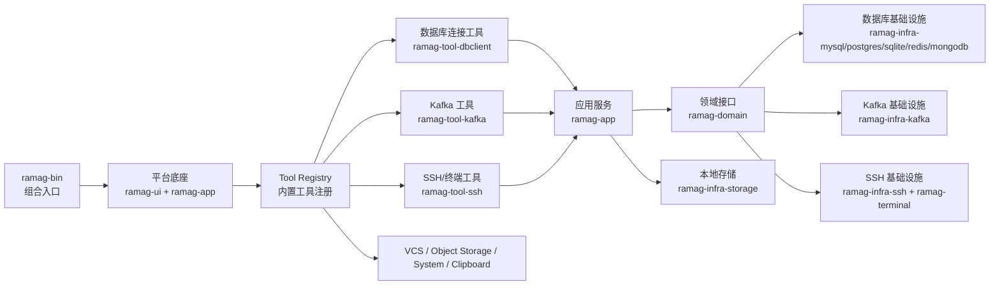

# Ramag Platform 产品与开发整合设计

> 文档状态：设计整合稿，不代表所有计划接口已经实现
> 适用仓库：`E:/Project/ramag-platform`
> 评估基线：当前 `main`；本工作区在 `feat/term-001-ssh-session-forwarding` 上包含 TERM-001 未提交改动
> 更新时间：2026-09-07

本文将现有架构说明、主线开发计划、插件平台路线、Kafka 路线和数据库路线整合为一个可执行的产品与开发设计。本文只描述当前代码事实、明确的目标边界和后续验收条件；没有实现的设计使用“计划”“拟实现”或“未实现”标记。

## 术语表与命名约定

| 规范名称 | English / Acronym | 本文职责 | 不代表什么 |
|---|---|---|---|
| 平台底座 | Platform Core | 提供窗口、导航、主题、共享 UI、配置、存储和工具生命周期 | 不包含数据库、Kafka 或 SSH 的业务实现 |
| 内置插件 | Built-in Plugin | 编译进主程序、通过 Rust 接口注册的工具 | 不代表已经支持第三方动态插件 |
| 动态插件 | Dynamic Plugin | 运行时从外部包或进程接入的平台扩展 | 不代表第一阶段必须实现 ABI、沙箱或插件市场 |
| 工具注册表 | Tool Registry | 保存已注册工具的身份、入口和实例 | 不代表插件权限系统或远程市场 |
| SSH 工作区 | SSH Session Workspace | 按 SSH 连接隔离终端、SFTP 和远程文件状态的用户工作区 | 不代表 SSH 连接本身、数据库隧道或远程桌面会话 |
| 终端核心 | Terminal Core | 处理 PTY、ANSI/VT 状态、键盘鼠标输入、选区、滚动和绘制快照 | 不代表 SSH、RDP、VNC、Telnet 或 Serial 协议客户端 |
| Kafka 传输层 | Kafka Transport | 隔离具体 Kafka 客户端库并向应用层提供读取、管理和观测能力 | 不代表 UI、Kafka Broker 或某一个客户端库 |
| Kafka 集群 | Kafka Cluster | 通过 Kafka 协议提供 Broker、Topic 和 Partition 服务的整体 | 不代表 Ramag 保存的一条连接配置 |
| 指标快照 | Metrics Snapshot | 在时间点记录集群、Topic、Partition 或消费者组状态 | 不代表 Kafka Admin API 能直接提供全部 Broker 运行指标 |
| 消费者组 Lag | Consumer Group Lag | 已提交 Offset 与 Partition 末尾 Offset 之间的差值 | 不代表业务处理延迟或端到端消息延迟 |
| Schema Registry | Schema Registry | 保存和校验 Avro、Protobuf 或 JSON Schema 等消息结构 | 不代表 Kafka Broker，也不属于当前核心 Kafka 工具 |
| Kafka Connect | Kafka Connect | 在 Kafka 与外部系统之间搬运数据的连接框架 | 不代表 Ramag 内部的 Kafka 读取任务 |
| ksqlDB | ksqlDB | 使用 SQL 对 Kafka 数据流执行过滤、聚合和连接的流处理服务 | 不代表 Kafka 查询 UI 或普通 Topic 搜索 |
| 产品验收 | Product Acceptance | 用真实窗口、真实外部服务或可复核的替代证据确认用户流程 | 不代表仅通过编译或单元测试 |

命名约定：正文首次出现使用“中文名（English / Acronym）”，后续使用中文规范名；代码、字段、crate、协议和固定产品名称保留原始大小写。四条主线使用“插件平台、Kafka 工具、SSH/终端工具、数据库连接工具”这四个名称，不把 `ramag-terminal` 与整个 SSH 工具混为一谈。

## 1. 产品定位与当前结论

### 1.1 产品定位

Ramag Platform 是一个本地优先的开发者工作台，将数据库、消息系统、远程主机、代码仓库和文件操作放在同一个原生 GPUI 窗口中。平台化的第一阶段不是加载任意第三方代码，而是把现有编译期工具收敛为具有稳定描述、注册和生命周期边界的内置插件。

目标产品由四条主线组成：

1. 插件平台：统一工具身份、入口、设置、能力声明、生命周期和诊断。
2. Kafka 工具：面向集群、Topic、Partition、消息、消费者组、ACL 和配置的桌面工作台。
3. SSH/终端工具：面向 SSH 会话、PTY 终端、SFTP 和远程文件操作的工作区。
4. 数据库连接工具：面向 MySQL、PostgreSQL、SQLite、Redis 和 MongoDB 的连接、查询、结果处理和安全变更工作流。

系统监控、VCS、对象存储和剪贴板继续作为内置工具存在，但不在本轮四条产品主线中扩展新的大功能。

### 1.2 当前真实状态

| 主线 | 当前实现 | 设计判断 | 交付距离 |
|---|---|---|---|
| 插件平台 | `Tool`、`ToolRegistry`、插件描述、静态生命周期和失败诊断已经存在 | P0-C 设置与权限接口尚未落地 | P0-A、P0-B、PLAT-003 已完成 |
| Kafka 工具 | 元数据、Topic、Partition、消息读取、搜索、消费者组、ACL、Topic/配置管理已存在 | 路线图已加入 `KafkaMonitoringDriver`、实时 Tail 和指标快照，但当前代码没有这些接口 | 基础管理可用，观测增强未开始 |
| SSH/终端工具 | OpenSSH、PTY、SFTP、JumpServer、文件预览/编辑、传输队列、多终端标签、会话状态、每标签重连和 `-L/-R/-D` 参数模型已存在 | 真实端点和真实窗口证据尚未补齐；端口转发的独立状态/停止面板、会话日志、脚本、宏和多协议仍未实现 | 代码交付已完成，真实服务验收待补 |
| 数据库连接工具 | SQL、Redis、MongoDB、分页、编辑、事务、查询历史、比较和迁移相关能力已有较多实现 | 后续重点是连续工作流、真实数据库回放、失败恢复和窗口证据 | 四条主线中最接近稳定化 |

不能把“headless UI 测试通过”描述为“真实 Windows 窗口已验收”。当前多个路线图明确记录了真实窗口截图和部分外部服务验收仍未补齐。

## 2. 现有代码与文档基线

### 2.1 实际 crate 分层



实际工具注册在 [`crates/ramag-bin/src/composition.rs`](../crates/ramag-bin/src/composition.rs) 和 [`crates/ramag-bin/src/windows.rs`](../crates/ramag-bin/src/windows.rs)。`ramag-tool-kafka` 与 `ramag-tool-system` 已经进入主程序，但旧版 [`docs/architecture.md`](architecture.md) 和部分 README 清单没有同步记录。

### 2.2 架构约束

- `ramag-domain` 只保存实体、错误和跨层 trait，不直接依赖 GPUI、具体数据库驱动或 Kafka 客户端类型。
- `ramag-app` 负责服务和用例编排，不负责 UI 布局。
- `ramag-infra-*` 负责外部协议、数据库、系统命令、存储和运行时适配。
- `ramag-tool-*` 负责工具界面和交互，不直接绕过应用服务访问外部系统。
- `ramag-terminal` 只负责通用终端内核和视图，不承担 SSH 认证或远程协议组合。
- 密码、Token、密钥路径和消息正文不得进入普通日志；敏感配置由本地存储加密或交给系统凭据库管理。
- 长任务必须有取消、代次或上下文检查，防止旧结果写入新连接、新 Topic 或已关闭的视图。
- 结果、消息、目录、传输和 UI 列表都必须有数量、字节、并发或时间上限。

### 2.3 文档源的职责

| 文档 | 应保留的职责 | 不应继续承载的内容 |
|---|---|---|
| [`docs/architecture.md`](architecture.md) | 已实现 crate、依赖方向和技术决策 | 详细产品路线和长期功能愿望 |
| [`docs/development-roadmap.md`](development-roadmap.md) | 跨工具 UI、响应性、质量和验收 | Kafka 或数据库协议功能排期 |
| [`docs/plugin-platform-roadmap.md`](plugin-platform-roadmap.md) | 插件平台 P0-P4 设计和任务 | 当前工具具体业务功能 |
| [`docs/kafka-tool-roadmap.md`](kafka-tool-roadmap.md) | Kafka 领域、传输、UI 和管理能力 | 数据库或通用 UI 排期 |
| [`docs/database-client-datagrip-roadmap.md`](database-client-datagrip-roadmap.md) | 数据库工作流和驱动差异 | 插件、Kafka 或 SSH 产品定义 |
| 本文 | 四条主线的统一产品边界、依赖关系和阶段顺序 | 逐个提交的执行日志 |

本文不是替换这些专项文档，而是作为整合层；专项文档与本文冲突时，先修正专项文档的实现状态，再进入开发。

## 3. 平台与插件设计

### 3.1 第一阶段只做内置插件

现有主程序在 `build_tool_registry` 中直接创建 `DbClientTool`、`KafkaTool`、`VcsTool`、`SshTool`、`ObjectStorageTool`、`SystemTool` 和平台可用时的 `ClipboardTool`。第一阶段应在不复制业务状态的前提下，为这条注册路径增加稳定适配层：

```text
PluginDescriptor
    -> PluginId / API version / capabilities / settings schema
    -> static registration adapter
    -> existing Tool instance
    -> existing Tool View factory
```

`PluginDescriptor` 至少包含：

- 稳定的 `PluginId` 和显示名称
- 插件 API 主次版本
- 工具入口和命令贡献点
- 能力声明，例如 `ui.entry`、`ui.notification`、`storage.plugin`、`task.scoped`
- 设置模式、默认值、敏感字段标志、范围和枚举值
- 诊断信息和注册失败原因

P0 不扫描外部目录、不执行外部代码、不引入动态 ABI、不实现插件市场。动态插件若进入后续阶段，必须先完成包格式、签名、来源、兼容性、权限审批、崩溃隔离、升级回滚和残留清理设计。

### 3.2 插件验收条件

- 重复 `PluginId`、空 ID、非法版本、冲突入口和未知能力会被拒绝。
- 非法设置模式不会进入持久化层。
- 单个插件注册失败不会使其他工具消失。
- 插件任务绑定插件生命周期；停用或关闭时取消任务并拒绝迟到更新。
- 诊断只记录插件 ID、阶段和有界错误摘要，不记录密码、Token、完整连接配置或消息正文。
- 内置工具的顺序、身份、入口和现有用户行为保持不变。
- P0/P1 使用单元测试、headless UI 和 workspace Clippy；涉及窗口布局时补充真实窗口证据或明确记录环境限制。

## 4. Kafka 工具设计

### 4.1 当前核心边界

Kafka 工具独立于数据库 `DriverKind` 和 `ConnectionConfig`，使用 `KafkaClusterConfig`、`KafkaDriver` 和 `KafkaAdminDriver`。

只读能力包括：

- 连接测试和集群元数据
- Broker、Topic、Partition 浏览
- 按 Offset 或时间范围读取消息
- Key、Value、Headers 的有限范围搜索
- 消费者组、成员、分配和 Offset 浏览

管理能力包括：

- 创建、删除和扩容 Topic
- 读取和修改支持动态变更的配置
- ACL 查询、创建和精确删除

消息浏览必须使用独立、手动分配 Partition 的读取上下文，关闭自动提交，不加入或推进用户业务消费者组。搜索和读取必须有范围、消息数、字节数、并发、超时和取消限制。

### 4.2 Kafka 路线图与代码的冲突

当前领域代码存在 `KafkaDriver` 和 `KafkaAdminDriver`，见 [`crates/ramag-domain/src/traits/kafka_driver.rs`](../crates/ramag-domain/src/traits/kafka_driver.rs)。当前代码没有 `KafkaMonitoringDriver`、`KafkaMetricsSnapshot` 或 Live Message Tail 的实现。

`ramag-bin` 当前显式启用 `ramag-infra-kafka` 的 `cmake-build` feature，见 [`crates/ramag-bin/Cargo.toml`](../crates/ramag-bin/Cargo.toml)。因此“默认桌面构建不依赖 CMake、MSVC、MinGW 或 `librdkafka`”仍是未完成目标，不能写成当前事实。

下一步必须先做传输选择：

1. 保留 `rdkafka/librdkafka` 为正式默认后端，并把 native 工具链列为 Windows 发布前置条件；或
2. 增加 `KafkaTransport` 边界，完成纯 Rust 传输能力矩阵，再将 native 后端降为显式兼容路径。

在传输选择完成前，不继续扩展实时指标页面。

### 4.3 观测能力的后续边界

后续可以增加：

- `KafkaMonitoringDriver`
- 集群、Topic、Partition 和消费者组的指标快照
- 有明确 Topic/Partition 范围的 Live Message Tail
- Consumer Group Lag、首尾 Offset、ISR、Leader 和消息速率
- 可选的 JMX、Prometheus 或 exporter 数据源

Broker CPU、内存、磁盘、JVM 和请求延迟不能由 Kafka Admin API 伪造。没有外部指标源时，界面必须显示“未配置”“无权限”或“采集失败”，不能显示为零值。

Schema Registry、Kafka Connect 和 ksqlDB 都是可选的外部生态服务：前者管理消息结构，第二者搬运外部系统数据，第三者执行 Kafka 流计算。它们不属于当前 Kafka 核心工作台，后续只有在用户场景、部署模型和安全边界明确后再独立立项。

### 4.4 Kafka 验收条件

- 默认只读上下文不会提交业务 Offset。
- 集群、Topic、Partition、消费者组和消息结果始终带有集群上下文，旧请求不能覆盖新集群页面。
- 读取、搜索、Tail 和指标采集彼此隔离；一个任务失败不会覆盖其他视图的成功状态。
- Topic、配置和 ACL 的变更必须显示目标、变更前后内容并二次确认。
- Kafka Docker/KRaft 集成测试覆盖元数据、消息读取和管理路径。
- 若保留 native 后端，Windows CI、发布脚本和本地开发指南必须明确 CMake、编译器和链接依赖。
- 实时 Tail 必须有开始、暂停、停止、断线、重连、速率、已读取数和取消状态。

## 5. SSH/终端工具设计

### 5.1 终端核心决策

继续使用 `alacritty_terminal + GPUI`。当前 [`crates/ramag-terminal`](../crates/ramag-terminal) 已经具备 PTY、ANSI 状态、光标、颜色、Alternate Screen、滚动、选区、剪贴板、Bracketed Paste、resize 和退出生命周期能力，并有 19 项单元测试覆盖基础行为。

终端核心只负责：

- PTY 启动、输入输出和 resize
- ANSI/VT 状态解析和 bounded scrollback
- 键盘、鼠标、选区、复制和粘贴
- 光标、颜色、文本样式和绘制快照
- 终端任务退出、取消和资源回收

终端核心不负责：

- SSH 认证、Host Key、SFTP 或 JumpServer
- SSH 端口转发配置
- RDP、VNC、Telnet、Serial 或 X11 协议
- 会话日志、脚本、宏和多主机批量执行

### 5.2 SSH 基础设施和工作区

`ramag-infra-ssh` 继续使用系统 OpenSSH，负责：

- profile 校验和命令参数构造
- System、Password、Key File 认证路径
- Host Key 和生产连接保护
- SFTP 会话、目录、文件预览、编辑和传输
- 通用 `-L`、`-R`、`-D` 端口转发的模型、参数构造和随交互终端退出的资源回收
- ProxyJump 或多跳连接的显式配置

`ramag-tool-ssh` 负责：

- 连接列表和环境/生产标识
- 每个连接一个 SSH 工作区
- 终端标签、活动终端、重连和退出状态
- SFTP 文件浏览器和传输队列
- 终端会话状态、退出标签和目标标签重连；端口转发配置由 profile 传入交互终端，关闭终端或工作区时随 SSH 进程停止

数据库专用 SSH 隧道继续由 `ramag-infra-tunnel` 管理，不把数据库连接隧道误认为通用终端会话。

### 5.3 主流终端参考范围

SecureCRT 和 MobaXterm 用于划定产品参考范围，不代表 Ramag 已经实现相关功能。

| 参考能力 | Ramag 当前状态 | 建议边界 |
|---|---|---|
| Tab、会话列表和连接工作区 | 已有连接工作区和最多 8 个终端标签 | 补齐标签状态、收藏、分组和恢复 |
| SSH/SFTP | 已有 | 继续稳定化和补真实环境验收 |
| SSH Gateway、ProxyJump、端口转发 | profile 已支持解析和保存 `-L/-R/-D`，启动参数已由 `ramag-infra-ssh` 构造；独立转发状态/停止 UI 未实现 | 先完成真实端点验收，再单独补转发状态、错误和停止面板；多跳模型另行立项 |
| Serial、Telnet、RDP、VNC、X11 | 未形成通用协议工具；JumpServer 有 RDP Web 目标 | 作为外部程序或独立适配器评估，不塞进终端核心 |
| 会话日志和录制 | 未实现 | 先做有界文本日志，明确敏感数据策略 |
| 脚本和宏 | 未实现 | 先不做任意代码执行，后续做受限命令序列 |
| 多主机批量执行 | 未实现 | 后续独立能力，必须有目标确认和并发上限 |
| 密码和会话安全 | 本地加密存储、系统凭据和 Host Key 保护已有基础 | 保持不记录密码、Token 和完整命令秘密 |

产品定位应是“本地优先的 SSH、SFTP 和远程文件工作区”，不是完整 SecureCRT 或 MobaXterm 克隆。

### 5.4 SSH/终端验收条件

- 同一 SSH 工作区中的多个终端互不覆盖输入、输出、焦点和退出状态。
- 重连只替换目标终端；其他终端和文件浏览状态保持可用。
- 端口转发显示监听地址、目标地址、方向、状态、错误和停止入口；关闭工作区时有界停止转发。
- SFTP 与终端使用独立会话，文件传输取消不会终止活动终端。
- 生产连接默认禁止高风险远程写操作，所有解除保护的动作可见且需确认。
- Host Key 不可信、认证失败、OpenSSH 不存在和远端路径错误都显示可操作的原因。
- 终端输出、日志和诊断具备长度、时间和磁盘预算。
- 真实 OpenSSH 端点至少覆盖 Linux Shell、Windows OpenSSH/SFTP、断线重连和无效 Host Key 场景。

`TERM-001` 的代码范围已覆盖会话状态、退出标签、目标标签重连、profile 中 `-L/-R/-D` 的解析/保存/参数构造，以及 OpenSSH 参数解析测试。真实 OpenSSH 端点、真实 Windows 窗口和独立转发状态/停止面板仍是后续验收或独立任务，不能用 headless 测试代替。

## 6. 数据库连接工具设计

### 6.1 当前边界

`ramag-tool-dbclient` 是 SQL、Redis 和 MongoDB 的统一连接入口；`ramag-tool-redis` 与 `ramag-tool-mongodb` 提供各自的数据模型视图，不为了统一操作而伪装成 SQL。

当前主路径包括：

- MySQL、PostgreSQL、SQLite 连接和 SQL 查询
- Redis Key 树、类型详情和命令/值操作
- MongoDB Collection、JSON 查询和文档结果
- 查询取消、执行代次、查询历史和最近关闭草稿
- 服务端分页、排序、筛选、结果导出和稳定键编辑
- 事务、保存点、提交/回滚和失败状态
- 执行计划、Schema/结果比较、迁移 SQL 预览和确认记录

### 6.2 后续交付边界

后续按以下顺序继续：

1. 结果查看模式、大字段有界查看和编辑失败恢复。
2. 表树对象定位、收藏、大小状态和连接上下文保护。
3. 结构化执行计划，解析失败时保留原文。
4. Schema 对比、脚本指纹、破坏性操作分组和逐段确认。
5. 查询管理、流式导出、取消和大数据量性能。

不能把迁移 SQL 生成成功当作数据库执行成功；不能把估算表大小、缺失统计或未连接状态显示成确定数值；不能在没有可靠稳定键时伪造行匹配。

### 6.3 数据库验收条件

- 查询、切换连接、切换标签、取消和重试后，旧结果不能覆盖新上下文。
- 结果查看模式切换不产生额外数据库请求。
- 结果编辑失败保留用户输入，并显示影响行数、数据库错误和重试路径。
- MySQL、PostgreSQL、SQLite、Redis 和 MongoDB 不支持的能力显示明确原因。
- Schema 迁移脚本变化后必须重新计算指纹并重新确认。
- 大字段、超宽结果、至少万行分页、查询取消和连接失败均有有界行为。
- 真实 MySQL/PostgreSQL 集成测试和 Windows 窗口证据与 headless 测试分开记录。

## 7. 统一阶段顺序

### 阶段 0：源文件和证据收敛

负责人：平台维护者。

任务：

- 统一 `main`、`dev` 和实际实施分支描述。
- 更新 README 和 architecture 的工具清单，补充 Kafka/System。
- 在 Kafka 路线图中区分“已实现基础能力”和“未实现的 Monitoring/Tail/Transport 目标”。
- 把已完成历史和后续计划分开，避免路线图同时表达相互冲突的状态。
- 清点真实窗口、外部数据库、Docker Kafka 和 OpenSSH 的缺失证据。

完成条件：文档对当前代码的描述一致；工作区改动和已提交基线分别标注；所有“完成”条目都有测试或窗口/服务证据。

### 阶段 1：内置插件平台 P0/P1

负责人：`ramag-domain`、`ramag-app`、`ramag-ui`、`ramag-bin`。

任务：增加 `PluginId`、`PluginDescriptor`、API 版本、能力声明、设置模式、注册诊断和静态生命周期适配器。现有工具实例和业务状态不复制。

完成条件：所有当前工具通过静态插件注册适配器装配；重复 ID、非法版本、未知能力、注册失败和任务取消均有测试；现有入口和用户行为不变。

### 阶段 2：SSH/终端工作区 P0

负责人：`ramag-domain`、`ramag-infra-ssh`、`ramag-tool-ssh`、`ramag-terminal`。

任务：补齐会话状态、通用 SSH 端口转发、重连、日志策略和基础会话管理；终端核心继续使用 `alacritty_terminal + GPUI`。

完成条件：真实 OpenSSH 端点覆盖 Shell、SFTP、重连、端口转发、Host Key 错误和生产保护；终端核心单测、SSH 集成测试、headless UI 和真实窗口证据分别通过。

### 阶段 3：Kafka Transport 和观测边界

负责人：`ramag-domain`、`ramag-app`、`ramag-infra-kafka`、`ramag-tool-kafka`、构建脚本维护者。

任务：决定 native `rdkafka` 或纯 Rust transport；必要时增加 `KafkaTransport`；补齐 Monitoring/Tail 前置接口和资源预算。

完成条件：Windows 默认构建依赖、TLS/SASL、Kafka Docker/KRaft、连接失败、取消和断线恢复均有可复核证据；未实现能力不出现在“已完成”列表。

### 阶段 4：数据库 P0/P1 连续工作流

负责人：`ramag-app`、`ramag-tool-dbclient`、SQL/MongoDB/Redis 基础设施。

任务：补齐结果查看、失败恢复、对象导航、执行计划、Schema 迁移确认和大数据量边界。

完成条件：真实 MySQL/PostgreSQL 回放、驱动差异、连接上下文、失败恢复和窗口边界均可验证；MongoDB/Redis 不被错误套用 SQL 语义。

### 阶段 5：可选生态和动态能力评估

只有阶段 1-4 稳定后才评估：

- 动态插件包、签名、权限和进程隔离
- Schema Registry 集成
- Kafka Connect 管理或连接器状态查看
- ksqlDB 查询或流处理入口
- Serial、Telnet、RDP、VNC、X11 等远程协议适配

这一阶段不自动进入核心产品，也不因参考产品有这些能力就承诺实现。

## 8. 验收和发布规则

每个独立功能只能形成一个独立、可验收的交付单元。交付前必须根据风险选择证据：

| 风险类型 | 最低证据 |
|---|---|
| 纯领域规则 | 目标 crate 单元测试、Clippy、格式检查 |
| 异步任务和上下文 | 代次、取消、关闭和迟到结果测试 |
| 外部协议/数据库 | 真实服务集成测试，记录服务版本、连接条件和跳过原因 |
| GPUI 布局/交互 | headless 边界测试加真实窗口截图/操作；不可用时明确记录限制 |
| Windows 构建和发布 | 与 CI 相同的工具链、构建、安装包和产物校验 |
| 安全/权限 | 正常、拒绝、超时、取消、敏感信息脱敏路径测试 |

未通过目标测试、workspace Clippy、格式检查、源码尺寸检查或必要的真实验收时，不把功能写为完成，不提交和推送。

## 9. 风险、非目标和后续任务

### 9.1 主要风险

- `rdkafka/librdkafka`、CMake、OpenSSL/curl 和 Windows 链接器使 Kafka 构建与发布路径复杂化。
- 动态插件会引入 ABI、供应链、权限、升级、崩溃隔离和残留清理风险。
- 终端范围若直接追赶 SecureCRT/MobaXterm，容易把产品扩大为通用远程桌面套件。
- Headless 测试不能证明真实窗口在 DPI、双屏、最小尺寸、焦点和系统输入下的行为。
- 现有路线图包含较多历史执行记录，继续追加会降低当前状态的可读性。

### 9.2 明确非目标

- 不实现 SecureCRT 或 MobaXterm 的完整复制品。
- 不在 `ramag-terminal` 内实现 RDP、VNC、Telnet、Serial、X11 或 SSH 协议。
- 不把 Kafka 放进数据库 `DriverKind` 或复用数据库连接模型。
- 不在插件 P0 阶段加载第三方动态代码。
- 不把 Schema Registry、Kafka Connect、ksqlDB 当作 Kafka 核心基础能力。
- 不在真实窗口和外部服务证据缺失时宣称产品发布就绪。

### 9.3 立即后续任务

1. 修正 [`docs/architecture.md`](architecture.md) 和 [`README.md`](../README.md) 的 Kafka/System 工具清单。
2. 修正 [`docs/development-roadmap.md`](development-roadmap.md) 的分支描述和历史完成项表达。
3. 在 [`docs/kafka-tool-roadmap.md`](kafka-tool-roadmap.md) 增加“代码未实现接口”小节，明确 `KafkaMonitoringDriver`、Live Tail 和纯 Rust Transport 的状态。
4. 实现插件平台 P0 的描述、注册错误和静态生命周期适配器。
5. 为 TERM-001 准备具备 `sshd` 的真实端点，补 Shell、转发、断线重连和 Host Key 错误验证。
6. 在真实端点验收后，单独设计端口转发状态、错误和停止面板。
7. 决定 Kafka native backend 与纯 Rust transport 的产品取舍，再决定是否实现指标快照。
8. 把 `docs/v0.0.5-release-todo.md` 和历史公告移入归档目录，避免被误当作当前计划。

## 10. 当前验证记录

本次 TERM-001 交付完成的验证：

- `cargo metadata --locked --no-deps`：通过
- `cargo fmt --all -- --check`：通过
- `cargo test --locked -p ramag-terminal --lib`：19/19 通过
- `cargo +nightly-2026-04-16-x86_64-pc-windows-gnu test --offline -p ramag-domain -p ramag-infra-ssh -p ramag-app --lib`：152、62、189 项通过
- `cargo +nightly-2026-04-16-x86_64-pc-windows-gnu test --offline -p ramag-tool-ssh --lib`：73 项通过
- 目标四个 crate 的 `clippy --all-targets -- -D warnings`：通过
- Windows OpenSSH `ssh -G`：通过并解析 `localforward`、`remoteforward`、`dynamicforward`
- `cargo fmt --all -- --check`、源码尺寸检查和 `git diff --check`：通过
- workspace 全量库测试未完成：`rdkafka-sys` 在 Windows GNU 环境缺少 MSYS/MinGW CMake generator
- 真实 SSH 端点未完成：Windows 和 WSL 没有 `sshd`；临时容器镜像拉取超时
- 真实 Windows 窗口截图和键盘操作仍未完成，不能把 headless 结果写成真实窗口验收
